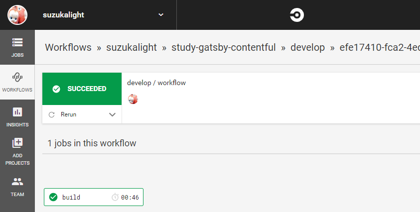
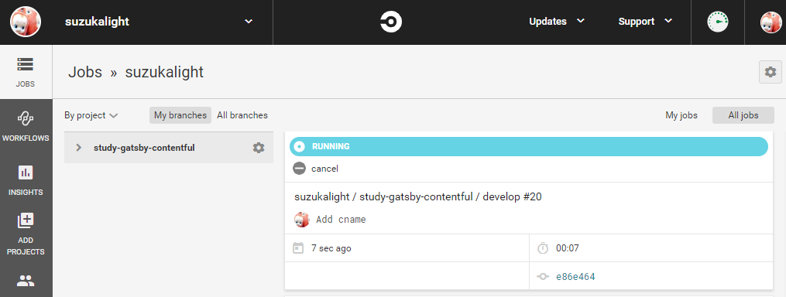

GitHub に CircleCI を設置しておき、Contentful の webhook 機能から記事の更新をトリガして、CI による GitHub Pages への自動デプロイができるようにする方法を紹介します。

https://suzukalight.com/2019-07-13-contentful-starter/

前回、Contentful による Gatsby サイトのハンズオンを行いました。しかしながらこのままだと Contentful で記事を更新しても、コンテンツサーバ側は更新できません。Gatsby に SSG してもらい、それをサーバにデプロイする必要があります。

Contenful には webhook 機能があり、記事の更新時などにトリガさせることができます。この webhook によって CircleCI を起動させ、CircleCI に `yarn deploy` を行わせることで、自動的に GitHub Pages へデプロイすることを狙いとしています。

# CircleCI の設置と動作確認

## サインアップ

https://circleci.com/signup/

- GitHub アカウントでサインアップ
- `Follow a Project` -> study-gatsby-contentful

## ブログリポジトリに CI 設定

- study-gatsby-contentful を `Set Up Project`
- config.yml のテンプレートをコピー

## リポジトリのファイルを更新

- `.circleci/config.yml` として、上のテンプレートを保存
- `package.json` の `test` を `yarn lint` に変更（動作確認用）

```javascript{3}:title=package.json
{
  "scripts": {
    "test": "yarn lint",
  }
}
```

- 上記 2 つの変更についてコミット

## CI の動作確認

- `Start building` で開始！
- テストが成功したかを確認



## Personal API Token を入手

- User -> Personal API Tokens -> `Create New Token`
  - 適当な名前（Contentful など）を入力し、API トークンを生成

# Contentful の初期設定

## Contentful に webhook を追加

- `Settings -> Webhooks`
  - 右側の Webhook templates から `CircleCI` を `Add`
  - 必要な情報を入力して、 `Create webhook`


## コンテンツを変更し、CI が起動するかチェック

適当なコンテンツを変更してみて、Webhook が起動し、CircleCI のテストが走るかを確認；


# デプロイまでの詳細設定

## CircleCI

### SSH Key

CircleCI がデプロイに使用するための SSH 鍵を新規に生成します；

```bash:title=bash
$ ssh-keygen -t rsa -b 4096 -C "circleci@suzukalight.com" -f ~/.ssh/circleci-suzukalight
$ pbcopy < ~/.ssh/circleci-suzukalight
```

**Settings -> SSH Permisions -> Add SSH Key** に秘密鍵を CircleCI に登録し、その fingerprint を保存しておきます；

```
Hostname    : github.com
Private Key : [Paste Clipboard]
```

### Environment Variables

**Settings -> Environment Variables** に Contentful の AccessToken と SpaceID を登録しておき、CircleCI からデプロイができるようにします。

```
CONTENTFUL_ACCESS_TOKEN : xxx
CONTENTFUL_SPACE_ID     : xxx
HOST_NAME               : github.com
USER_NAME               : circleci
```

## GitHub

### Deploy Key

**Settings -> Deploy keys -> Add Deploy Key** に、先程の秘密鍵に対する公開鍵を GitHub 側に登録します；

```bash:title=bash
$ pbcopy < ~/.ssh/circleci-suzukalight.pub
```

```
Title : CircleCI-Contentful
Key   : [Paste Clipboard]
[x]   : Allow write access
```

## gatsby-contentful-starter

CircleCI で実行するデプロイコマンドを追加します。CircleCI に秘密鍵を登録したときに表示された fingerprint を用意しておきましょう；

### config.yml

```yml:title=.circleci/config.yml
      # run deploy
      - add_ssh_keys:
          fingerprints:
            - "aa:aa:aa:aa..."

      - run:
          name: Start ssh-keyscan
          command: |
            ssh-keyscan ${HOST_NAME} >> ~/.ssh/known_hosts

      - run:
          name: Deploy development branch to gh-pages
          command: |
            git config user.email "circleci@suzukalight.com"
            git config user.name "circleci"
            yarn deploy
```

### static/CNAME

独自ドメインを登録している人は、CNAME ファイルを忘れずに追加しましょう。私はこれを忘れていて、デプロイのたびにリセットされてしまいました。

```text:title=static/CNAME
study-gatsby-contentful.suzukalight.com
```

# 記事を更新してみよう

これでセットアップは完了です。では早速、Contentful で記事を更新してみます。


CircleCI 側の job を見ると、即座に実行が開始されており、30 秒ほどでデプロイ完了の SUCCESS 表示に切り替わります。



記事側を見にいくと、更新されていることが確認できます。これで完了です！


