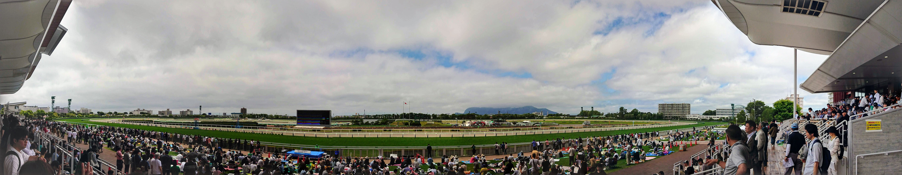

# 目的

```
- 函館競馬場に行く
    - 中央10場全制覇の旅
    - よゐこステージ
    - 馬場開放イベント
- 美味い海鮮を食べまくる
    - ラビスタ函館ベイの朝食バイキング
    - 函太郎
    - まるかつ水産
- 美味いローカルフードを食べまくる
    - ラッキーピエロ（チャイニーズチキンバーガー）
    - ハセガワストア（やきとり弁当）
    - 沼の家（大沼だんご）
- 幕末開港地を楽しむ
    - 函館市旧イギリス領事館
    - ハリストス正教会・カトリック元町教会
    - 金森赤レンガ倉庫
- 景色を楽しむ
    - 函館山夜景
    - 城岱牧場展望台
    - 五稜郭
    - 八幡坂・二十間坂
```

# 1 日目（2019/7/17)：五稜郭

- **行程：** 自宅 → 羽田空港 → 函館空港 → 五稜郭 → ラビスタ函館ベイ
- **食事：** 回転寿司（函太郎五稜郭公園店）

<blockquote class="twitter-tweet"><p lang="ja" dir="ltr">はーるばるーきたぜ函館〜。函館競馬場が真下に！ <a href="https://t.co/zmotBYh6mC">pic.twitter.com/zmotBYh6mC</a></p>&mdash; suzukalight (@suzukalight) <a href="https://twitter.com/suzukalight/status/1151369886246899712?ref_src=twsrc%5Etfw">July 17, 2019</a></blockquote>

<blockquote class="twitter-tweet"><p lang="ja" dir="ltr">北海道の<br/>寿司は<br/>最高<br/>だ <a href="https://t.co/bmuAueSGnC">pic.twitter.com/bmuAueSGnC</a></p>&mdash; suzukalight (@suzukalight) <a href="https://twitter.com/suzukalight/status/1151484420966121473?ref_src=twsrc%5Etfw">July 17, 2019</a></blockquote>

# 2 日目（2019/7/18)：駅前・元町エリア

- **行程：** ホテル → 金森赤レンガ倉庫 → 緑の島 → 函館市臨海研究所 → 箱館丸 → 函館市旧イギリス領事館 → ハリストス正教会 → カトリック元町教会 → ハセガワストア → 函館山ロープウェイ → 函館山夜景 → ホテル
- **食事：** 朝食バイキング（ラビスタ函館ベイ）、アフタヌーンティーセット（函館市旧イギリス領事館）、やきとり弁当（ハセガワストア）

<blockquote class="twitter-tweet"><p lang="ja" dir="ltr">坂のある港町大好き <a href="https://t.co/oWZkPW839S">pic.twitter.com/oWZkPW839S</a></p>&mdash; suzukalight (@suzukalight) <a href="https://twitter.com/suzukalight/status/1151678205905870848?ref_src=twsrc%5Etfw">July 18, 2019</a></blockquote>

<blockquote class="twitter-tweet"><p lang="ja" dir="ltr">函館のにゃんこ可愛すぎる件…。 <a href="https://t.co/E0Kd27dHGP">pic.twitter.com/E0Kd27dHGP</a></p>&mdash; suzukalight (@suzukalight) <a href="https://twitter.com/suzukalight/status/1151748635576586241?ref_src=twsrc%5Etfw">July 18, 2019</a></blockquote>

<blockquote class="twitter-tweet"><p lang="ja" dir="ltr">噂に名高い、ハセガワストアさんのやきとり弁当買ってきたぞ！　溝がついてるからこうやって引き抜いて…美味い！！（テーレッテレー <a href="https://t.co/18WegEWOdW">pic.twitter.com/18WegEWOdW</a></p>&mdash; suzukalight (@suzukalight) <a href="https://twitter.com/suzukalight/status/1151795627849732096?ref_src=twsrc%5Etfw">July 18, 2019</a></blockquote>

<blockquote class="twitter-tweet" data-conversation="none"><p lang="ja" dir="ltr">函館山ロープウェイで夜景を。綺麗でしたわ…。 <a href="https://t.co/urTf2bIsJd">pic.twitter.com/urTf2bIsJd</a></p>&mdash; suzukalight (@suzukalight) <a href="https://twitter.com/suzukalight/status/1151833696296550400?ref_src=twsrc%5Etfw">July 18, 2019</a></blockquote>

# 3 日目（2019/7/19)：函館東部

- **行程：** ホテル → 立待岬 → コーヒールームきくち → トラピスチヌ修道院 → 湯の川温泉足湯 → ラッキーピエロ → ホテル
- **食事：** 朝食バイキング（ラビスタ函館ベイ）、ナポリタン＋ケーキセット（コーヒールームきくち）、チャイニーズチキンバーガーセット（ラッキーピエロマリーナ末広店）

<blockquote class="twitter-tweet"><p lang="ja" dir="ltr">立待岬で海成分を補給。2時間ドラマで犯人追い詰めもできそう <a href="https://t.co/kBktjQq90B">pic.twitter.com/kBktjQq90B</a></p>&mdash; suzukalight (@suzukalight) <a href="https://twitter.com/suzukalight/status/1152141693451243520?ref_src=twsrc%5Etfw">July 19, 2019</a></blockquote>

<blockquote class="twitter-tweet"><p lang="ja" dir="ltr">トラピスチヌ修道院。厳格な戒律に従って生きる人々のための、厳かな建築。 <a href="https://t.co/sHuJqsPKb4">pic.twitter.com/sHuJqsPKb4</a></p>&mdash; suzukalight (@suzukalight) <a href="https://twitter.com/suzukalight/status/1152144817205334016?ref_src=twsrc%5Etfw">July 19, 2019</a></blockquote>

<blockquote class="twitter-tweet"><p lang="ja" dir="ltr">ラッキーピエロさん行ってきたんさ、チャイニーズチキンまじで美味しすぎない？甘い油淋鶏みたいな。バンズ柔らかくて食べやすいし。函館ずるい <a href="https://t.co/dCS3olLuOw">pic.twitter.com/dCS3olLuOw</a></p>&mdash; suzukalight (@suzukalight) <a href="https://twitter.com/suzukalight/status/1152184217259761664?ref_src=twsrc%5Etfw">July 19, 2019</a></blockquote>

# 4 日目（2019/7/20)：北斗市・大沼公園

- **行程：** ホテル → 新函館北斗駅 → 沼の家 → 大沼公園 → 城岱牧場 → まるかつ水産 → ホテル
- **食事：** 朝食バイキング（ラビスタ函館ベイ）、大沼だんご（沼の家）、回転寿司（まるかつ水産）

<blockquote class="twitter-tweet" data-conversation="none"><p lang="ja" dir="ltr">新函館北斗駅の、ずーしーほっきーに会いに来た。ご利益は…なんだろう？　北斗の拳コラボもあり、ツッコミ甲斐のある駅。今度は新幹線で来てみたいのぅ <a href="https://t.co/OTs1OOVwhs">pic.twitter.com/OTs1OOVwhs</a></p>&mdash; suzukalight (@suzukalight) <a href="https://twitter.com/suzukalight/status/1152511604585447424?ref_src=twsrc%5Etfw">July 20, 2019</a></blockquote>

<blockquote class="twitter-tweet"><p lang="ja" dir="ltr">城岱牧場展望台。函館が素晴らしい湾であることが良くわかる、オススメのポイント。あと、馬、いた！！ <a href="https://t.co/S1zA7nN00m">pic.twitter.com/S1zA7nN00m</a></p>&mdash; suzukalight (@suzukalight) <a href="https://twitter.com/suzukalight/status/1152514056168722432?ref_src=twsrc%5Etfw">July 20, 2019</a></blockquote>

# 5 日目（2019/7/21)：函館競馬場

- **行程：** ホテル → 函館競馬場 → 函館空港 → 羽田空港 → 自宅
- **食事：** 朝食バイキング（ラビスタ函館ベイ）、あじさい（塩ラーメン＋カレーチャーハン）、ホッケフライ定食＋ザンギ（函館空港）



<blockquote class="twitter-tweet"><p lang="ja" dir="ltr">メジロ牧場の歴史展。執念の歴史だ。 <a href="https://t.co/DHxOHQdLjL">pic.twitter.com/DHxOHQdLjL</a></p>&mdash; suzukalight (@suzukalight) <a href="https://twitter.com/suzukalight/status/1152809583968227328?ref_src=twsrc%5Etfw">July 21, 2019</a></blockquote>

<blockquote class="twitter-tweet"><p lang="ja" dir="ltr">誰もいなくなった競馬場マニア歓喜 <a href="https://t.co/ud88jFeL7e">pic.twitter.com/ud88jFeL7e</a></p>&mdash; suzukalight (@suzukalight) <a href="https://twitter.com/suzukalight/status/1152872951902982144?ref_src=twsrc%5Etfw">July 21, 2019</a></blockquote>

# 所感

雰囲気も景色も食事も最高でした。とてもオススメできる。食事が（安価なのに）非常に美味しいものが多くて、函館の人が羨ましい！

あと、夏に行くと本当に気持ち良い。東京や名古屋の夏は蒸し暑くて灼熱地獄って感じだけど、函館は湿度も低くてカラッといい天気。夏は函館でリモートワークしたい。

長崎とか横浜とかが好きな人は、函館も絶対楽しめるので、ぜひ旅行して欲しいなと思います。
