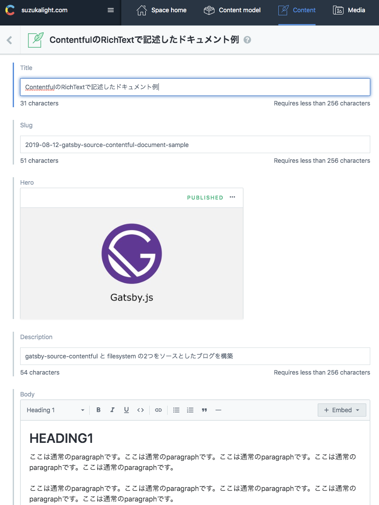

# 使用するパッケージ

```bash
yarn add gatsby-source-contentful @contentful/rich-text-react-renderer @contentful/rich-text-types esm date-fns
yarn add -D dotenv
```

## Contentful API との通信

- `gatsby-source-contentful`: Contentful のデータをソースにできるプラグイン
- `dotenv`: `CONTENTFUL_SPACE_ID`と`CONTENTFUL_ACCESS_TOKEN`を env ファイルとして保管することで、GitHub に露出させない

## コンテンツの変換

- `@contentful/rich-text-react-renderer`, `@contentful/rich-text-types`: Contentful の RichText を ReactNode に変換してくれる
- `esm`: gatsby-node.js で ES6 のモジュールを import するための変換を行う
- `date-fns`: Contentful の Date オブジェクトの変換や、Markdown の DateString との比較を行う

# Contentful に記事データを配置

## モデル定義

記事用のモデル、Article を定義します。フィールド名は自動で lowerCamelCase されます。


## 記事の配置

Content メニューから、Article を 1 つ準備します。



# Contentful からデータを取得

# 記事ページ

`gatsby-node.js` で記事一覧を取得し、createPage を呼び出す処理をサンプルとして解説していきます。

1. filesystem と contentful で記事のテンプレートを分ける
1. gatsby-source-filesystem と gatsby-source-contentful の両方から記事データを同時に Fetch
1. createPage を呼び出すための下処理

## filesystem と contentful で記事のテンプレートを分ける

filesystem と contentful では、記事ページを作成する起点となる GraphQL のクエリが異なりますので、export する pageQuery を変えるために、テンプレートファイルを分割しました；

```javascript{4-9}:title=gatsby-node.js
exports.createPages = async ({ graphql, actions }) => {
  const { createPage } = actions;

  const blogPostGitHubTemplate = path.resolve(
    `./src/components/templates/BlogPost/source-github.js`,
  );
  const blogPostContentfulTemplate = path.resolve(
    `./src/components/templates/BlogPost/source-contentful.js`,
  );
  const tagTemplate = path.resolve(`./src/components/templates/Tags/index.js`);
  const categoryTemplate = path.resolve(`./src/components/templates/Categories/index.js`);
```

Contentful を source とするテンプレートファイルは、下記のようになりました（**contentful + モデル名**）；

```javascript{15-33}:title=components/templates/BlogPost/source-contentful.js
import { graphql } from 'gatsby';

import BlogPost from './';

export default BlogPost;

export const pageQuery = graphql`
  query ContentfulBlogPostBySlug($id: String!) {
    site {
      siteMetadata {
        title
        author
      }
    }
    contentfulArticle(id: { eq: $id }) {
      id
      slug
      title
      description
      body {
        json
      }
      date
      category
      tags
      hero {
        title
        description
        sizes(maxWidth: 1440) {
          ...GatsbyContentfulSizes
        }
      }
    }
  }
`;
```

## filesystem と contentful の両方からデータを Fetch

filesystem(markdownRemark) と contentful(contentfulArticle) では、GraphQL の query が異なるため、それぞれのクエリを用いて Fetch を行います。クエリ発行は 1 つの読み出しで可能ですので、`allContentfulArticle` を追加します（**allContentful + モデル名**）；

```javascript{23-35}
  const result = await graphql(`
    {
      site {
        siteMetadata {
          title
        }
      }
      allMarkdownRemark(filter: { frontmatter: { status: { eq: "published" } } }, limit: 1000) {
        edges {
          node {
            fields {
              slug
            }
            frontmatter {
              title
              category
              tags
              date
            }
          }
        }
      }
      allContentfulArticle(limit: 1000) {
        edges {
          node {
            id
            title
            description
            slug
            category
            tags
            date
          }
        }
      }
    }
  `);

  if (!result || result.errors) {
    throw result.errors;
  }
```

## createPage を呼び出すための下処理

取得したページ一覧を起点に、createPage を呼び出します。このとき行った下処理は以下のとおりです；

- 取り出した記事データは source によってデータ構造が異なるため、適当なコンバータ(convertArticles)を作成してデータ構造を揃えた
- 記事ページでの prev/next 遷移を実現するために、記事データを公開日時でソートした
- source によって、component に引き渡すテンプレートを振り分けた
- filesystem では slug で、contentful では id で、それぞれ記事データを Fetch させるため、context に両方を詰めた

```javascript{2,10,12,14}
  // Create blog posts pages
  const posts = sortByDate(convertToArticles(result.data));
  posts.forEach((post, index) => {
    const previous = index === posts.length - 1 ? null : posts[index + 1];
    const next = index === 0 ? null : posts[index - 1];
    const { id, slug, source } = post.head;

    createPage({
      path: slug,
      component: source === 'github' ? blogPostGitHubTemplate : blogPostContentfulTemplate,
      context: {
        id,
        source,
        slug,
        previous,
        next,
      },
    });
  });
```

## タグごとの記事一覧や、カテゴリごとの記事一覧

タグごとの記事一覧や、カテゴリごとの記事一覧も、さきほど取得した記事全体の情報を加工することで、作成することができます；

```javascript
  // Tag pages
  const tags = posts.reduce((tags, post) => {
    const tagsInPost = post.head.tags;
    return tagsInPost ? tags.concat(tagsInPost) : tags;
  }, []);

  [...new Set(tags)].forEach(tag => {
    createPage({
      path: `/tags/${kebabCase(tag)}/`,
      component: tagTemplate,
      context: {
        tag,
      },
    });
  });
};
```

# カテゴリリストページ

filesystem/contentful の両方で `group` キーワードが使用できます。`markdown.frontmatter.category` と `contentful.category` の両方で、カテゴリをそれぞれ groupBy しておきます；

```javascript{9,15}:title=pages/categories.js
export const pageQuery = graphql`
  query {
    site {
      siteMetadata {
        title
      }
    }
    allMarkdownRemark(filter: { frontmatter: { status: { eq: "published" } } }, limit: 2000) {
      group(field: frontmatter___category) {
        fieldValue
        totalCount
      }
    }
    allContentfulArticle(limit: 2000) {
      group(field: category) {
        fieldValue
        totalCount
      }
    }
  }
`;
```

その結果を手計算で合成することで、全体としてのカテゴリ一覧を生成します；

```javascript{4,6-10}:title=pages/categories.js
const Categories = ({ location, data, pageContext }) => {
  const { site, allMarkdownRemark, allContentfulArticle } = data || {};

  const groups = [...allMarkdownRemark.group, ...allContentfulArticle.group];

  const categoriesMap = groups.reduce((cat, group) => {
    if (!cat[group.fieldValue]) cat[group.fieldValue] = 0;
    cat[group.fieldValue] += group.totalCount;
    return cat;
  }, {});

  const categories = Object.keys(categoriesMap)
    .sort((a, b) => a.localeCompare(b))
    .map(key => ({
      fieldValue: key,
      totalCount: categoriesMap[key],
    }));

  return (
    <CategoriesPage location={location} siteMetadata={site.siteMetadata} categories={categories} />
  );
};
```

## カテゴリごとの記事一覧

カテゴリに所属する記事の総数を取得したいため、`totalCount` を追加しておきます。このデータを手計算で合計することで、カテゴリに所属する記事の総数を表示します；

```javascript{14,18}:title=pages/categories.js
const CategoryPage = ({ data }) => {
  const { site, allMarkdownRemark, allContentfulArticle } = data || {};
  const totalCount = allMarkdownRemark.totalCount + allContentfulArticle.totalCount;

  return <Component />;
};

export const pageQuery = graphql`
  query($category: String) {
    site {
      ...
    }
    allMarkdownRemark() {
      totalCount
      ...
    }
    allContentfulArticle(limit: 2000, filter: { category: { in: [$category] } }) {
      totalCount
      edges {
        node {
          id
          title
          description
          slug
          category
          tags
          date
        }
      }
    }
  }
`;
```

# 完成したページ


https://suzukalight.com/2019-08-12-gatsby-source-contentful-document-sample/

# Tips

## RichText の展開

> （※注：この部分は、記事の body 部分を RichText にした場合に、追加で必要な処理です。body を Text(Long)にした場合は、childMarkdownRemark による html 変換が利用できるため、より簡単にマークアップ処理が可能です）

意外と厄介なのが、Contentful の RichText の処理です。記事データが JSON で構造化された状態で渡されるため、それを HTML に変換してやる必要があります。

```javascript:title=utils/contentful.jsx
import React from 'react';
import { documentToReactComponents } from '@contentful/rich-text-react-renderer';
import { BLOCKS } from '@contentful/rich-text-types';

const renderOptions = {
  renderNode: {
    [BLOCKS.PARAGRAPH]: (_, children) => <p className="contentful-paragraph">{children}</p>,
    [BLOCKS.EMBEDDED_ASSET]: node => {
      const { target } = node.data || {};
      const { title, description, file } = (target || {}).fields || {};
      if (!file) return null;

      const key1 = Object.keys(file)[0];
      const { contentType, url } = file[key1];
      const mimeGroup = contentType.split('/')[0];

      switch (mimeGroup) {
        case 'image': {
          return (
            
          );
        }
        default: {
          return null;
        }
      }
    },
  },
};

export const contentfulArticleToReactComponents = json => {
  console.log('json', json);
  return documentToReactComponents(json, renderOptions);
};
```

```javascript:title=components/templates/BlogPost/index.js
const BlogPostTemplate = ({ location, siteMetadata, head, body, richTextJson, pageContext }) => (
  ...
      {richTextJson && (
        <div className={styles.article}>{contentfulArticleToReactComponents(richTextJson)}</div>
      )}
  ...
```

```scss:title=components/templates/BlogPost/index.module.scss
  & p[class='contentful-paragraph'] {
    white-space: pre-wrap;
  }

  & p[class='contentful-paragraph'] > code {
    display: block;
    background-color: #f2f2f2;
    white-space: pre-wrap;
  }
```

## esm を利用して、gatsby-node.js で ESM パッケージを import

gatsby-node.js は Node 環境向けのファイルなので、そのままだと import 構文は利用できません。いくつか対策はあると思いますが、[こちらの Issue](https://github.com/gatsbyjs/gatsby/issues/7810)を参考に、`esm`モジュールを利用して対応しました；

```javascript:title=gatsby-node.js
require = require('esm')(module);
module.exports = require('./gatsby-node.esm.js');
```

## date-fns を利用した、Date の扱い

frontmatter で `date(formatString: "YYYY/M/D")` として拾ってきても構わないのですが、記事のソートを日付で行いたい場合は、時刻まで拾ってきたいので、graphql での変換はいったん行わないようにします。

かわりに`moment`などのライブラリで変換を行えば OK なのですが、最近は`date-fns`を採用する例も増えてきているので、これを素振りしました；

```javascript:title=日付のフォーマット
import format from 'date-fns/format';

format(date, 'YYYY/M/D');
```

```javascript:title=日付の比較（ソート）
import differenceInMilliseconds from 'date-fns/difference_in_milliseconds';

export const sortByDate = data => data.sort((a, b) => differenceInMilliseconds(b, a));
```
