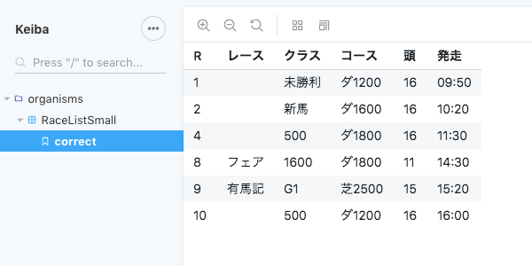

Monorepo 環境で、create-react-app w/ TypeScript したパッケージに対して、Storybook を導入する手順です。CLI を使わずに手動で設定していますが、簡単にセットアップは完了できました。

# セットアップ

- Storybook w/React, Addons(viewport, actions, storyshots) をインストール
- 型情報もインストール

```bash
$ yarn workspace client add -D @storybook/addon-actions @storybook/addon-storyshots @storybook/addon-viewport @storybook/addons @storybook/react @storybook/theming
$ yarn workspace client add -D @types/storybook__react @types/storybook__addon-actions
```

# config

- 子パッケージの `./.storybook/config.js` に設定を記述すれば OK
- `/.stories.tsx?$/` にマッチするファイルすべてを対象にするように設定
- viewport, actions のアドオンを追加

```javascript:title=src/client/.storybook/config.js
import { configure, addParameters } from '@storybook/react';
import { create } from '@storybook/theming';

addParameters({
  options: {
    theme: create({
      base: 'light',
      brandTitle: 'Keiba',
    }),
  },
});

// automatically import all files ending in *.stories.js
const req = require.context('../src/components', true, /.stories.tsx?$/);
function loadStories() {
  req.keys().forEach(filename => req(filename));
}

configure(loadStories, module);
```

```javascript:title=src/client/.storybook/addons.js
import '@storybook/addon-viewport/register';
import '@storybook/addon-actions/register';
```

# storybook

- コンポーネントを TypeScript で記述
- Story も同様。

```javascript:title=src/client/src/components/organisms/RaceListSmall/index.tsx
import React from 'react';
import format from 'date-fns/format';

import trackCode from '../../../constants/codes/track';
import gradeCode from '../../../constants/codes/grade';
import joukenCode from '../../../constants/codes/jouken';

interface Race {
  id: number; // Int!
  number: number; // Int!
  ryakushou6: string; // String!
  gradeCode: string;
  joukenCodeJy: string;
  trackCode: string;
  distance: number; // Int!
  tourokuTousuu: number;
  hassouTime: Date;
}

interface RaceItemProps {
  race: Race;
}

export const RaceItem: React.FC<RaceItemProps> = ({ race }) => (
  <tr>
    <td>{race.number}</td>
    <td>{race.ryakushou6}</td>
    <td>{gradeCode[race.gradeCode].ryaku || joukenCode[race.joukenCodeJy].ryaku}</td>
    <td>{`${trackCode[race.trackCode].course}${race.distance}`}</td>
    <td>{race.tourokuTousuu}</td>
    <td>{`${format(race.hassouTime, 'HH:mm')}`}</td>
  </tr>
);

interface RaceListPresenterProps {
  races: Race[];
}

export const RaceListPresenter: React.FC<RaceListPresenterProps> = ({ races }) => (
  <table className="bp3-html-table bp3-html-table-condensed bp3-html-table-striped bp3-interactive">
    <thead>
      <tr>
        <th>R</th>
        <th>レース</th>
        <th>クラス</th>
        <th>コース</th>
        <th>頭</th>
        <th>発走</th>
      </tr>
    </thead>
    <tbody>
      {races.map(race => (
        <RaceItem key={race.id} race={race} />
      ))}
    </tbody>
  </table>
);
```

```javascript:title=src/client/src/components/organisms/RaceListSmall/storybook/index.stories.tsx
import React from 'react';
import { storiesOf } from '@storybook/react';

import { RaceListPresenter } from '..';

const races = [
  {
    id: 1,
    number: 1,
    ryakushou6: '',
    joukenCodeJy: '703',
    gradeCode: ' ',
    trackCode: '24',
    distance: 1200,
    tourokuTousuu: 16,
    hassouTime: new Date(2019, 2, 1, 9, 50, 0),
  },
  ...
];

storiesOf('organisms/RaceListSmall', module).add('correct', () => (
  <RaceListPresenter races={races} />
));
```

# start

- package.json で `yarn workspace [package-name] [command]` を使って `yarn workspace client start-storybook` と記述
- これで `yarn storybook` と単純な記述で起動できる

```json:title=package.json
{
  "scripts": {
    "storybook": "yarn workspace client start-storybook"
  },
}
```

```bash
$ yarn storybook
```

## 表示結果


