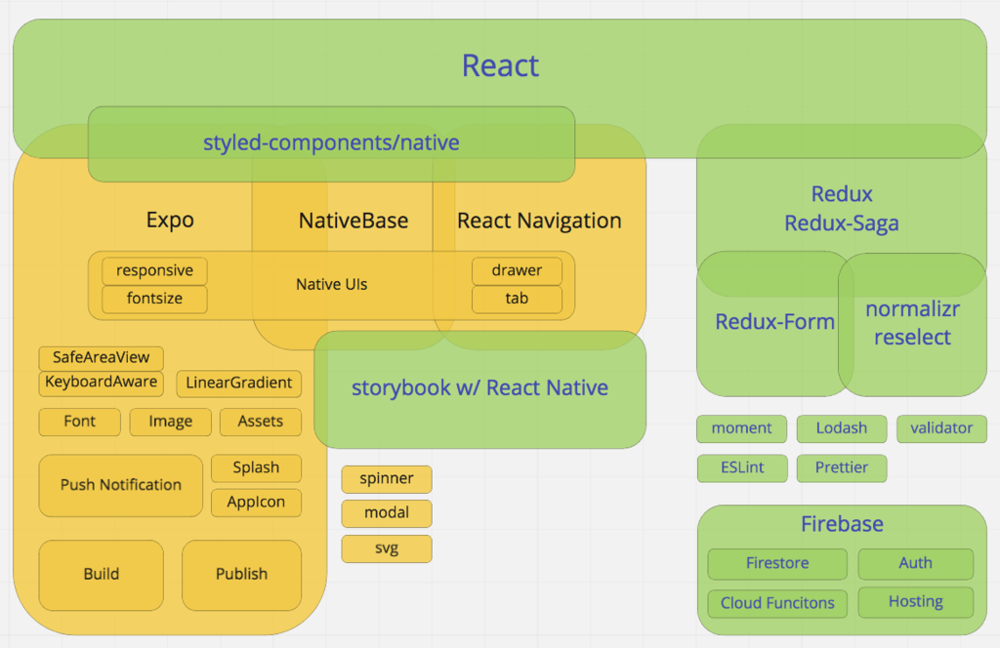
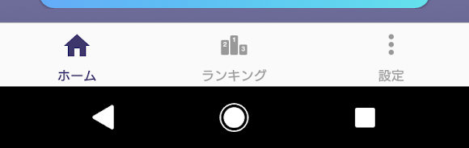
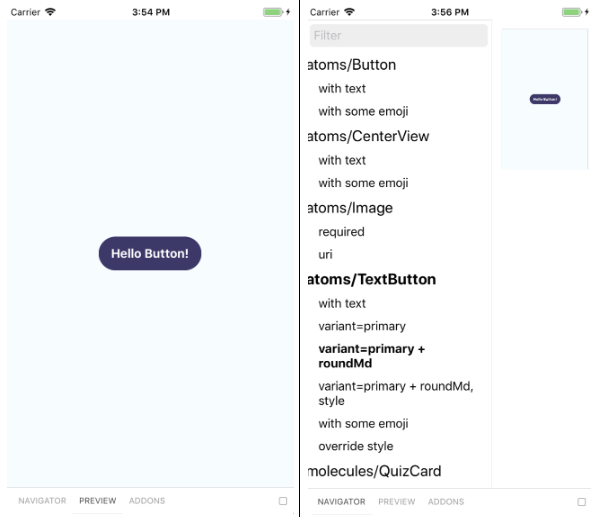
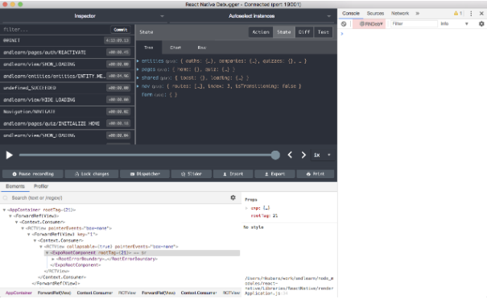
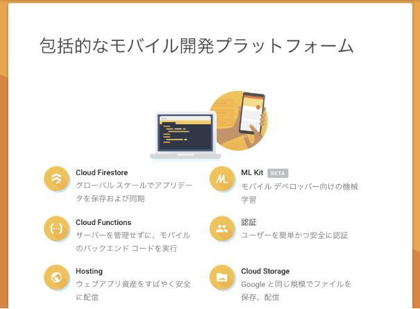

# Web エンジニアだけどスマホアプリを作ることになった件

RELATIONS 株式会社では「ええ会社をつくる」というミッション実現のために、様々な新規事業の仮説検証を行っています。そしてこの度、とある検証のためのスマホアプリを開発することとなり、私が開発を担当をすることになりました。

私は Web のフロントエンドエンジニアではありますが、スマホアプリの開発経験はほぼゼロの人です。そこで今回は「**自分のフロントエンドスキルセットを活かしつつ、最速でスマホアプリをリリースするためには、どうすればよいか？**」を色々と試行錯誤した結果を綴ってみたいと思います。

## PWA（Progressive Web Apps）じゃダメなの？

Web 技術でスマホ対応と聞いて、Web エンジニアとして真っ先に思いつくのは、「**PWA で実装できるんじゃない？**」という話なのですが、今回の要件として「iOS でのリリース」「プッシュ通知が仮説検証のためのコア機能」という 2 点があり、アプリとしての実装が必須でした。

近い将来、プッシュ通知などを含めた PWA が実現できる環境が（特に iOS 側に！）整っていると良いなぁ…と思っています。

## 結論：React Native と Expo を採用

結果だけ先にお伝えしますと、**React Native** と **Expo**を採用しました。これによって必要な知識の多くを Web 技術でまかなえたことから、**素振り 0.5 ヶ月、フロント 1 ヶ月、バックエンドを含めても合計 2 ヶ月**ほどで、ドッグフーディング版をリリースできました。

昨今、React Native と Expo を使って、開発がとても早くできたよ！という事例も、数多く見かけるようになってきたと思います。**今回は React Native と Expo を採用した場合、Web エンジニアとしては、どのあたりの知識が差分になり、どこを学習すれば良いか、という勘所を中心にお伝えできればと思います。**

# React Native と Expo

## 選定基準

「最速で仮説検証するために、最小のコストでリリースできる」ことを技術の選定基準としました。私は Web のエンジニアなので、特に「**可能な限りネイティブの知識を学ばずに済む**」ようにすることがコストの削減につながると考えました。

ネイティブの知識とは、Swift や Kotlin、Storyboard や XML、Xcode や Android Studio など。ここを Web の知識（HTML/CSS/JS）だけで済ませたい。

そこで Web 技術ベースで開発を行える環境をあたることになるのですが、著名な例としては React Native や Apache Cordova などの環境が挙げられるかと思います。いずれも長所がありますが、**社内で React を使っていることや、Expo という素晴らしいツールチェインの存在を知ったこと**もあり、React Native と Expo を使用することを選択しました。

## React Native・Expo の特徴と勘所


**React Native（以下、RN）**は Facebook 製のフレームワークで、JavaScript（以下、JS）記述のみで iOS や Android 向けのスマホアプリを開発することができるものです。ベースは React であり、その主要知識である JSX・state/props・ライフサイクルメソッド・イベントハンドリングなどは、**RN でも React と同じ知識で実装が可能です。**

Web エンジニアとしては、React に関する知識があれば、ただ「**ビルドターゲットをスマホに向けるだけ**」という感覚で開発が可能になります。コードはすべて JS 記述になるので、ロジック部分はそのまま流用でき、多くのコードベースを活かすことができます。

**Expo**は RN の開発環境です。CLI とライブラリ群を提供しています。CLI としての Expo は、スケルトン生成から、ビルド、ライブリロード、デプロイ、実機テスト、リリースまでの**開発のすべてのフローをサポートしてくれる、強力なツールチェイン**になっています。

Web エンジニアとしては、create-react-app の native 版＋リリースツールだと認識いただければ、ビルドやリリースなどの部分を webpack や create-react-app に任せて、自身はアプリの機能開発に集中できることが想像できると思います。

加えてライブラリとしての Expo は、ネイティブ UI、プッシュ通知などのラッパーを、JS のインターフェースにて提供しています。つまりこれひとつで**多くのネイティブ機能が JS 記述だけで追加できる**という、非常に便利なライブラリになっています。

まとめると、**RN と Expo を使えば、開発フロー全体は Expo に任せつつ、全体の記述を JS で、UI の記述を React ベースで行えることになります。**かなり多くの知識を Web 技術から流用できそうです。

では、新しく学習が必要なところはどこでしょうか？

# Web の知識で戦えるところ、戦えないところ



## Web の知識で戦えるところ

| カテゴリ                            | 学習済みの知識で戦えるところ               |
| ----------------------------------- | ------------------------------------------ |
| UI のコンポーネント化・イベント周り | React                                      |
| フロントエンドロジック              | Redux, Redux-Saga                          |
| フォームバリデーション              | Redux-Form                                 |
| 汎用ロジック                        | moment, lodash, validator, normalizr, etc. |
| スタイル記述 (CSS in JS)            | styled-components                          |
| Linter/Formatter                    | ESLint, Prettier                           |

RN と Expo によって、React での UI 記述や、JS 記述のロジックなど、多くの技術がそのままスマホアプリへ転用できることがわかります。心強いですね！

## Web の知識だけでは戦えないため、学習したところ

| カテゴリ                 | 学習したところ                                 |
| ------------------------ | ---------------------------------------------- |
| 開発環境                 | React Native, Expo                             |
| ナビゲーション           | React Navigation・スタックベースナビゲーション |
| ネイティブ UI            | NativeBase・レイアウト手法                     |
| メディア表現とプリロード | ロード方法・CSS との差の埋め方                 |
| ネイティブ機能           | プッシュ通知                                   |
| デバッグ                 | react-native-debugger                          |
| ビルドとリリース         | Expo                                           |
| フロントエンド以外の技術 | Firebase                                       |

ネイティブ固有の UI やナビゲーション、メディアの活用、デバッグ手法など、Web の概念と微妙に異なる知識もあります。次章では、この知識の差分を埋めるために学習した、32 のコトをご紹介していきます。

# 新たに学習した 32 のコト

## 開発環境 (2)

- [React Native](https://facebook.github.io/react-native/)
- [Expo](https://expo.io/)

前述の通りです。インストールは非常に簡単で、npm コマンドだけで終わります。あとはスケルトンプロジェクトを `expo init` で作成するだけで、すぐに開発が開始できます。

留意点として、Expo はアカウント登録が必要になりますが、登録すると Expo サーバへデプロイが可能になり、実機テストやコードのパブリッシュも容易になりますので、メリットのほうが強いです。

## ナビゲーション (3)

- ナビゲーション: [React Navigation](https://reactnavigation.org/en/)
- ドロワー: [react-navigation#createDrawerNavigator](https://reactnavigation.org/docs/en/drawer-navigator.html)
- 下タブ: [react-navigation#createBottomTabNavigator](https://reactnavigation.org/docs/en/bottom-tab-navigator.html)

**React Navigation**は、アプリ内での遷移部分を担当します（react-router のポジション）。URL リンクでの遷移ではなく、アクションを起動してスクリーン間を遷移させるような記述法になります。 `onClick = id => { this.props.history.push({id}); }` みたいな感じです。

遷移記述は「this.props.navigation からアクションを叩く」か「[Redux Middleware で紐つけておいて Saga などから叩く](https://reactnavigation.org/docs/en/redux-integration.html)」かになります。遷移先の指示はスクリーンにつけた unique 名を使い、querystring みたいなものは params として引き渡せますので、/users/:id や /posts?q=Expo みたいな指示が実質的に可能です。

```javascript
handlePressNav = (yearMonth) => {
  this.props.navigation.navigate('List', { yearMonth });
};
```

ナビゲーションの種類としては、push 遷移型のスタック（戻れる）と、replace 遷移型のドロワー、タブ、スイッチなどがあり、それらをネストさせて組み上げることが可能です。

ナビゲーションの記述については、JSX ではなく専用のデータモデルを使用しますが、React-Router で Switch/Route だけのコンポーネントをページ単位で記述するような感覚で、Navigator コンポーネントを export できます

```javascript
import { createSwitchNavigator, createStackNavigator } from 'react-navigation';

// アプリのメイン部分のナビゲーションスタック
const AppStack = createStackNavigator(
  {
    Main: MainTab, // タブナビゲーションを積む
    Quiz: QuizStack, // タブナビを使わないスタック
  },
  {
    initialRouteName: 'Main',
    headerMode: 'none',
  },
);

// 認証などを含む、最上位のナビゲーション
const RootNavigator = createSwitchNavigator(
  {
    Initialize, // 自動認証し、成功したらApp、失敗したらSignInへスイッチ
    SignUp,
    SignIn,
    App: AppStack, // Appへナビゲーションした場合は、AppStackがルーティングを担当
  },
  {
    initialRouteName: 'Initialize',
  },
);

export default RootNavigator;
```

ナビゲーション用の UI も提供されます。ドロワー・ヘッダ・タブなどがあり、Navigator コンポーネントに自動付与されます。**環境ごとに最適な UI が表示される**ため、これらの実装を省略し、作りたいことに集中できるのは、React Navigation の非常に良い点でした。

```javascript
import { createBottomTabNavigator } from 'react-navigation';
import SvgUri from 'react-native-svg-uri';

const homeIcon = require('./icon-nav-home.svg');
const homeIconCurrent = require('./icon-nav-home-on.svg');

const HomeIcon = ({ focused }) => (
  <SvgUri width="24" height="24" source={focused ? homeIconCurrent : homeIcon} />
);

const MainTab = createBottomTabNavigator(
  {
    Home: {
      screen: Home,
      navigationOptions: {
        title: 'ホーム',
        tabBarIcon: HomeIcon,
      },
    },
    Ranking: { ... },
    Setting: { ... },
  },
  {
    initialRouteName: 'Home',
    tabBarOptions: { ... },
  },
);
```



## ネイティブ UI の提供 (5)

- UI フレームワーク: [NativeBase](https://nativebase.io/)
- レイアウト記述: [styled-components/native](https://www.styled-components.com/docs/basics#react-native)
- レスポンシブデザイン: [react-native-responsive-screen](https://github.com/marudy/react-native-responsive-screen)
- モーダル: [react-native-modal](https://github.com/react-native-community/react-native-modal)
- ローディングスピナー: [react-native-loading-spinner-overlay](https://github.com/joinspontaneous/react-native-loading-spinner-overlay)

**NativeBase**は、React ベースの UI フレームワークです。Material-UI や Semantic-UI をご存知であれば、同様の書き心地で記述ができます。環境ごとのネイティブ UI を適切に使ってくれますし、テーマの設定や、styled-components による個別上書きも可能でした。

```javascript
import { Container, Button, Text } from 'native-base';

export const NativeBaseSample = () => (
  <Container>
    <Button>
      <Text>Button</Text>
    </Button>
  </Container>
);
```

スタイル記述は CSS in JS を使うことになります。**styled-components が RN に正式対応しており、CSS 的な記法でスタイリングが可能です。**

レイアウトについて Web とアプリで考え方が異なる点は、Web の場合は溢れた要素を縦方向に流しますが、**アプリの場合は一画面に収まるように要素全体をスケーリング**する場合が多いことです。そこで、[react-native-responsive-screen](https://github.com/marudy/react-native-responsive-screen), [react-native-responsive-fontsize](https://github.com/heyman333/react-native-responsive-fontSize)の 2 点を使って、画面幅基準の％指定によるレイアウトを行うようにしました。

```javascript
import styled, { css } from 'styled-components/native';
import { Button as NbButton, Text as NbText } from 'native-base';
import { heightPercentageToDP as hp } from 'react-native-responsive-screen';
import rf from 'react-native-responsive-fontsize';

import { hasVariant } from '../../../utils/style';

export const Button = styled(NbButton)`
  display: flex;
  justify-content: center;
  align-items: center;
  align-self: center;

  background-color: ${(props) => (hasVariant(props.variant, 'primary') ? '#40356f' : 'white')};

  ${(props) =>
    hasVariant(props.variant, 'rounded') &&
    css`
      height: ${hp('6.6%')};
      border-radius: ${hp('3.3%')};
    `};
`;

export const Text = styled(NbText)`
  align-self: center;

  font-size: ${rf(2.4)};
  font-weight: bold;
  color: ${(props) => {
    if (hasVariant(props.variant, 'primary')) return 'white';
    if (hasVariant(props.variant, 'default')) return '#4facfe';
    return 'gray';
  }};
`;
```


モーダルについては、Web では擬似的なものなので無限に重ねられますが、アプリの場合はシステムモーダルを使う関係で、RN 側で 1 枚制限などがかかります。特に表示切り替え時にアニメーションを入れた場合は、切り替え後のモーダルが表示制限に引っかかって表示されず、wait が必要だった、なんていう問題が出たりしますので注意が必要でした。

## メディア表現とプリロード (5)

- フォント: [Expo#Font](https://docs.expo.io/versions/v32.0.0/sdk/font/)
- 画像: [Expo#Image](https://docs.expo.io/versions/v32.0.0/react-native/image/)
- SVG アイコン: [react-native-svg-uri](https://github.com/vault-development/react-native-svg-uri)
- プリロード [Expo#Asset.fromModule](https://docs.expo.io/versions/v32.0.0/guides/assets/), Image.prefetch, Font.loadAsync
- エフェクト: [Expo#LinearGradient](https://docs.expo.io/versions/v32.0.0/sdk/linear-gradient/), etc.

画像やアイコン、フォントなどについては、Web と同じように遅延読み込みされます。気をつけたい点としては、Web の世界では初期レンダリング時にコンテンツが完全表示されないことは一般的な事象ですが、アプリの場合は**アセットをすべてダウンロードしてから画面を表示する**ことが多いでしょう。

そういった場合は、アセットの準備完了を同期するために、 Asset.fromModule, Image.prefetch, Font.loadAsync などのプリロードメソッドをそれぞれ使用し、await Promise.all([...]) で待ち受けてから表示する、というような実装が必要でした。

```javascript
function cacheImages(images) {
  return images.map((image) => {
    if (typeof image === 'string') {
      return Image.prefetch(image);
    }
    return Asset.fromModule(image).downloadAsync();
  });
}

const assetImages = cacheImages(images);
await Promise.all([...assetImages, ...others]);
```

グラデーションなどのエフェクトは、CSS in JS では記述できず、ネイティブ機能に頼ることになります。Expo が**LinearGradient コンポーネント**を提供していますので、私はそれを使用しました。アニメーションについては Lottie が推奨されています。

```javascript
import { LinearGradient as ExLinearGradient } from 'expo';

const LinearGradient = styled(ExLinearGradient).attrs({
  colors: ['#cccaee', '#6c699b'],
})`
  flex: 1;
  width: 100%;
  height: 100%;
`;

export const MainContainer = ({ children }) => (
  <SafeAreaView>
    <Container>
      <LinearGradient>
        <Content>{children}</Content>
      </LinearGradient>
    </Container>
  </SafeAreaView>
);
```

## 各種ネイティブ機能の利用と設定 (5)

- プッシュ通知: [Expo#Push Notifications](https://docs.expo.io/versions/latest/guides/push-notifications/)
- ディープリンク: [Expo#Linking](https://docs.expo.io/versions/v32.0.0/workflow/linking/)
- 端末情報: [react-native-device-info](https://github.com/react-native-community/react-native-device-info)
- AppIcon: [Expo#app.json#icon](https://docs.expo.io/versions/v32.0.0/guides/app-icons/)
- スプラッシュスクリーン: [Expo#app.json#splash](https://docs.expo.io/versions/v32.0.0/guides/splash-screens/)

Web エンジニアには利用が難しいネイティブ機能、その中でもプッシュ通知はアプリ開発におけるコア機能と言えます。こういったネイティブ絡みの機能の活用は、React Native（以下、RN）でアプリを作るための大きなモチベーションですね。

そんなプッシュ通知機能ですが、**Expo はライブラリを提供するだけでなく、なんとプッシュ通知用のサーバまで提供してくれます！**ですので Expo の領域内で、プッシュ通知の生成から配信までを一貫して構築可能になっています。素晴らしいですね！

```javascript
exports.sendNotification = functions.firestore
  .document('users/{userId}/messages/{messageId}')
  .onCreate(async () => {
    const { params: { userId, messageId } = {} } = context || {};

    const userRef = db.collection('users').doc(userId);
    const userSnapshot = await userRef.get().catch(() => ({}));
    const user = userSnapshot.data();
    const { deviceToken } = user || {};

    const message = {
      to: deviceToken,
      sound: 'default',
      body: '新しいメッセージを受信しました！',
      data: { type: 'messageCreated', userId, messageId },
    };

    const chunks = expo.chunkPushNotifications([message]);
    const tickets = [];

    chunks.forEach(async (chunk) => {
      const ticketChunk = await expo
        .sendPushNotificationsAsync(chunk)
        .catch((error) => console.error(error));
      tickets.push(...ticketChunk);
    });

    return tickets;
  });
```

アプリのアイコン（AppIcon）やスプラッシュスクリーンなどの設定も、Expo で完結できます。**app.json というファイルに設定を記述**することによって、環境の差を自動で埋めてくれますので、開発者としてはこれらの画像の用意と、簡単な記述を行うだけで OK です。

```json
{
  "expo": {
    "orientation": "portrait",
    "primaryColor": "#665d8c",
    "icon": "./assets/icon.png",
    "splash": {
      "image": "./assets/splash.png",
      "resizeMode": "cover",
      "backgroundColor": "#9a96dd"
    },
    ...
  }
}
```

その他のネイティブ機能やネイティブ設定などについても、その多くが Expo のライブラリによってサポートされます。実際にこれらの実装において Xcode や Android Studio を開く必要はなく、すべて JS で完結することができました。本当にありがたい話です。

## デバッグ (4)

- UI カタログ: [Storybook for React Native](https://storybook.js.org/docs/guides/guide-react-native/), [react-native-storybook-loader](https://github.com/elderfo/react-native-storybook-loader)
- 要素の検証: [react-native-debugger](https://github.com/jhen0409/react-native-debugger)
- Redux: [redux-devtools-extension](https://github.com/zalmoxisus/redux-devtools-extension)
- エラー検知: [Expo#Sentry](https://docs.expo.io/versions/v32.0.0/guides/using-sentry/)

Web エンジニアとしてはお馴染みの**Storybook**で、Web と同様の UI カタログが作れます。表示はシミュレータ上で、操作は Web ブラウザから、それぞれ行うことができます。

```javascript
import React from 'react';
import { storiesOf } from '@storybook/react-native';
import styled from 'styled-components/native';

import TextButton from '..';
import CenterView from '../../CenterView';

storiesOf('atoms/TextButton', module)
  .addDecorator(getStory => <CenterView>{getStory()}</CenterView>)
  .add('with text', () => <TextButton>Hello Button!</TextButton>)
  .add('variant=primary', () => <TextButton variant="primary">Hello Button!</TextButton>)
  .add('variant=primary + roundMd', () => (
    <TextButton variant="primary roundMd">Hello Button!</TextButton>
  ))
</QuizButton>);
```



注意点として、執筆時点では Expo と Storybook の食い合わせがやや悪いため、story の更新に**react-native-storybook-loader**が必要になりました。近日 v5 で解決されるかもしれません。

余談ですが、v4 からスタンドアロンアプリ形式で storybook 配布が可能になりました。ビルドパイプラインを分けて、storybook 用の配信チャネルを別途設けておくと、デザインチェックが捗る気がします。ぜひ試してみたいですね。

デバッグは、Web エンジニアは Chrome の検証タブを頻用していると思います。**react-native-debugger**をインストールすると、この検証タブを RN アプリに接続できるようになりますのでオススメです。UI のインスペクタ表示も Redux のトレースも可能です。



もうひとつ、RN 組み込みのデバッグメニューもあり、こちらはシミュレータ上から Cmd+D で表示できます。こちらの固有機能としては、ライブリロードの ON/OFF などがあります。（Cmd+R で手動更新できるので、ロジック調整時などに使用しています）。

このように、デバッグについては Web 開発とほぼ同様の手法で可能です。心強いですね！

## ビルドとリリース (4)

- スタンドアロンビルド: [expo build](https://docs.expo.io/versions/v32.0.0/distribution/building-standalone-apps/)
- テスター向け配信: TestFlight/Expo Client
- パブリッシュ／コードアップデート: [expo publish --channel](https://docs.expo.io/versions/v32.0.0/workflow/publishing/)
- アプリリリース

Web の場合と大きく異なる部分です。ですが多くのフローを Expo がサポートしてくれます。

スタンドアロンのアプリをビルドする操作は、**expo-cli を使って build コマンドを叩くだけ**です。オプション無指定であれば、iOS/Android それぞれのバイナリを一括生成してくれます。

```bash
$ expo publish
```

配布については、各プラットフォームの流儀に則って進めていく必要があります。

テスター向けにアプリを配信する場合、Web であれば自前テストサーバにデプロイすれば OK ですが、スマホアプリの場合は審査が入ります。

iOS の場合は TestFlight を使い、審査を受けてからテスターへ公開します。Android の場合は公開用の Expo アカウントを作成し、ExpoClient 経由でテスターへ公開する形が最短です（審査不要）が、よりしっかりとやる場合は、GooglePlay のテスト配信機能を使うことになるでしょう。

本番リリースにおいても、審査を通して、公開するというプロセスが必要になります。Web のリリースと比べて、どうしても面倒に感じてしまうところですね…。

他方、コードのアップデートについては、JS バンドルの再配布のみで気軽に行なえます。**CLI から publish を行えば、Expo サーバ経由で更新が自動配信**され、設定した更新ポリシーに基づいて自動更新できます（自動更新・ダイアログで確認して更新など）。

**デバッグ用／テスト用／公開用など、チャネルを分けてパブリッシュも可能です。**テストビルドや storybook ビルドなどの配布は、個別にチャネルを分けて配信することができます。

```bash
$ expo publish --release-channel stg
```

以上のように、アプリの公開に関しては Expo の力を借りることはできないのですが、アプリのビルドやアップデートに関しては、Expo の力で簡単に行うことができるようになっています。

## フロントエンド以外の技術 (4)

- 認証: [Firebase Authentication](https://firebase.google.com/docs/auth/?hl=ja)
- データストア: [Cloud Firestore](https://firebase.google.com/docs/firestore/?hl=ja)
- プッシュ通知トリガ／バッチ処理: [Cloud Functions for Firebase](https://firebase.google.com/docs/functions/?hl=ja)
- 管理画面ホスティング: [Firebase Hosting](https://firebase.google.com/docs/hosting/?hl=ja)



いわゆるバックエンド側は**Firebase**で固めました。mBaaS を使うことで、バックエンド部分を専門のエンジニアに実装を依頼する形ではなく、自分自身で、データストア（Firestore）・バッチ処理（Cloud Functions）・認証（Authentication）まで構築することに成功しました。しかもこれらの実装記述は JS だけで可能です。昨今 JS がどんどん汎用性を持っていくことに驚きと楽しさを感じます。

データベースには**Cloud Firestore**を使用しています。NoSQL 系であり、情報を正規化せずに保存することが多いため、慣れが必要かもしれません。しかしながら上手くデータモデリングすると、「Read キャッシュが JSON で保存されている」ような環境が実現できます。

CRUD は専用の API を通して行います。単に REST のような使い方もできますが、リアルタイムデータベースですので、データ更新のリッスンができ、更新内容のプッシュを受けることができます。**リッスンはエンティティだけではなくクエリで行うことも可能**で、たとえばクエリで画面全体のデータを表現できていれば、結果的にオートリフレッシュのような機能を高速に実装することも可能になります。

```js
db.collection('cities')
  .where('state', '==', 'CA')
  .onSnapshot(function (querySnapshot) {
    var cities = [];
    querySnapshot.forEach(function (doc) {
      cities.push(doc.data().name);
    });
    console.log('Current cities in CA: ', cities.join(', '));
  });
```

プッシュ通知のバックエンドは、**Cloud Functions**を利用します。**Firestore の更新トリガと連携させることができ、**そこから Expo サーバと接続してプッシュする形式です。下記が簡易的な例になります。詳細は弊社大川の記事をぜひご覧ください！

```js
exports.sendNotification = functions.firestore
  .document('users/{userId}/messages/{messageId}')
  .onCreate(async () => {
    const { params: { userId, messageId } = {} } = context || {};

    const userRef = db.collection('users').doc(userId);
    const userSnapshot = await userRef.get().catch(() => ({}));
    const user = userSnapshot.data();
    const { deviceToken } = user || {};

    const message = {
      to: deviceToken,
      sound: 'default',
      body: '新しいメッセージを受信しました！',
      data: { type: 'messageCreated', userId, messageId },
    };

    const chunks = expo.chunkPushNotifications([message]);
    const tickets = [];

    chunks.forEach(async (chunk) => {
      const ticketChunk = await expo
        .sendPushNotificationsAsync(chunk)
        .catch((error) => console.error(error));
      tickets.push(...ticketChunk);
    });

    return tickets;
  });
```

アプリ用の管理画面（Web）も作成したのですが、CRUD のロジックはアプリと全く同じ知識が使用できたため、アプリと同じように Firestore を叩くだけで実装できました。このためかなりの処理が共通化できています。

**管理画面のデプロイについては、Hosting が提供する CLI のコマンド一つで完了できます。**実装以外にかかるはずだった手間がほぼゼロになり、そのぶん開発に集中できる環境を得ることができました。非常に大きなメリットです。

```bash
$ firebase deploy
```

このように Firebase には、フロントと同じ JS 記述でバックエンド開発が可能になる環境が整っていますので、フロントエンドエンジニアとしてはガンガン採用したいサービスです。ちなみにほかの選択肢として AWS Amplify などもあります。こちらも試してみたいですね。

# 結果

開発の結果ですが、社内のドッグフーディング版をリリースするまでに、**素振り期間を加えても 2 ヶ月程度で完成**させることができました。

チーム内でアプリの開発実績がない中、このスピード感でリリースすることができたことについて、プロダクトオーナー側からは、品質・速度感ともに高い評価を受けました！

# まとめ

Web エンジニアがスマホアプリをリリースするまでに学んだことについて共有させていただきました。

全編を通して感じたのは、JS スキルのカバレッジの高さです。ブラウザの世界を超え、**バックエンドからアプリ開発まで、非常に潰しの効くスキルになってきた**なと感じます。もうひとつは Web 開発スキルのポータビリティが向上したことです。RN によって環境間におけるスキルセットの垣根が低くなったことは、とても喜ばしいことだと感じています。これらによりエンジニアは、**適応すべきコンテキストを減らせますから、より本質的価値の開発に素早く注力でき、**ビジネス側の期待にも応えやすくなることでしょう。

もちろん RN 万能！というわけではないと思います。速さを求めるアプリや、個別のカスタマイズが多いアプリ、デバイスのエッジな機能を使うようなアプリなどでは、RN よりもネイティブで開発したほうが良い場面も出てくると思います。要は使い所の問題なだけで、**今回のように仮説検証のような速度感を求められるフェーズにおいては、最適解のひとつだなと感じました。**

個人的には、スマホアプリの開発ができるようになったことで、**Web エンジニアの域を超えて、表現の幅を大きく増やせたことに満足感を得ています。**自分の提供可能なスキルセットに「スマホアプリ」を加えられたことは、より多くの環境で自分がコミットできることになるため、さらに多くの面白い案件に関われることになりそうで楽しみです。
