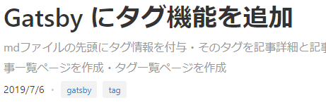
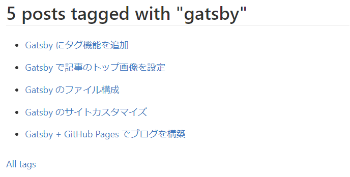
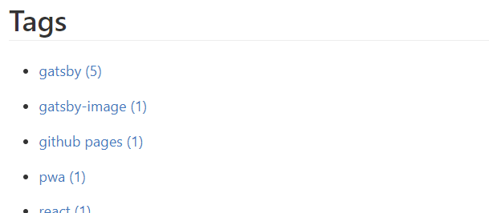
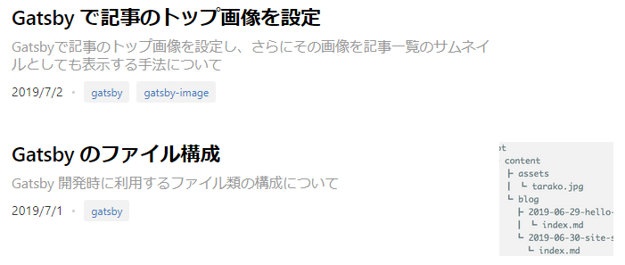

この記事のタイトル部分に表示されているような「タグ機能」を実装する方法について解説します。

# 記事にタグカラムを追加

タグを指定するカラムを、md ファイルの先頭に追加します。前回トップ画像情報を追加したときと同じ手法です。

```yaml{3}:index.md
---
...
tags: ['gatsby', 'tag']
---
```

タグは複数つけられるため、配列で指定できるようにしています。タグの名称は予め登録しておく必要はなく、そのときに自由に記述して OK です。

# 記事詳細にタグを表示

## query

markdown からタグを抽出します；

```javascript{7}:BlogPost/index.js
export const pageQuery = graphql`
  query {
    ...
    frontmatter {
      date(formatString: "MMMM DD, YYYY")
      ...
      tags
```

## component

このタグ情報を表示するコンポーネントを作成します；

```javascript:Tags/index.js
import React from 'react';
import { Link } from 'gatsby';
import kebabCase from 'lodash/kebabCase';

import styles from './index.module.scss';

const Tag = ({ tag }) => (
  <Link className={styles.link} to={`/tags/${kebabCase(tag)}/`}>
    <li className={styles.tag}>{tag}</li>
  </Link>
);

const Tags = ({ tags }) => (
  <ul className={styles.tags}>
    {(tags || []).map(tag => (
      <Tag key={tag} tag={tag} />
    ))}
  </ul>
);

export default Tags;
```

記事詳細テンプレートで、この Tag コンポーネントを import し利用すると、下記のように表示されて、タグ表示は完了です。



# タグ一覧ページを追加

タグをクリックすると、そのタグが紐付けられている記事一覧を表示するようなページを作成します。

1. `gatsby-node.js`: 全 md ファイルからタグを抽出して分類し、各タグごとの記事一覧ページである HTML を `/tags/{tagName}` の URL で出力する処理を書く
2. `templates/Tags/index.js`: `/tags/{tagName}` ページのテンプレートを作成する

## gatsby-node.js

記事情報を取得する query の frontmatter に tags を追加し、md ファイルからタグ情報を取得しておきます；

```javascript{8}:gatsby-node.js
const result = await graphql(`
{
  allMarkdownRemark(sort: { fields: [frontmatter___date], order: DESC }, limit: 1000) {
    edges {
      node {
        frontmatter {
          ...
          tags
        }
`);
```

記事情報を取得できたら、そこからタグ情報を抽出し、重複を取り除きます。得られたタグ配列を使用して、createPage でタグ毎のページを出力させます；

```javascript:gatsby-node.js
  const posts = result.data.allMarkdownRemark.edges;
  const tags = posts.reduce((tags, edge) => {
    const edgeTags = get(edge, 'node.frontmatter.tags');
    return edgeTags ? tags.concat(edge.node.frontmatter.tags) : tags;
  }, []);

  const tagTemplate = path.resolve(`./src/components/templates/Tags/index.js`);
  [...new Set(tags)].forEach(tag => {
    createPage({
      path: `/tags/${kebabCase(tag)}/`,
      component: tagTemplate,
      context: {
        tag,
      },
    });
  });
```

## templates/Tags/index.js

createPage で生成するタグページのテンプレートです。

### query

`gatsby-node.js`から受け取った`context.tag`を query の filter 条件に利用することで、そのタグが紐ついている md ファイルのみを抽出することができるようになります；

```javascript{2,9}:templates/Tags/index.js
export const pageQuery = graphql`
  query($tag: String) {
    site {
      ...
    }
    allMarkdownRemark(
      limit: 2000
      sort: { fields: [frontmatter___date], order: DESC }
      filter: { frontmatter: { tags: { in: [$tag] } } }
    ) {
      ...
    }
  }
`;
```

### component

query で取得した記事情報をもとに、記事一覧を表示します；

```javascript{12-16}:templates/Tags/index.js
const Tags = ({ location, pageContext, data }) => {
  const { tag } = pageContext;
  const { edges, totalCount } = data.allMarkdownRemark;
  const tagHeader = `${totalCount} post${totalCount === 1 ? '' : 's'} tagged with "${tag}"`;
  const siteTitle = data.site.siteMetadata.title;

  return (
    <Layout location={location} title={siteTitle}>
      <Seo title={tagHeader} />
      <h1>{tagHeader}</h1>
      <ul>
        {edges.map(({ node: { fields: { slug }, frontmatter: { title } } }) => (
          <li key={slug}>
            <Link to={slug}>{title}</Link>
          </li>
        ))}
      </ul>
      <p>
        <Link to="/tags">All tags</Link>
      </p>
    </Layout>
  );
};
```

このようなページが作成できました；



# タグ一覧ページ

すべてのタグを表示できるページも用意しましょう。`/tags`で表示できるようにします。

## query

`group`を利用することで、tag で groupby をかけた結果を得ることができます。totalCount を受け取って、記事の総数も表示できるようにしましょう；
https://www.gatsbyjs.org/docs/graphql-reference/#group

```javascript:pages/tags.js
export const pageQuery = graphql`
  query {
    site {
      siteMetadata {
        title
      }
    }
    allMarkdownRemark(limit: 2000) {
      group(field: frontmatter___tags) {
        fieldValue
        totalCount
      }
    }
  }
`;
```

## component

groupby した結果をもとに、タグ一覧を表示します；

```javascript:pages/tags.js
const TagsPage = ({
  location,
  data: {
    allMarkdownRemark: { group },
    site: {
      siteMetadata: { title },
    },
  },
}) => (
  <Layout location={location} title={title}>
    <Seo title="Tags" />
    <h1>Tags</h1>
    <ul>
      {group.map(tag => (
        <li key={tag.fieldValue}>
          <Link to={`/tags/${kebabCase(tag.fieldValue)}/`}>
            {tag.fieldValue} ({tag.totalCount})
          </Link>
        </li>
      ))}
    </ul>
  </Layout>
);
```

このようなページが作成できました；



# 記事一覧に表示

`pages/index.js`の query に tags を加えれば、記事一覧にもタグを表示できます。手法は同じのため、詳細は割愛します。



# references

- [Creating Tags Pages for Blog Posts | GatsbyJS](https://www.gatsbyjs.org/docs/adding-tags-and-categories-to-blog-posts/)
