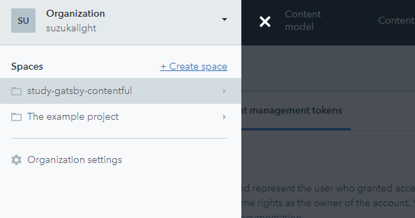
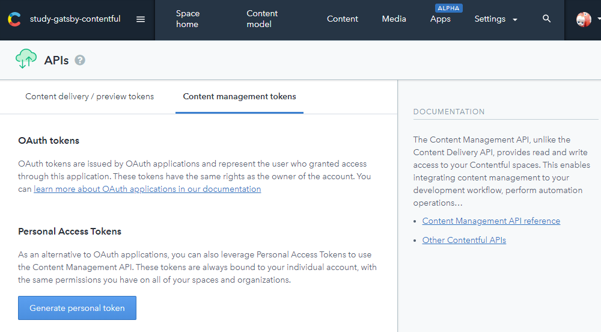
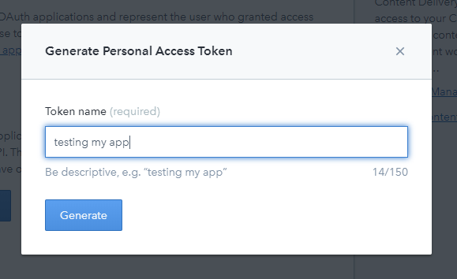
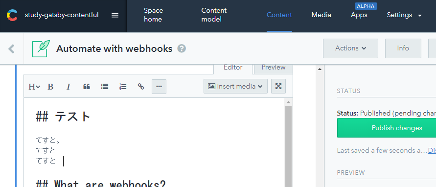

[Contentful](https://www.contentful.com/) は Headless-CMS と呼ばれる仕組みを提供しており、コンテンツの設計と配信（API）のみを受け持つようなサービスになっています。WordPress との違いは、コンテンツ表示までは担当していないところです。

Gatsby でこれを利用することで、コンテンツは SaaS 側に載せて管理しておき、Web システムは React 系で作成する、ということができるようになります。

これにより、サイト管理は Git が使えない一般の人にもできて、開発は React、配信は JAMstack でできるという、フロントエンドエンジニアにとって夢の環境が実現できます（単に WordPress を触りたくないだけとも言う）

早速、Contentful で Gatsby を素振りしてみました。公式のこれにしたがって、Web サイトを 1 つ作ってみます；

https://www.contentful.com/r/snippetbase/gatsbyjs-and-contentful-in-five-minutes/

# gatsby-contentful-starter

公式の starter をもとに、リポジトリをセットアップします；

```bash
gatsby new study-gatsby-contentful https://github.com/contentful-userland/gatsby-contentful-starter
```

# Contentful のセットアップ

## サインアップ

まずサインアップ。GitHub Pages にデプロイするので、そのアカウントで登録するほうが、後々楽になるかと；

https://www.contentful.com/sign-up/

利用目的を聞かれる（サンプルの Space を 1 つ用意してくれる）ので、左側の WebApp を選択しました。このサンプルは使用しない予定ですが、Web サイトのコンテンツ例として非常に良くできているので、今後の参考になりました。

## Space の作成

無料枠では 2 つの Space を作成できるので、2 つ目の枠でハンズオンしてみます。ドロワーから `+ Create space` を選択；



Free 枠を選択し、適当なスペース名（ここでは study-gatsby-contentful とした）を入力して完了。

## tokens の作成

Contentful で Web サイトを作成するには、下記 3 つのトークンが必要のようです。それぞれ作成していきます；

- Content Management Token
- Content Delivery Token
- Content Preview Token

### Content management tokens

`Settings->APIs` から `Content management tokens` を選択して、 `Generate personal token` を作成；



どういう利用法のトークンなのかを訊かれるので、適当に説明；



API Token は 1 回しか表示できないので、必ずコピーしておき、適切に保管しておきます。

### Content delivery / preview tokens

つづけて `Delivery token` と `Preview Token` を作成。`Settings->APIs` の `Content delivery / preview tokens` を選択し、 `Add API key` をクリックすれば作成完了。

# gatsby-contentful-starter の設定

作成したトークンを starter に設定します。`yarn setup` コマンドがあり、自動設定してくれるようになっています；

```bash
$ yarn setup

$ Your Space ID
$ Your Content Management API access token
$ Your Content Delivery API access token

...

The import took a few seconds (27s)
No errors or warnings occurred
The import was successful.
All set! You can now run yarn run dev to see it in action.

Done in 109.99s.
```

このとき、Contentful のコンテンツをもとに、Web サイトのビルドも合わせて行ってくれるため、この時点ですでに手元で SSG されている状態になります。

なお、設定したトークンの情報は、 `.env.development` などのファイルに書き出されます。このファイルは `.gitignore` されているため、リポジトリにプッシュしても漏洩の心配はなさそうです。

# 開発用ビルド

```bash
$ yarn dev

...

DONE  Compiled successfully in 2670ms
You can now view gatsby-contentful-starter in the browser.⠀
  http://localhost:8000/
```

あっという間に完成です。


> **Static Sites are great!**

おっしゃる通り。

# コンテンツの書き換え

試しに Contentful の Contents を書き換えてみましょう。`Content` から適当に 1 つ（たとえば一番上の記事）を選択して、Markdown を書き加えてみます；



そして `Publish changes` をして、 `yarn develop` をし直せば…書き換わっています！


> さすがに Contentful を書き換えたら、自動的にプレビュー側も更新されている…ということはありませんでしたが、あるいは webhooks とかで設定できれば、できるかもしれない…？

> ちなみに、develop で取得したコンテンツは、Preview トークンを利用しているので、Unpublished なコンテンツも引っ張れるようになっているようです。

# デプロイ

## GitHub Pages 向けの設定

デフォルトの URL 設定から、GitHub Pages 向けの設定に変更しておきます。具体的には `pathPrefix` を除去し、独自のサブドメインをセットしました；

```javascript{4-5}:gatsby-config.js
module.exports = {
  siteMetadata: {
    title: 'Gatsby Contentful starter',
    siteUrl: `https://study-gatsby-contentful.suzukalight.com`,
  },
  plugins: [
```

サブドメインを利用する場合は、DNS 側でサブドメインを作成した後、CNAME レコードを向けておきます。

## GitHub Pages へのデプロイ

ほかの starter と同様、下記のコマンドが利用できました；

- `yarn build` : 本番ビルド
- `yarn deploy` : GitHub Pages への公開

```bash
$ yarn deploy

...

info Done building in 15.659 sec

Published
Done in 27.92s.
```

GitHub Pages でホスティングできました、これで完了です！


# 成果物

https://github.com/suzukalight/study-gatsby-contentful
