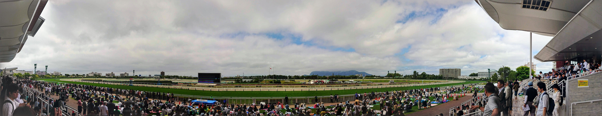

# 目的

```
- 函館競馬場に行く
    - 中央10場全制覇の旅
    - よゐこステージ
    - 馬場開放イベント
- 美味い海鮮を食べまくる
    - ラビスタ函館ベイの朝食バイキング
    - 函太郎
    - まるかつ水産
- 美味いローカルフードを食べまくる
    - ラッキーピエロ（チャイニーズチキンバーガー）
    - ハセガワストア（やきとり弁当）
    - 沼の家（大沼だんご）
- 幕末開港地を楽しむ
    - 函館市旧イギリス領事館
    - ハリストス正教会・カトリック元町教会
    - 金森赤レンガ倉庫
- 景色を楽しむ
    - 函館山夜景
    - 城岱牧場展望台
    - 五稜郭
    - 八幡坂・二十間坂
```

# 1 日目（2019/7/17)：五稜郭

- **行程：** 自宅 → 羽田空港 → 函館空港 → 五稜郭 → ラビスタ函館ベイ
- **食事：** 回転寿司（函太郎五稜郭公園店）

<TwitterEmbed tweetId="1151369886246899712" />
<TwitterEmbed tweetId="1151484420966121473" />

# 2 日目（2019/7/18)：駅前・元町エリア

- **行程：** ホテル → 金森赤レンガ倉庫 → 緑の島 → 函館市臨海研究所 → 箱館丸 → 函館市旧イギリス領事館 → ハリストス正教会 → カトリック元町教会 → ハセガワストア → 函館山ロープウェイ → 函館山夜景 → ホテル
- **食事：** 朝食バイキング（ラビスタ函館ベイ）、アフタヌーンティーセット（函館市旧イギリス領事館）、やきとり弁当（ハセガワストア）

<TwitterEmbed tweetId="1151678205905870848" />
<TwitterEmbed tweetId="1151748635576586241" />
<TwitterEmbed tweetId="1151795627849732096" />
<TwitterEmbed tweetId="1151833696296550400" />

# 3 日目（2019/7/19)：函館東部

- **行程：** ホテル → 立待岬 → コーヒールームきくち → トラピスチヌ修道院 → 湯の川温泉足湯 → ラッキーピエロ → ホテル
- **食事：** 朝食バイキング（ラビスタ函館ベイ）、ナポリタン＋ケーキセット（コーヒールームきくち）、チャイニーズチキンバーガーセット（ラッキーピエロマリーナ末広店）

<TwitterEmbed tweetId="1152141693451243520" />
<TwitterEmbed tweetId="1152144817205334016" />
<TwitterEmbed tweetId="1152184217259761664" />

# 4 日目（2019/7/20)：北斗市・大沼公園

- **行程：** ホテル → 新函館北斗駅 → 沼の家 → 大沼公園 → 城岱牧場 → まるかつ水産 → ホテル
- **食事：** 朝食バイキング（ラビスタ函館ベイ）、大沼だんご（沼の家）、回転寿司（まるかつ水産）

<TwitterEmbed tweetId="1152511604585447424" />
<TwitterEmbed tweetId="1152514056168722432" />

# 5 日目（2019/7/21)：函館競馬場

- **行程：** ホテル → 函館競馬場 → 函館空港 → 羽田空港 → 自宅
- **食事：** 朝食バイキング（ラビスタ函館ベイ）、あじさい（塩ラーメン＋カレーチャーハン）、ホッケフライ定食＋ザンギ（函館空港）



<TwitterEmbed tweetId="1152809583968227328" />
<TwitterEmbed tweetId="1152872951902982144" />

# 所感

雰囲気も景色も食事も最高でした。とてもオススメできる。食事が（安価なのに）非常に美味しいものが多くて、函館の人が羨ましい！

あと、夏に行くと本当に気持ち良い。東京や名古屋の夏は蒸し暑くて灼熱地獄って感じだけど、函館は湿度も低くてカラッといい天気。夏は函館でリモートワークしたい。

長崎とか横浜とかが好きな人は、函館も絶対楽しめるので、ぜひ旅行して欲しいなと思います。
