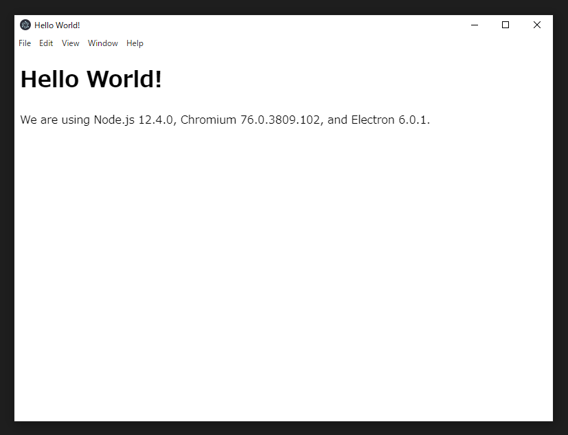

# Windows で Electron 開発環境を整えたい

Windows で Node を試す場合は、最近だと WSL での実行例も多い気がしますが、Windows 向けの Electron バイナリを生成する場合は、WSL で実行してしまうと「Unix 環境向けの開発になってしまう」ので、Windows バイナリ向けの開発環境としては適切ではないと感じました。

ここでは、Windows 環境（PowerShell）において、Node と Electron 環境を構築する方法について紹介します。

# 手順

## OS + VSCode

私の環境は MacBook Pro + Parallels + Windows10 です。純 Windows 環境でも結果は同じになるかと思います。

- Parallels
- Windows10
- Visual Studio Code
  - 「管理者として実行」してください

## nvm-windows

Node バージョン管理ツールとして、[nvm-windows](https://github.com/coreybutler/nvm-windows) を使用します。上記の URL から nvm-setup.zip をダウンロードし、そこからインストーラを取り出してインストールすれば OK です。

続けて、nvm-windows を使用して実際に Node と Yarn をインストールします；

```bash
$ nvm install 12.4.0
$ nvm use 12.4.0
$ node -v
> v12.4.0
```

```bash
$ npm i -g yarn
$ yarn -v
> 1.17.3
```

## Chocolatey

Windows のパッケージ管理ツール、[Chocolatey](https://chocolatey.org/) をインストールします。PowerShell 経由でのインストールは、下記の URL を参考に行います；

https://chocolatey.org/install#install-with-powershellexe

```powershell
$ Set-ExecutionPolicy Bypass -Scope Process -Force; iex ((New-Object System.Net.WebClient).DownloadString('https://chocolatey.org/install.ps1'))
$ Set-ExecutionPolicy -Scope CurrentUser RemoteSigned
```

ここで vscode を再起動。

## posh-git

Git をインストールします。補完機能などがついている [posh-git](https://github.com/dahlbyk/posh-git) を使用します。

```powershell
$ choco install poshgit
> $ y
> $ y
```

ここで vscode を再起動。

```bash
$ git --version
> git version 2.20.0.windows.1
```

## electron-quick-start

以上で環境は整いました。いよいよ Electron の公式クイックスタートである、https://github.com/electron/electron-quick-start を試します。

```bash
$ git clone https://github.com/electron/electron-quick-start
$ cd electron-quick-start
$ yarn
$ yarn start
```

下記のような画面が表示されれば、成功です！


