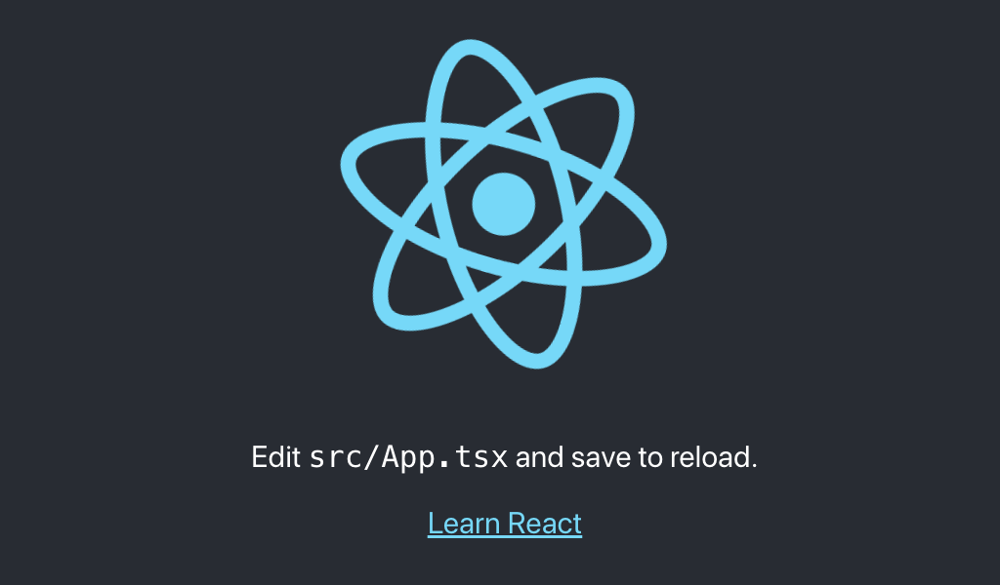
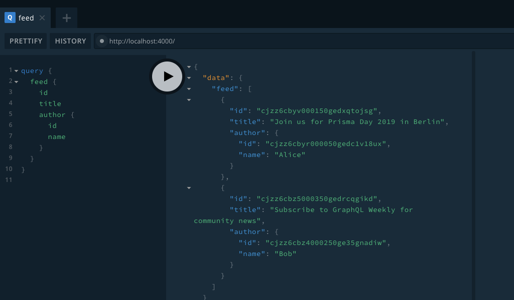

Monorepo 環境で、**yarn workspace** を使って、**create-react-app --typescript** した client ワークスペースと、**prisma2** で作成した server ワークスペースを共存させる手順のメモです。Lint, Prettier, Husky の設定も行います。

# 前提条件

## 完成品

手元で同様の手順を踏んだリポジトリを、GitHub 上に公開していますので、併せてご参照ください。

https://github.com/suzukalight/monorepo-react-prisma2

## 動作環境

- Mac
- Node.js v10.16.0
- npm v6.9.0
- create-react-app (react-script v3.1.1)
- prisma2 v2.0.0-preview-5
- TypeScript v3.5.3
- Lint, Prettier, Husky

## ＜概説＞ワークスペース（Yarn Workspaces）とは？

https://yarnpkg.com/lang/ja/docs/workspaces/

> デフォルトで利用できるパッケージのアーキテクチャを設定する新しい方法です。ワークスペースにより複数のパッケージを設定する際に、 yarn install を一度実行するだけで、それらの全てが単一のパスにインストールされるようになります。

1 つのプロジェクトを立ち上げるとき、クライアント・サーバ・共通ロジック・Lambda・デザインシステム・LP などの様々なサブプロジェクトが必要になることは多いと思います。これらを 1 つのリポジトリで扱えるようにする考え方が Monorepo であり、それを実現する手段がワークスペースとなります。

Monorepo 環境の管理には、現在においては Lerna などが方法として存在しますが、ワークスペースはより低レベルでプリミティブな、内部依存関係の解決に特化した仕組みを提供してくれるものです。

# セットアップ: yarn workspace

## リポジトリ作成

ハンズオン形式で進めます。まずは簡単にリポジトリの作成から；

```bash
$ mkdir monorepo-react-prisma2
$ cd monorepo-react-prisma2
$ git init
$ yarn init -y
```

```text:.gitignore
# dependencies
node_modules

# misc
npm-debug.log*
yarn-debug.log*
yarn-error.log*
```

## package.json で workspace を設定

yarn workspace で Monorepo 環境を構築する場合は、package.json に `private: true` と `workspaces: {...}` の 2 つを記述することになっています。

- `packages:` ワークスペースの対象となるディレクトリを指定します。ワイルドカード指定が可能です。
- `nohoist:` 指定した npm モジュールを、子ワークスペースごとで個別に管理させることができるようになります。指定していなかった npm モジュールは、ワークスペース間で共用利用になり、ディスク容量が削減できるなどのメリットを得ることができます。

```json:package.json
{
  "name": "monorepo-react-prisma2",
  "version": "1.0.0",
  "main": "index.js",
  "author": "suzukalight <mail@mkubara.com>",
  "license": "MIT",
  "private": true,
  "workspaces": {
    "packages": [
      "src/*"
    ],
    "nohoist": [
      "**/react-scripts",
      "**/react-scripts/**",
      "**/@generated",
      "**/@generated/**"
    ]
  }
}
```

# client: create-react-app --typescript

## ワークスペース作成

create-react-app で TypeScript の環境を作成します。**（eject は使用しません）**；

```bash
$ npx create-react-app src/client --typescript
```

## yarn workspace client add

個別のワークスペースでのみ使用する npm モジュールをインストールする場合は、`yarn workspace [ws-name] add` コマンドを使用します。

ここでは、client 側でしか使わないようなパッケージのインストールを行うために、`yarn workspace client add` コマンドを使用してみます；

```bash
$ yarn workspace client add node-sass
```

成功すると、client 側の package.json にのみ、設定が追加されます；

```json:/src/client/package.json
{
  "dependencies": {
    "node-sass": "^4.12.0",
  },
}
```

## yarn workspace client start

個別のワークスペースに記述した npm スクリプトは、`yarn workspace [ws-name] [script-name]` コマンドで起動することができます。

この仕組みを利用して、ルートの package.json に、client の dev-server 起動コマンドを追加します；

```json:package.json
{
  "scripts": {
    "cl:start": "yarn workspace client start",
  },
}
```

これでクライアントの開発環境が起動できるようになりました；

```bash
$ yarn cl:start
```

http://localhost:3000/



# server: Prisma2

今回は手軽に GraphQL サーバを立てられる [Prisma2](https://www.prisma.io/blog/announcing-prisma-2-zq1s745db8i5) と [graphql-yoga](https://github.com/prisma/graphql-yoga) を利用して、簡単な手順でサーバを構築しています。

## ワークスペース作成

サーバ環境のディレクトリを作成します；

```bash
$ mkdir src/server
$ cd src/server
```

Prisma2 の CLI が未インストールの場合は、それもインストールしてください；

```bash
$ npm i -g prisma2@2.0.0preview-5
```

> prisma2 は、2019 年末のリリースに向けて、絶賛開発中です。そのため Breaking Changes が常に発生しており、執筆時点の preview-9.1 では PhotonJS のサンプルが正常に起動しませんでした。このため、バージョンを固定してインストールしています。

**[PhotonJS のサンプル](https://github.com/prisma/photonjs/tree/master/examples/typescript/graphql)** から、5 つのファイルをコピーし、初期環境としました；

```
- src/server/
    - prisma/
        - schema.prisma
        - seed.ts
    - src/
        - index.ts
        - types.ts
    - tsconfig.json
```

## パッケージのインストール

package.json に dependencies などを追加していきます。このように `yarn workspace [ws-name] add` を通さず、直接 package.json を書き換えても OK です。

```json:package.json
{
  "name": "server",
  "version": "0.1.0",
  "private": true,
  "scripts": {
    "start": "ts-node-dev --no-notify --respawn --transpileOnly ./src",
    "seed": "ts-node prisma/seed.ts",
    "postinstall": "prisma2 generate"
  },
  "dependencies": {
    "@prisma/nexus": "^0.0.1",
    "graphql-yoga": "1.17.4",
    "nexus": "0.11.7"
  },
  "devDependencies": {
    "@types/node": "10.14.9",
    "ts-node": "^8.3.0",
    "ts-node-dev": "1.0.0-pre.40",
    "typescript": "3.5.2"
  }
}
```

変更した packaje.json に基づいて、ワークスペースの npm パッケージをインストールします；

```bash
$ yarn
```

## photon + lift によるサーバの自動生成

- `prisma2 lift`: マイグレーションファイルを生成し、そのファイルを利用してマイグレーションを実行します
- `prisma2 generate`: このプロジェクト用の PhotonJS を生成します
- `yarn seed`: seed.ts に記述した初期データを流し込みます

```bash
$ prisma2 lift save --name 'init'
$ prisma2 lift up
$ prisma2 generate
$ yarn seed
```

## サーバ起動

ルートの package.json に、サーバ起動コマンドを追加します；

```json:package.json
{
  "scripts": {
    "sr:start": "yarn workspace server start",
  },
}
```

これでサーバの開発環境が起動できるようになりました；

```bash
$ cd ../../
$ yarn sr:start
```

http://localhost:4000/



# Lint + Prettier

コードの健全性を高めるために、すべてのワークスペースで、Lint や Prettier を実行します。すべてのワークスペースで行うため、これらを共用モジュールとしてインストールします。

コーディングルールについては、各ワークスペースごとに個別の設定を行いたい場合は、各々のワークスペースに配置します。そうでないものについては、ルートディレクトリに配置します。

## yarn install

- eslint, prettier のインストール
- 各種 eslint-plugin のインストール
- TypeScript のために `@typescript-eslint/eslint-plugin` `@typescript-eslint/parser` を追加

```bash
$ yarn add -D -W prettier eslint eslint-config-prettier eslint-plugin-prettier
$ yarn add -D -W eslint-plugin-import eslint-plugin-flowtype eslint-plugin-jsx-a11y eslint-plugin-react eslint-plugin-react-hooks
$ yarn add -D -W @typescript-eslint/eslint-plugin @typescript-eslint/parser
```

## package.json

Lint+Prettier を行うスクリプトを、ルートの package.json に記述しておきます；

```json:package.json
{
  "scripts": {
    "lint": "yarn cl:lint && yarn sr:lint",
    "cl:lint": "eslint --fix --ext .jsx,.js,.tsx,.ts ./src/client/src",
    "sr:lint": "eslint --fix --ext .jsx,.js,.tsx,.ts ./src/server/src",
  },
}
```

## 設定ファイルの配置

`.prettierrc`, `.eslintrc.json`, `tsconfig.json` を追加していきます。

### .prettierrc

.prettierc は、ルートに同じ内容を配置しました；

```json:.prettierrc
{
  "printWidth": 100,
  "tabWidth": 2,
  "trailingComma": "all",
  "singleQuote": true,
  "semi": true
}
```

### tsconfig.json

tsconfig.json は client と server で異なります。いずれもすでに作成済みのものをそのまま利用します。

ルートディレクトリの tsconfig.json には、共通設定を置くのですが、ここは無指定とします（配置しないと lint 時にエラーが出たため、ダミーとして配置しています）；

```json:tsconfig.json
{}
```

client 側は、create-react-app が提供しているファイルをそのまま利用します。React を意識した設定です；

```json:src/client/tsconfig.json
{
  "compilerOptions": {
    "target": "es5",
    "lib": [
      "dom",
      "dom.iterable",
      "esnext"
    ],
    "allowJs": true,
    "skipLibCheck": true,
    "esModuleInterop": true,
    "allowSyntheticDefaultImports": true,
    "strict": true,
    "forceConsistentCasingInFileNames": true,
    "module": "esnext",
    "moduleResolution": "node",
    "resolveJsonModule": true,
    "isolatedModules": true,
    "noEmit": true,
    "jsx": "react"
  },
  "include": [
    "src"
  ]
}
```

server 側は、Prisma2 が提供しているファイルをそのまま利用します。ts-node を意識した設定です；

```json:src/server/tsconfig.json
{
  "compilerOptions": {
    "sourceMap": true,
    "outDir": "dist",
    "lib": ["esnext", "dom"],
    // "strict": true, // `strict` is commented because of this issue: https://github.com/prisma/prisma/issues/3774; all its options except `strictNullChecks` & `strictPropertyInitialization` are explicitly set below.
    "noImplicitAny": true,
    "noImplicitThis": true,
    "alwaysStrict": true,
    "strictBindCallApply": true,
    "strictFunctionTypes": true,
    "skipLibCheck": true, // `skipLibCheck` is enabled until this is issue is fixed: https://github.com/prisma/nexus-prisma/issues/82,
    "esModuleInterop": true
  }
}
```

### .eslintrc.json

基本設定は以下の通りとしました；

```json:.eslintrc.json
{
  "extends": [
    "eslint:recommended",
    "plugin:@typescript-eslint/eslint-recommended",
    "plugin:@typescript-eslint/recommended",
    "plugin:prettier/recommended",
    "prettier/@typescript-eslint"
  ],
  "plugins": ["@typescript-eslint", "prettier"],
  "env": { "node": true, "es6": true },
  "parser": "@typescript-eslint/parser",
  "parserOptions": {
    "sourceType": "module",
    "project": "./tsconfig.json"
  },
  "rules": {
    "prettier/prettier": "error",
    "@typescript-eslint/explicit-function-return-type": "off",
    "@typescript-eslint/no-var-requires": "off"
  }
}
```

これとは別に、client 側の lint 設定に、React 関係のプラグイン設定を追加し、配置しました；

```json:src/client/.eslintrc.json
{
  "extends": [
    "eslint:recommended",
    "plugin:@typescript-eslint/eslint-recommended",
    "plugin:@typescript-eslint/recommended",
    "plugin:prettier/recommended",
    "prettier/@typescript-eslint"
  ],
  "plugins": ["@typescript-eslint", "prettier", "react"],
  "env": { "node": true, "es6": true },
  "parser": "@typescript-eslint/parser",
  "parserOptions": {
    "sourceType": "module",
    "project": "./tsconfig.json"
  },
  "rules": {
    "prettier/prettier": "error",
    "@typescript-eslint/explicit-function-return-type": "off",
    "@typescript-eslint/no-var-requires": "off",
    "react/jsx-uses-vars": "warn",
    "react/jsx-uses-react": "warn"
  }
}
```

## Lint + Prettier 実行

これでクライアント・サーバ両方の Lint+Prettier が実行できるようになりました。早速実行してみます；

```bash
$ yarn lint

> $ eslint --fix --ext .jsx,.js,.tsx,.ts ./src/client/src

/Users/suzukalight/work/monorepo-react-prisma2/src/client/src/serviceWorker.ts
   45:9  error    'checkValidServiceWorker' was used before it was defined  @typescript-eslint/no-use-before-define
   57:9  error    'registerValidSW' was used before it was defined          @typescript-eslint/no-use-before-define
```

> もし「plugin が読み取れない」系のエラーが発生した場合は、`@typescript-eslint/eslint-plugin @typescript-eslint/parser` のバージョンを 1.3 にダウングレードしてみると良いかもしれません。
>
> ```
> $ yarn add -D -W @typescript-eslint/eslint-plugin@^1.3 @typescript-eslint/parser@^1.3
> ```

エラーが出ている部分を修正します。create-react-app の自動生成部分なので、それを信じて握りつぶします…。

```javascript{6,18}:src/client/src/serviceWorker.ts
    window.addEventListener('load', () => {
      const swUrl = `${process.env.PUBLIC_URL}/service-worker.js`;

      if (isLocalhost) {
        // This is running on localhost. Let's check if a service worker still exists or not.
        checkValidServiceWorker(swUrl, config); // eslint-disable-line @typescript-eslint/no-use-before-define

        // Add some additional logging to localhost, pointing developers to the
        // service worker/PWA documentation.
        navigator.serviceWorker.ready.then(() => {
          console.log(
            'This web app is being served cache-first by a service ' +
              'worker. To learn more, visit https://bit.ly/CRA-PWA',
          );
        });
      } else {
        // Is not localhost. Just register service worker
        registerValidSW(swUrl, config); // eslint-disable-line @typescript-eslint/no-use-before-define
      }
    });
```

再度実行すると、正常終了しました；

```bash
$ yarn lint

> $ eslint --fix --ext .jsx,.js,.tsx,.ts ./src/client/src
> $ eslint --fix --ext .jsx,.js,.tsx,.ts ./src/server/src
> ✨  Done in 5.40s.
```

ステージされたファイルの diff を見てみると、Prettier によっていくつかのファイルが自動整形されているのがわかります。これで Lint+Prettier が成功していることが確認できたと思います。

# Husky + lint-staged

クライアント・サーバどちらのファイルがコミットされても、husky によって自動的に Lint+Prettier が行われ、不健全なファイルがコミットされないように設定します；

## セットアップ

```bash
$ yarn add -D -W husky lint-staged
```

package.json に husky と lint-staged の設定を追加します；

```json:package.json
{
  "husky": {
    "hooks": {
      "pre-commit": "lint-staged"
    }
  },
  "lint-staged": {
    "./src/{client,server}/src/**/*.{js,jsx,ts,tsx}": [
      "eslint --fix",
      "git add"
    ]
  }
}
```

## Lint によるコミット阻止例

lint の通らないファイルがコミットに失敗するかをテストします。App.tsx の 7 行目に `<>` だけを追加してみます；

```javascript{7}:src/client/src/App.tsx
import React from 'react';
import logo from './logo.svg';
import './App.css';

const App: React.FC = () => {
  return (
    <>
    <div className="App">
      <header className="App-header">
```

コミットしてみると、エラーとなってコミットに失敗しています；

```bash
$ git commit -am "wrong"

husky > pre-commit (node v10.16.0)
  ↓ Stashing changes... [skipped]
    → No partially staged files found...
  ❯ Running tasks...
    ❯ Running tasks for ./src/{client,server}/src/**/*.{js,jsx,ts,tsx}
      ✖ eslint --fix
        git add

✖ eslint --fix found some errors. Please fix them and try committing again.

/Users/suzukalight/work/monorepo-react-prisma2/src/client/src/App.tsx
  6:10  error  Parsing error: JSX fragment has no corresponding closing tag

✖ 1 problem (1 error, 0 warnings)
```

## Prettier によるコミット前の自動整形例

Prettier によって自動整形される例もテストします。さきほどの App.tsx の `<>` を空行に置き換えます；

```javascript{7}:src/client/src/App.tsx
import React from 'react';
import logo from './logo.svg';
import './App.css';

const App: React.FC = () => {
  return (

    <div className="App">
      <header className="App-header">
```

コミットしてみると、空行が取り除かれた状態でファイルが保存され、コミットされていることが確認できたと思います。これで成功です！

```bash
mkubarambp2018:monorepo-react-prisma2 mkubara$ git commit -am "auto format"
husky > pre-commit (node v10.16.0)
  ↓ Stashing changes... [skipped]
    → No partially staged files found...
  ✔ Running tasks...
[master 6df70da] auto format
```

# 完成品

手元で同様の手順を踏んだリポジトリを、GitHub 上に公開していますので、併せてご参照ください。

https://github.com/suzukalight/monorepo-react-prisma2
