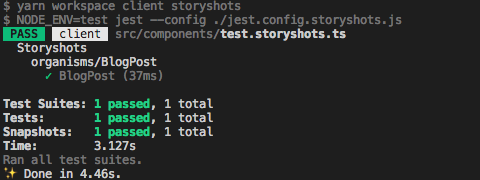

monorepo 環境で、create-react-app w/ TypeScript したパッケージに対して、Jest のテストと、Storyshots による Storybook ベースのスナップショットテスティングを導入する例です。

# まえがき

## 完成品

実装内容をプルリクエストにしたものを、GitHub 上に公開していますので、併せてご参照ください。

- https://github.com/suzukalight/monorepo-react-prisma2/pull/2
- https://github.com/suzukalight/monorepo-react-prisma2/pull/3

## 動作環境

- Mac
- Node.js v10.16.0 / npm v6.9.0 / yarn v1.16.0
- create-react-app (react-script v3.1.1)
- TypeScript v3.5.3
- Storybook v5.1
- Jest v24.9
- Babel v7

# Jest のセットアップ

## yarn install

- Jest のインストール
- Babel および presets のインストール（react, typescript）
- 型情報もインストール

```bash
$ yarn add -DW @babel/core @babel/preset-env @babel/preset-react @babel/preset-typescript babel-jest babel-plugin-require-context-hook jest react-test-renderer @types/jest
```

## global config

### /babel.config.js

- **presets**: React(JSX)と TypeScript を変換するように指定します
- **babelrcRoots**: Jest で実行する Babel に対して、monorepo 構成であることを伝えます

```javascript:/babel.config.js
module.exports = {
  presets: [
    ['@babel/preset-env', { targets: { node: 'current' }, modules: 'commonjs' }],
    '@babel/preset-react',
    '@babel/preset-typescript',
  ],
  babelrcRoots: ['src/*'],
};
```

### /jest.config.js

**[projects オプション](https://jestjs.io/docs/ja/configuration#projects-array-string-projectconfig)**を指定して、Jest が複数のプロジェクトを独立して扱えるようにします。`<rootDir>/[packages-dir]/*` を指定すると、packages-dir 配下のすべてのプロジェクトがテスト対象となり、Jest コマンドによって並行してテストされるようになります；

```javascript:/jest.config.js
module.exports = {
  projects: ['<rootDir>/src/*'],
};
```

# client プロジェクトのセットアップ

create-react-app 環境には、デフォルトで src/App.test.tsx がありますので、まずはこのテストが通るように環境を整えます。

## /src/client/jest.config.js

- **displayName**: テスト実行中に、ラベルとして console に表示してくれます
- **moduleFileExtensions**: テスト対象の拡張子を指定します
- **transform**: Babel などの変換プロセスを指定します。JS ファイルを指定して、より細かい変換動作を指定できます
- **testMatch**: テスト対象のファイル名を正規表現で指定します
- **moduleNameMapper**: import などで指定したファイルが、テストにおいて邪魔になる場合、それを別のモジュールに置き換えることができる設定です。assets と styles を、それぞれダミーデータに置き換えさせています

```javascript:/src/client/jest.config.js
module.exports = {
  name: 'client',
  displayName: 'client',
  verbose: true,
  moduleFileExtensions: ['js', 'json', 'jsx', 'ts', 'tsx', 'node'],
  transform: {
    '^.+\\.(js|jsx|ts|tsx)$': '<rootDir>/.jest/transform.js',
  },
  testMatch: ['<rootDir>/**/?(*.)(spec|test).(ts|js)?(x)'],
  moduleNameMapper: {
    '\\.(jpg|jpeg|png|gif|eot|otf|webp|svg|ttf|woff|woff2|mp4|webm|wav|mp3|m4a|aac|oga)$':
      '<rootDir>/.jest/__mocks__/file.js',
    '\\.(styl|css|less|scss)$': '<rootDir>/.jest/__mocks__/style.js',
  },
};
```

## /src/client/.jest/transform.js

**babel-jest** で JS ファイルを変換します。この変換において使用する Babel オプションをここで指定できます；

```javascript:/src/client/.jest/transform.js
module.exports = require('babel-jest').createTransformer({
  presets: [
    ['@babel/preset-env', { targets: { node: 'current' }, modules: 'commonjs' }],
    '@babel/preset-react',
    '@babel/preset-typescript',
  ],
  plugins: ['require-context-hook', '@babel/plugin-transform-modules-commonjs'],
});
```

## Mocks

**[Jest の例に載っているモックファイル](https://jestjs.io/docs/ja/webpack#%E9%9D%99%E7%9A%84%E3%82%A2%E3%82%BB%E3%83%83%E3%83%88%E3%81%AE%E7%AE%A1%E7%90%86)**をそのまま利用します。

```javascript:/src/client/.jest/__mocks__/file.js
module.exports = 'test-file-stub';
```

```javascript:/src/client/.jest/__mocks__/style.js
module.exports = {};
```

## テスト実行

以上で Jest 実行環境が整いましたので、package.json にテストコマンドを追加して、実行してみます；

```json:package.json
  "scripts": {
    "test": "NODE_ENV=test jest"
  },
```

```bash
$ yarn test

yarn run v1.16.0
$ NODE_ENV=test jest
 PASS   client  src/client/src/App.test.tsx
  ✓ renders without crashing (20ms)

Test Suites: 1 passed, 1 total
Tests:       1 passed, 1 total
Snapshots:   0 total
Time:        1.645s, estimated 2s
Ran all test suites.
✨  Done in 2.76s.
```

# Storyshots のセットアップ

**[Storyshots](https://github.com/storybookjs/storybook/tree/master/addons/storyshots/storyshots-core)** は、**Storybook で記述した Story をテストファイルと見立てて、そのレンダリング結果をスナップショットとして保存してくれるテスティングツールです**。保存済みのスナップショットと、実行時のスナップショットが異なっている場合に、テストを Fail にしてくれます。コンポーネントの意図しないデグレを検知することができるようになります。

## yarn install

- @storybook/addon-storyshots
- require.context を解決できる Babel plugin
- 型情報

```bash
$ yarn add -DW @storybook/addon-storyshots react-test-renderer babel-plugin-require-context-hook @types/storybook__addon-storyshots
```

## /src/client/jest.config.js

- **setupFiles**: Jest の初期化関数を追加します

```javascript{3}:/src/client/jest.config.js
module.exports = {
  ...
  setupFiles: ['<rootDir>/.jest/setup.js'],
};
```

## /src/client/.jest/setup.js

Storybook の初期化時に使用している require.context を Jest でも使用できるようにします（[※参照文献](https://github.com/storybookjs/storybook/tree/master/addons/storyshots/storyshots-core#configure-jest-to-work-with-webpacks-requirecontext)）。babel-plugin-require-context-hook を使います；

```javascript{3}:/src/client/.jest/setup.js
const registerRequireContextHook = require('babel-plugin-require-context-hook/register');
registerRequireContextHook();
```

## /src/client/src/components/storyshots.test.js

Jest が Storyshots の起点とするテストファイルで、ここで Storyshots の初期化を行います。

- **configPath**: Storybook の config を指定
- **test**: どのようなスナップショットを出力するかを指定します。ここでは multiSnapshotWithOptions を指定することで、コンポーネントごとに 1 つずつスナップショットファイルを生成するようにしています

```javascript{3}:/src/client/src/components/storyshots.test.js
import initStoryshots, { multiSnapshotWithOptions } from '@storybook/addon-storyshots'; // eslint-disable-line import/no-extraneous-dependencies
import path from 'path';

initStoryshots({
  configPath: path.resolve(__dirname, '../../.storybook/config.js'),
  test: multiSnapshotWithOptions({}),
});
```

## yarn test

では実際に Storyshots を実行してみます。成功すると、スナップショットファイルが 1 つ生成されます；

```bash
$ yarn test

 PASS   client  src/client/src/components/storyshots.test.ts
 › 1 snapshot written.
 PASS   client  src/client/src/App.test.tsx

Snapshot Summary
 › 1 snapshot written from 1 test suite.

Test Suites: 2 passed, 2 total
Tests:       2 passed, 2 total
Snapshots:   1 written, 1 total
Time:        4.32s
Ran all test suites.
✨  Done in 5.44s.
```

## デグレ検知の実験

スナップショットテストが正しく動作しているかをチェックするために、簡単にデグレを起こしてみましょう；

```javascript{7}:/src/client/src/components/organisms/BlogPost/index.tsx
export const BlogPost = ({ post }: BlogPostPresenterProps) => (
  <Container>
    <Header as="h1">{post.title}</Header>
    <small>{`created at: ${format(post.createdAt, 'yyyy/MM/dd')}`}</small>
    <article className={styles.content}>{post.content}</article>
    <Author author={post.author} />
    <p>デグレ検知</p>
  </Container>
```

Storyshots を実行してみます。デグレを起こした部分が表示され、テストが正しく Fail します；

```bash{20-22}
$ yarn test

 PASS   client  src/client/src/App.test.tsx
 FAIL   client  src/client/src/components/storyshots.test.ts
  ● Storyshots › organisms/BlogPost › BlogPost

    expect(received).toMatchSnapshot()

    Snapshot name: `Storyshots organisms/BlogPost BlogPost 1`

    - Snapshot
    + Received

    @@ -91,10 +91,13 @@
                  テスト太郎
                </div>
                test@example.com
              </div>
            </div>
    +       <p>
    +         デグレ検知
    +       </p>
          </div>
        </div>
        <div>
          <div
            style={

      at match (../../node_modules/@storybook/addon-storyshots/dist/test-bodies.js:27:20)
      at ../../node_modules/@storybook/addon-storyshots/dist/test-bodies.js:39:10
      at Object.<anonymous> (../../node_modules/@storybook/addon-storyshots/dist/api/snapshotsTestsTemplate.js:42:33)

 › 1 snapshot failed.
Snapshot Summary
 › 1 snapshot failed from 1 test suite. Inspect your code changes or run `yarn test -u` to update them.

Test Suites: 1 failed, 1 passed, 2 total
Tests:       1 failed, 1 passed, 2 total
Snapshots:   1 failed, 1 total
Time:        4.289s
Ran all test suites.
error Command failed with exit code 1.
info Visit https://yarnpkg.com/en/docs/cli/run for documentation about this command.
```

わざとデグレを起こした部分を削除して保存し、改めて Storyshots を実行してみます。そうすると今回はテストが正常に終了します。これで導入成功です！

```bash
$ yarn test

 PASS   client  src/client/src/App.test.tsx
 PASS   client  src/client/src/components/storyshots.test.ts

Test Suites: 2 passed, 2 total
Tests:       2 passed, 2 total
Snapshots:   1 passed, 1 total
Time:        3.131s
Ran all test suites.
✨  Done in 3.94s.
```

# ロジックと Storyshots のテストを分離

現状のままだと、ロジックのテストと、Storyshots のテストが同時に走っています。コンポーネントのみのテストを行うために、Storyshots のテストを分離してみます。

## /src/client/src/components/test.storyshots.ts

Storyshots のテストを行うファイルを、通常のテストファイルのパターンから外れるようにリネームします。今回は **storyshots.test.ts→test.storyshots.ts に変更しました**。

## /src/client/jest.config.storyshots.js

通常の jest.config.js から、Storyshots のテストを行うための設定を分離します。具体的には testMatch を、Storyshots のテストを行うファイルのみをマッチさせるように上書きします；

```javascript:/src/client/jest.config.storyshots.js
const baseConfig = require('./jest.config');

module.exports = {
  ...baseConfig,
  testMatch: ['<rootDir>/**/test.storyshots.(js|jsx|ts|tsx)'],
};
```

## /src/client/package.json

テストを実行するスクリプトを、ロジック・Storyshots に分割します。Storyshots のテストについては、さきほと作成した config ファイルを使用するように変更しました；

```json{6-7}:/src/client/package.json
  "scripts": {
    "start": "react-scripts start",
    "build": "react-scripts build",
    "eject": "react-scripts eject",
    "storybook": "start-storybook",
    "test": "NODE_ENV=test jest",
    "storyshots": "NODE_ENV=test jest --config ./jest.config.storyshots.js"
  },
```

## /package.json

ルートの package.json も変更します。storyshots を実行するコマンドを、yarn workspace 経由で直接呼び出すように変更しました；

```json{8-9}:/package.json
  "scripts": {
    "cl:start": "yarn workspace client start",
    "sr:start": "yarn workspace server start",
    "lint": "yarn cl:lint && yarn sr:lint",
    "cl:lint": "eslint --fix --ext .jsx,.js,.tsx,.ts ./src/client/src",
    "sr:lint": "eslint --fix --ext .jsx,.js,.tsx,.ts ./src/server/src",
    "storybook": "yarn workspace client storybook",
    "test": "NODE_ENV=test jest",
    "storyshots": "yarn workspace client storyshots"
  },
```

## 実行

実行してみます。無事に成功しました！

```bash
$ yarn storyshots

$ yarn workspace client storyshots
$ NODE_ENV=test jest --config ./jest.config.storyshots.js
 PASS   client  src/components/test.storyshots.ts
  Storyshots
    organisms/BlogPost
      ✓ BlogPost (37ms)

Test Suites: 1 passed, 1 total
Tests:       1 passed, 1 total
Snapshots:   1 passed, 1 total
Time:        3.127s
Ran all test suites.
✨  Done in 4.46s.
```



# NOTE

## 現在の Config 設定を表示する

設定がうまく反映されているか自信がない場合、Jest の Config を表示させて確認してみると良いです；

```bash
$ jest --showConfig
```

projects に指定した client と server の設定が configs の配列となって格納されています。それ以外にも global の config や version 情報などが表示されます；

```json
{
  "configs": [
    {
      "cwd": "/Users/suzukalight/work/monorepo-react-prisma2",
      "displayName": "client",
      "moduleFileExtensions": ["js", "json", "jsx", "ts", "tsx", "node"],
      "moduleNameMapper": [
        [
          "\\.(jpg|jpeg|png|gif|eot|otf|webp|svg|ttf|woff|woff2|mp4|webm|wav|mp3|m4a|aac|oga)$",
          "/Users/suzukalight/work/monorepo-react-prisma2/src/client/.jest/__mocks__/file.js"
        ],
        [
          "\\.(styl|css|less|scss)$",
          "/Users/suzukalight/work/monorepo-react-prisma2/src/client/.jest/__mocks__/style.js"
        ]
      ],
      "rootDir": "/Users/suzukalight/work/monorepo-react-prisma2/src/client",
      "transform": [
        [
          "^.+\\.(js|jsx|ts|tsx)$",
          "/Users/suzukalight/work/monorepo-react-prisma2/src/client/.jest/transform.js"
        ]
      ],
    }
    {
      "rootDir": "/Users/suzukalight/work/monorepo-react-prisma2/src/server",
    }
  ],
  "globalConfig": {
    "projects": [
      "/Users/suzukalight/work/monorepo-react-prisma2/src/client",
      "/Users/suzukalight/work/monorepo-react-prisma2/src/server"
    ],
    "rootDir": "/Users/suzukalight/work/monorepo-react-prisma2",
  },
  "version": "24.9.0"
}
```

## キャッシュをクリアする

Jest のキャッシュをクリアするには、`--clearCache` オプションを指定して Jest を実行します；

```bash
$ jest --clearCache
```

## /src/client/.babelrc.js を置いてはダメなの？

/src/client/.babelrc.js を置いた場合、Storybook の Webpack も、この RC ファイルを読みに来ます。ここで Jest と Storybook の設定がバッティングしてしまい、うまく動作させられませんでした。今回は babel-jest の createTransformer で設定を分けることができたので、それで対処しています。

# 完成品

実装内容をプルリクエストにしたものを、GitHub 上に公開していますので、併せてご参照ください。

- https://github.com/suzukalight/monorepo-react-prisma2/pull/2
- https://github.com/suzukalight/monorepo-react-prisma2/pull/3
