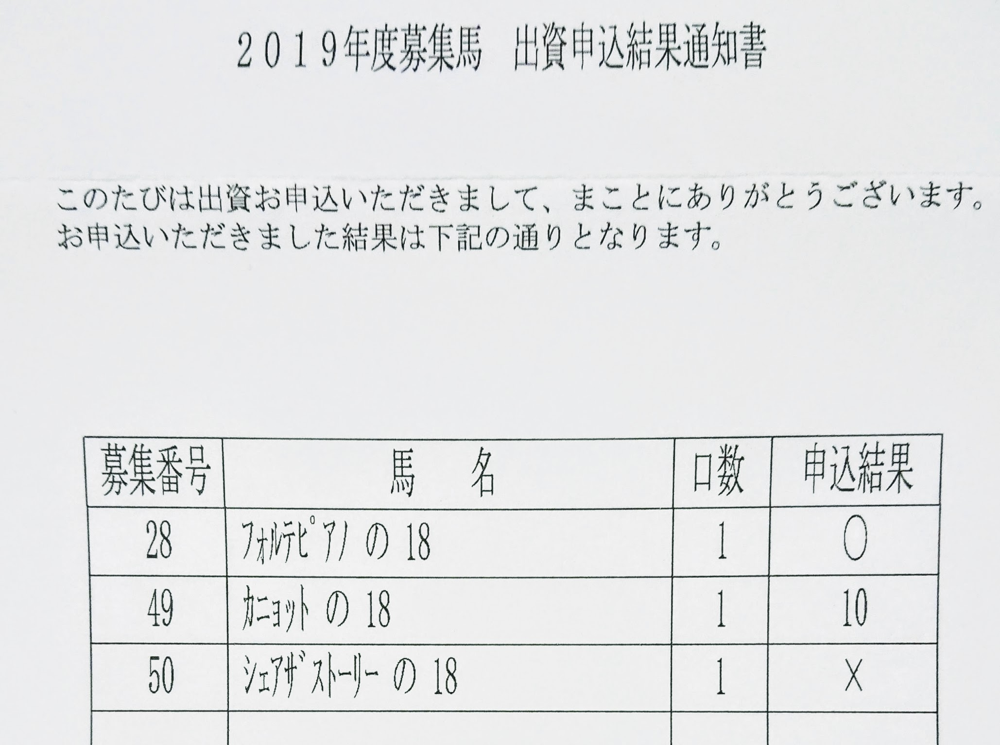

ねんがんのサラブレッドをてにいれたぞ！

**競馬ファンなら一度は憧れる夢・馬主になる**。今年はこれを達成するために、キャロットクラブで一口馬主に入会してみます。新規入会者の壁が非常に高いと評判ではありますが、果たして結果はいかに？

# はじめに

## キャロットクラブとは

https://carrotclub.net/

**サートゥルナーリア、リスグラシュー、レイデオロなど、有名馬が多数在籍する、言わずとしれた一口馬主クラブ**。私もいつかは馬主になりたいという夢を持っていましたが、今年ついに申し込むことにしました！　決めたからには 1 年でバッチリ入会したいので、しっかり攻略していきます。

# 出資のシステム

入会攻略には、まずはキャロットクラブにおける出資のシステムを理解することが重要です。以下ご紹介していきます。

## 1 ～ 4 位：母馬優先枠

キャロットクラブの特徴的な抽選システムとして「母馬優先」という制度があります。**これは 400 口のうちの半分の 200 口について、当該馬の母馬に投資していた人に優先抽選枠として確保されるというシステムです**。OurBlood というスローガンに基づき、親子末代まで馬主として応援していくことをサポートする、面白いシステムですね。個人的に好きなシステムです。はやく会員になりたい。

後述する最優先枠と重ねることで、母馬優先枠内でさらに優先抽選権を獲得できます。×2 ＞ ×1 ＞ ×0 の順に優先権があり、その下に支払遅延などを起こしてイエローカードをもらっている人が入ります。以上が 1 ～ 4 位の優先権を持ちます。

## 5 ～ 8 位：最優先枠

**すべての会員に存在する枠で、他の会員より優先して抽選される枠が 1 つ行使できるものです。**この 1 枠をどの馬に行使するかが、会員が最も頭を悩ませ、楽しむ枠になります。

というのも、キャロットクラブはすでに多数の一口馬主会員が存在し、会員内で馬の取り合い、つまり抽選が起きているような状態です。そうするとこの最優先枠ですら申し込み叶わず落選することが多くなります。**会員はこれを ×（バツ） と呼んでおり、×1 を獲得していると、×0 よりもさらに優先的に抽選されます**。この × は最大 2 年ぶん重ねることができるようになっており、優先権としては ×2 ＞ ×1 ＞ ×0 となっており、この下に延滞者が入ります。以上が 5 ～ 8 位までの優先権を持ちます。

よくよく考えると恐ろしいことなのですが、×1 同士でも落選するわけです。それだけキャロットは人気ということです。新規入会にはさらに綿密な出資戦略が求められることになります。

## 9 ～ 10 位：一般枠

母馬優先も最優先も持っていない、普通の枠がここに該当します。優先順位は 9 位で、この下に延滞枠が来て 10 位になります。

## 11 ～ 12 位：新規入会者枠

さて、では我々新規入会者の枠はどうなっているかというと、**これらのさらに下、11 番目になります。非常に厳しい。。。**キャロットではそれだけ会員を重視しているわけです。なお新規入会時も最優先枠を行使できますが、対象は「新規入会者内での最優先権」であり、会員には絶対に勝てません。

# 攻略の糸口

## どういう馬に応募する？

**新規入会者は、抽選順位において既存会員には絶対に勝てません。ですので、既存会員で満口にならなかった馬を狙って応募する必要があります。**

[こちらのサイト](https://ameblo.jp/gurigurikun1/entry-12404709115.html)によると、2018 年度の満口率は 77.1%だそうです（83 頭中 64 頭が満口）。その前の 2017 年が約 70%。新規会員の抽選権は、既存会員をすべて抽選しつくしたあとからですから、**新規入会者はまず、残りの 23%ないし 30%程度を探さなければ、入会すらできません。**

残る馬の傾向としては「ディープインパクト産駒のような、15 万円を超える高額馬」あるいは「過去実績の薄い、5 万円以下の馬」になるようです。さすがに 15 万円以上の馬で、23%の壁を超えるために、5 頭も申し込むようなギャンブルは打ちづらいですね。100 万円くださいとか言われても困る。

なので、**「過去実績の薄い、5 万円以下の馬」から 23%側の馬を探しておく必要があります**。

人気の多寡については、今回は [netkeiba さんの一口馬主サイト](https://owner.netkeiba.com/?rf=navi)から[募集馬の検討リストに入っている数](https://owner.netkeiba.com/?rf=navi)を参考にすることとしました。ほかに良好なファクターとしては、下記のような「なにかしらリスクのある馬」が挙げられます。自分が 1 頭しか選べない会員だったとして、これは避けそうだな、と思う馬のほうがチャンスがあるわけです。

- 厩舎の実績が乏しい、または新規開業
- 母馬が高齢、または初仔
- 種牡馬に実績がない、または新種牡馬
- 管囲が細い、繋ぎの角度が急、歩様が明らかにおかしい

## どれくらい応募する？

もともと人気のない馬を中心に選んでいますから、おそらく 50%くらいは満口にならないのではと想定しました。そうすると、**この枠で 5,6 頭へ応募しておけば、最低でも 1 頭、平均して 3 頭ほどは取れる計算です**。

本当はギリギリまで応募時期を粘れば、50%よりも精度が上げられるのでしょうが、新規入会者はそれもかないません（既存会員より期日が 1 日早く、さらに郵送必着のため）。リスク管理のために、やや多めに取っていきます。**たくさん取れたら取れたぶん楽しみが増えるだけ！（※なお出費もたくさん）**

# 申込みまで

## 2019/8/18: 申込書取り寄せ

https://carrotclub.net/club/lfx-doc-key-bosyu.htm

キャロットクラブの新規会員募集ページから、フォームに必要事項を記入して申し込みます。1 週間かからずに、申込書とカタログが届きました。オラワクワクすっぞ！

## 2019/8/26: PDF と動画公開

https://carrotclub.net/topics/news_dis_text.asp?No=2263

新規会員には DVD が届きませんので、募集馬の動きを確認するには、オフィシャルサイトへの動画掲載を待つ必要があります。キャロットクラブでは募集開始の数日後に、全馬掲載されました。

## 2019/9/3: 申し込み馬絞り込み

（※申し込みたくても申し込めないヒルダズパッションの 18）

**今回の第一目標は「とにかく入会する」です**。そのうえでリスク管理のために「高い馬一頭ではなく安めの馬を数頭を持つ」こと、「母馬優先のために牝馬を多めに取る」ことを、サブの目標としました。

「比較的人気のない、5 万円以下の馬」をリストアップしていきます。今回はその基準として、**募集開始前の時点で、検討リスト数が 200 未満の馬を対象としました**。たとえば私が芦毛枠で申し込んだ [ピエリーナの 18](https://owner.netkeiba.com/?pid=horse_profile&id=2018105544) の検討リスト数は 126 件（9/4 時点）ですから、これは対象になる、という感じです。

この作業を繰り返して、スプレッドシートに転記し、その中から自分の気に入った馬を選定していく、という感じです。いろんな仔馬を見てると、どれも目移りするから不思議…！

## 2019/9/4: 申込用紙記入

最終的に、申込み用紙に記入したのは、下記の 10 頭でした；

| 属 #  | 馬名                        | 性   | 出資 | 検討 |
| ----- | --------------------------- | ---- | ---- | ---- |
| 東 7  | アゼリの 18                 | メス | 90k  | 258  |
| 東 13 | (優)ジュエルトウショウの 18 | メス | 35k  | 192  |
| 東 17 | ヴァイスゴルトの 18         | 牡   | 60k  | 158  |
| 東 19 | アートプリンセスの 18       | 牡   | 90k  | 303  |
| 東 20 | ヒルダズパッションの 18     | メス | 125k | 444  |
| 東 32 | ピエリーナの 18             | 牡   | 45k  | 126  |
| 東 36 | ヒカルアモーレの 18         | 牡   | 90k  | 293  |
| 東 38 | ピースエンブレムの 18       | メス | 45k  | 181  |
| 西 73 | ユールフェストの 18         | メス | 45k  | 163  |
| 西 78 | スペクトロライトの 18       | メス | 30k  | 200  |

キャロットクラブの特徴である、母馬優先制度を将来に見越して、牝馬へ多めに応募しています。あとは個人的な趣味（関東在住、栗毛や芦毛が好き、ドゥラメンテ産駒が好き）で入れている感じですね。**一口馬主ですから好きと思った馬に応募したい。**

netkeiba の検討リストで、一次募集開始前の時点で 200pts. 以上の馬については、もうすでに厳しいでしょうから、これらは記念応募みたいな感じです。現実としては下記の 5 頭が中心となり、そのうち 23%の壁を突破できるのが 3 頭ほどと読んでいます；

| 属 #  | 馬名                        | 性   | 出資 | 検討 |
| ----- | --------------------------- | ---- | ---- | ---- |
| 東 13 | (優)ジュエルトウショウの 18 | メス | 35k  | 192  |
| 東 17 | ヴァイスゴルトの 18         | 牡   | 60k  | 158  |
| 東 32 | ピエリーナの 18             | 牡   | 45k  | 126  |
| 東 38 | ピースエンブレムの 18       | メス | 45k  | 181  |
| 西 73 | ユールフェストの 18         | メス | 45k  | 163  |

## 2019/9/5: 投函

一次募集開始が 9/6 なので、早ければその日に、遅くても末日までには届くよう、9/5 に投函しました。**私は返信用封筒が翌日配送にならないとは知らず、シルクホースクラブ宛へ前日に投函して見事に失敗した経歴を持っていますので、同じ轍を踏まない**（まさか同じ赤坂局内で翌日に届かないとは思ってなかった…）。

もし締め切りギリギリに応募することになる場合は、必ず自費で切手を買い、**できれば大きな郵便局の窓口で、必着日までに届くのを確認されることをオススメします！！！**

# 結果発表

## 2019/9/9: 中間発表 1 回目

https://carrotclub.net/topics/lfx-news_dis_text-No-1978.htm

9/9(月)、1 回目の中間発表がありました。28 頭が満口の半数以上応募があったそうです。現時点で昨年対比 24%の応募とのことで、最終的にこの 4 ～ 5 倍の応募が見込まれることから、**この時点で名前が挙がっている馬へ、新規入会者が出資できる確率はほぼゼロです。**

| 属 #  | 馬名                            | 申込 | 検討    |
| ----- | ------------------------------- | ---- | ------- |
| 東 13 | ~~(優)ジュエルトウショウの 18~~ | 215  | **192** |
| 東 17 | ヴァイスゴルトの 18             | -    | **158** |
| 東 32 | ピエリーナの 18                 | -    | **126** |
| 東 38 | ピースエンブレムの 18           | -    | **181** |
| 西 73 | ユールフェストの 18             | -    | **163** |

**最優先消えた！！！**

**本線の 5 頭については、まだ 4 頭が健在です**。最終的に 1 頭でも残ってくれれば目的達成です！　なんとか生き延びて欲しい…。ちなみに記念応募だった 5 頭については 3 頭がすでに消えていました。

## 2019/9/10: 最終中間発表

https://carrotclub.net/topics/lfx-news_dis_text-No-2288.htm

9/10(火)、2 回目の中間発表がありました。これが最終とのことです。12 頭が新たに加わり、40 頭が満口の半数以上応募となりました。現時点の応募数は昨年対比 32%で、最終的にこの 4 倍の応募が見込まれます。**この時点で名前が挙がっている馬へ、新規入会者が出資できる確率はほぼゼロです。**

| 属 #  | 馬名                            | 申込 | 検討    |
| ----- | ------------------------------- | ---- | ------- |
| 東 13 | ~~(優)ジュエルトウショウの 18~~ | 265  | **192** |
| 東 17 | **ヴァイスゴルトの 18**         | -    | **158** |
| 東 32 | **ピエリーナの 18**             | -    | **126** |
| 東 38 | **ピースエンブレムの 18**       | -    | **181** |
| 西 73 | **ユールフェストの 18**         | -    | **163** |

**本線の 5 頭については、まだ 4 頭が健在です。最終的に 1 頭でも残ってくれれば目的達成です！**　あとは 9/18(水)の抽選予定馬発表まで、一週間ほどソワソワしながら待つのみであります。。。頼む！！！

ちなみに、記念応募だった 5 頭は、この時点で全部消えました。まぁ予想通りなのですが、残念。。。

## 2019/9/18: 抽選馬発表

https://carrotclub.net/topics/lfx-news_dis_text-No-1987.htm

9/18(水)、「抽選の対象となる馬」が公表されました。**ここに載らなかった馬が、新規入会者が申し込めた馬となります**。これまでの計画はすべて、ここに載らないための仕込みでありました。

抽選対象となった馬は 69 頭、ならなかった馬は 16 頭。**実に 81%もの馬が一次募集で満口になりました**。計画よりずっと狭き門だった（昨年は 77%）。そのなかに、私の選んだ馬はいたのか、いなかったのか…。結果はこちらでした！

| 当選   | 属 #  | 馬名                            | 性   | 出資 | 検討 |
| ------ | ----- | ------------------------------- | ---- | ---- | ---- |
|        | 東 13 | ~~(優)ジュエルトウショウの 18~~ | メス | 35k  | 192  |
| 抽     | 東 17 | ヴァイスゴルトの 18             | 牡   | 60k  | 158  |
| **当** | 東 32 | **ピエリーナの 18**             | 牡   | 45k  | 126  |
|        | 東 38 | ~~ピースエンブレムの 18~~       | メス | 45k  | 181  |
|        | 西 73 | ~~ユールフェストの 18~~         | メス | 45k  | 163  |

**[ピエリーナの 18](https://db.netkeiba.com/horse/2018105544/) が当確となりました！** 入会申込書に不備不着がなければ、私も今年からキャロットクラブの会員となります。皆様どうぞよろしくお願いいたします！

今回想定外だったのは、「新規入会者内での抽選」になった馬が多かったことでしょうか。その数 8 頭。私の申し込んだ馬でも、**ヴァイスゴルトの 18 が新規入会者内抽選**となりました。それだけキャロットクラブが人気になっているということでしょう。今年がこれならば、来年はいったいどうなるのでしょうか…。

なにはともあれ、今年の目標であった「入会する」が果たせたことに満足しています。**ピエリーナの 18 にてご一緒する皆様、どうぞよろしくお願いいたします！**

## 2019/9/21: 出資申込結果通知書

9/21(土)、キャロットクラブから簡易書留にて、出資申込結果通知書を受け取りました。発送日の翌日昼の到着（首都圏）でした。**ポスト投函かと思っていましたが、ちゃんと書留なんですね**。ユーザ体験が良いです。

いただいた出資申込結果通知書です。まず、**ヴァイスゴルトの 18 ですが、残念ながら落選していました**。新規入会者内の抽選でしたが無念です…。一次募集での最終結果は、10 頭中 1 頭の当選となりました。

**ですが、私の今年の目標は「入会する」です。これは無事に達成できました！**　メンバーカードをいただいたことで、その実感がふつふつ湧いてきました。愛馬の出走するであろう、来年夏が早くも待ち遠しい。見学とかも行きたいです。

改めまして、キャロットの先輩方、よろしくお願いいたします！

# 1.5 次募集

**キャロットクラブでは、最優先枠に落選した人のために、1.5 次募集という出資機会が設けられています**。これは 2 次募集を開始する前に行われ、1 次募集で残口の出た馬すべてが対象となります。落選者のみが対象のため、希望馬へ出資機会を失ってしまった人への救済措置ですね。

**この 1.5 次募集については、新規入会者も既存会員と同じ優先順位を持っています（全員 1 位）。つまり新規入会者が 1 次募集で全滅したとしても、1.5 次募集でもう一度だけチャンスがあるわけです**。1 次募集に応募した人だけが得られる権利ですから、諦めずチャレンジしたい！

## 2019/9/25: 1.5 次募集開始

https://carrotclub.net/horse/bosyuba-list.asp

2019 年の 1.5 次募集は 16 頭が対象となりました。口数は任意の数を申込可能です。スケジュールは非常にスピーディで、2 日間で申込から発表まで完了することになっています；

- 9/25(水)正午: 申込開始
- 9/26(木)正午: 締切
- 9/27(金)夕刻: 発表

私は 3 頭を追加応募しました。牝馬を取りたかったので全部牝馬です。確率が全くわからないのですが、1 頭あるいは 2 頭とりたいなと考えての申込です。

## 2019/9/27: 1.5 次結果発表

9/27(金)の 15 時に、1.5 次募集の結果発表がありました。前日の締切時には「16 頭のうち 13 頭が抽選対象」と発表があり、例年よりもさらに激戦化している！　とネット上では話題になっていました。

私の申込結果は以下となりました；

**[フォルテピアノの 18](https://db.netkeiba.com/horse/2018105547/)、当選しました！**　関東の牝馬が欲しかったので満足の行く結果です。

## 2019/9/30: 1.5 次結果郵送

9/30(月)、キャロットクラブから普通郵便にて、1.5 次の結果が郵送されていました。新規入会での 1 次募集と違い、メンバーズカードなどが入っていないので、こちらは普通郵便ということでしょうか。そもそも会員なら Web でわかってるし大丈夫ですね。

カニョットの 18 に、10、と書いてあって、一瞬「10 口申し込んだっけ！？」などと勘違いしたのは秘密です。これはキャンセル番号。さすがに 10 人目は難しそうです。

# 入会手続き

結論としては、すぐになにかしないといけないわけでもなさそうです。出資申込結果通知書を受け取ったと同時に、なにか色々と入会申込手続きがあるのかと思っていましたが…。流れとしては以下のようです；

- 10 月頃: マイナンバー提供依頼書が届く
- 11/15(金): 請求明細書が届く
- 11/27(水): 初回請求日（入会金・月会費・出資金）

出資金は引き落としなんですね。しかも 2 ヶ月先、意外と余裕がありました。

# おわりに

**ねんがんのサラブレッドをてにいれたぞ！**

例年の申込傾向などをもとに、狭き門と呼ばれるキャロットクラブへの入会チャレンジを行い、結果としては無事に攻略成功、入会することができました。

- [ピエリーナの 18](https://db.netkeiba.com/horse/2018105544/)
- [フォルテピアノの 18](https://db.netkeiba.com/horse/2018105547/)

今回、この 2 頭と縁を持つことができました。ご一緒の皆様、よろしくお願いいたします！　**[Twitter](https://twitter.com/suzukalight)** などで一緒に応援できましたら嬉しいです！

## 2020 年の募集に向けて

2019 年の傾向をもとに、2020 年のキャロットクラブ新規入会の作戦を練るとしたら、以下のような感じでしょうか；

- **申込開始日の前日に、netkeiba の[募集馬の検討リストに入っている数](https://owner.netkeiba.com/?rf=navi)が 150 以下の馬を対象にする**
- 出資額が 20 万円以上、または 5 万円以下の馬を狙う
- 5 頭程度申し込む

2019 年の一次募集満口率は 81%で、二次募集まで残った馬はたった 3 頭でした。その二次募集も初日で完売になる可能性が高く、2 日目からしか参加権のない新規入会者には、もはや一分の隙もない状態です。

それでも残った馬に応募することで、確実に入会するのももちろんひとつの手段なのですが、**一次募集で少しでも希望にマッチした馬に申し込みができると、より楽しみが増えるのではと個人的には思います**。ぜひ一次募集のタイミングで、キャロット祭りに参加してみてください！

夢の馬主生活、ぜひご一緒できれば幸いです！
