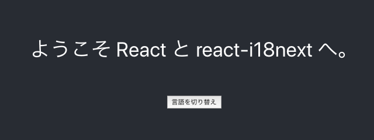
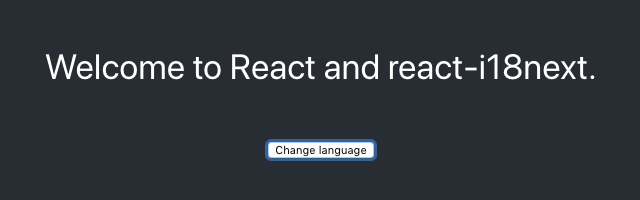
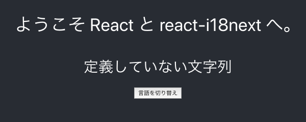
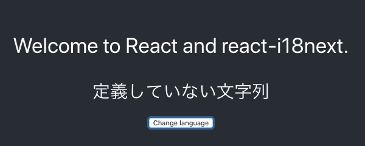

最近ははじめから世界で勝負しようと頑張っているアプリも増えてきています。その場合に、障壁のひとつとなるが多言語対応（国際化・i18n）の方法だと思います。今回はこの i18n について素振りしてみました。

# まえがき

## 完成品

実装したリポジトリはこちらです；

https://github.com/suzukalight/study-react-i18next

## 動作環境

- Mac
- Node.js v10.16.0 / npm v6.9.0 / yarn v1.16.0
- create-react-app (react-script v3.1.1)
- TypeScript v3.5.3
- react-i18next v10.12.2
- i18next v17.0.13

# 多言語対応

## ライブラリ比較

多言語対応のために利用可能なライブラリとして、下記のものがあります；

- [react-intl](https://github.com/formatjs/react-intl)
- [react-i18next](https://github.com/i18next/react-i18next)
- [polyglot](https://github.com/airbnb/polyglot.js)

react-intl がもっともスターが多く、利用例も豊富にあったのですが、私はどうもあの JSX を多用する言語変換系が好きになれず、、、react-i18next は「t 関数」でサクッと変換するだけのシンプルさがあり、こちらに興味を持ちました。

## セットアップ

素振り用に create-react-app --typescript します；

```bash
$ npx create-react-app study-react-i18next --typescript
$ cd study-react-i18next
$ yarn
```

react-i18next と、前提パッケージとなる i18next をインストールします；

```bash
$ yarn add i18next react-i18next
```

# 使い方

## 翻訳対象の指定

**t('key')** で、翻訳対象となる文字列を指定します。key といっても別に英字列である必要はないので、**むしろ日本語でジャンジャン書いてしまうほうが、メイン開発者層にとって優しい開発環境になります；**

```javascript{4,6}:title=/src/App.tsx
return (
  <div className="App">
    <header className="App-header">
      <p>{t('ようこそ React と react-i18next へ。')}</p>
      <div>
        <button onClick={() => setLang(lang === 'en' ? 'ja' : 'en')}>{t('言語を切り替え')}</button>
      </div>
    </header>
  </div>
);
```

**t('ようこそ React と react-i18next へ。')** など、普通に日本語で開発しましょう。

## 辞書設定

`i18next` パッケージを利用して初期化を行います。多くの引数が指定できますが、最初はこのあたりを指定しましょう；

- **resources**: 辞書情報です。後述する方法で、JSON ファイルを指定したり、遅延ローディングができたりします。
- **lng**: 初期表示する言語です。
- **fallbackLng**: 選択した言語に関する辞書情報がない場合に、かわりに表示する言語です。
- interpolation: 各種の補間設定です。

```javascript:title=/src/App.tsx
import i18n from 'i18next';
import { initReactI18next } from 'react-i18next';

i18n.use(initReactI18next).init({
  resources: {
    en: {
      translation: {
        'ようこそ React と react-i18next へ。': 'Welcome to React and react-i18next.',
        言語を切り替え: 'change language',
      },
    },
    ja: {
      translation: {
        'ようこそ React と react-i18next へ。': 'ようこそ React と react-i18next へ。',
        言語を切り替え: '言語を切り替え',
      },
    },
  },
  lng: 'ja',
  fallbackLng: 'ja',
  interpolation: { escapeValue: false },
});
```

## 言語切り替え

**i18n.changeLanguage(lang)** を行うと、指定した言語に切り替えることができます。React なので State と Hooks によって切り替え操作を実現してみます；

```javascript:title=/src/App.tsx
import React, { useState, useEffect } from 'react';
import { useTranslation } from 'react-i18next';

const App: React.FC = () => {
  const [t, i18n] = useTranslation();
  const [lang, setLang] = useState('ja');

  useEffect(() => {
    i18n.changeLanguage(lang);
  }, [lang, i18n]);

  return (
    ...
    <button onClick={() => setLang(lang === 'en' ? 'ja' : 'en')}>
    ...
  );
};
```

> 本題とはずれますが、Hooks について補足しますと、**useTranslation** で t 関数と i18n インスタンスを取得し、**useState** で現在の言語情報と言語切替関数を取得します。**useEffect** で State に変更があった場合のみ、changeLanguage を実行しています（第 2 引数の`[lang, i18n]`が、これらの変数に変更があった場合のみ、useEffect がトリガされることを指示しています）

## 実行

```bash
$ yarn start
```





# 辞書ファイルの指定

辞書ファイルは、外部の JSON ファイルを指定することができます。変換情報を切り出して管理できるようになり、スナップショットテストなどもしやすくなると思います。

## 辞書ファイルの作成

日本語と英語の 2 種類について作成してみましょう；

```json:title=/src/locales/ja.json
{
  "ようこそ React と react-i18next へ。": "ようこそ React と react-i18next へ。",
  "言語を切り替え": "言語を切り替え"
}
```

```json:title=/src/locales/en.json
{
  "ようこそ React と react-i18next へ。": "Welcome to React and react-i18next.",
  "言語を切り替え": "Change language"
}
```

## 外部 JSON ファイルの読み取り

webpack に頼って、JSON ファイルをインポートしてみます；

```javascript{6-7}:title=/src/App.tsx
import enJson from './locales/en.json';
import jaJson from './locales/ja.json';

i18n.use(initReactI18next).init({
  resources: {
    en: { translation: enJson },
    ja: { translation: jaJson },
  },
}
```

## 実行

JSON ファイルから辞書情報を取得して表示ができるようになっているはずです；

```bash
$ yarn start
```

# key を自動で JSON ファイルに書き出す

非常に面白い機能です。ラフに日本語で t 関数を書いていると、キー管理で抜け漏れが発生する可能性は当然あるのですが、その key を自動で抜き出して JSON ファイルに書き出してくれる機能があります。

## babel-plugin-i18next-extract

babel-plugin-i18next-extract パッケージを使うと、上記の JSON 書き出し機能が利用できるようになります；

```bash
$ yarn add -D babel-plugin-i18next-extract @babel/cli
```

babel プラグインとしての設定を記述します。設定した項目は 2 点です；

- **locales**: 書き出しを行う言語セットです。
- **outputPath**: 書き出すファイル名のパターンです。さきほどの手動辞書と同じ規則にしています。

```json{8-9}:title=/package.json
{
  "babel": {
    "presets": ["react-app"],
    "plugins": [
      [
        "i18next-extract",
        {
          "locales": ["ja", "en"],
          "outputPath": "./src/locales/{{locale}}.json"
        }
      ]
    ]
  }
}
```

書き出しを行うスクリプトを package.json へ追加します。引数に key を検索する対象ファイルのパターンを指定します；

```json{3}:title=/package.json
{
  "scripts": {
    "i18next-extract": "NODE_ENV=development babel './src/**/*.{js,jsx,ts,tsx}'"
  },
}
```

## コンポーネントの調整

実際に key を抜き出してくれるかを実験するために、ひとつ key を追加してみます；

```javascript{5}:title=/src/App.tsx
return (
  <div className="App">
    <header className="App-header">
      <p>{t('ようこそ React と react-i18next へ。')}</p>
      <small>{t('定義していない文字列')}</small>
      <div>
        <button onClick={() => setLang(lang === 'en' ? 'ja' : 'en')}>{t('言語を切り替え')}</button>
      </div>
    </header>
  </div>
);
```

i18next の設定も、少し変更します；

```javascript{8-9}:title=/src/App.tsx
i18n.use(initReactI18next).init({
  debug: true,
  resources: {
    en: { translation: enJson },
    ja: { translation: jaJson },
  },
  lng: 'ja',
  fallbackLng: false, // フォールバックしない＝keyをそのまま表示
  returnEmptyString: false, // 空文字での定義を許可
});
```

## 書き出し実行

```bash
$ yarn i18next-extract
```

```json{3}:title=/src/locales/ja.json
{
  "ようこそ React と react-i18next へ。": "ようこそ React と react-i18next へ。",
  "定義していない文字列": "",
  "言語を切り替え": "言語を切り替え"
}
```

```json{3}:title=/src/locales/en.json
{
  "ようこそ React と react-i18next へ。": "Welcome to React and react-i18next.",
  "定義していない文字列": "",
  "言語を切り替え": "Change language"
}
```

「定義していない文字列」が、空文字列の定義として出力されました。現状の設定(fallbackLng: false)であれば、i18next は空文字の定義を key 文字列にフォールバックして表示してくれるので、結果としては日本語の表示に代替されることになります。

## 表示テスト

```bash
$ yarn start
```





# 完成品

実装したリポジトリはこちらです；

https://github.com/suzukalight/study-react-i18next
