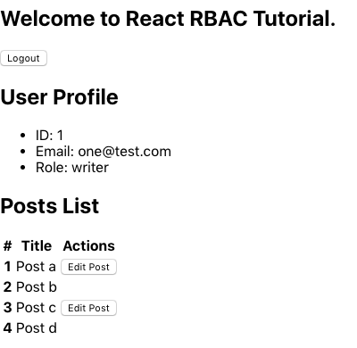
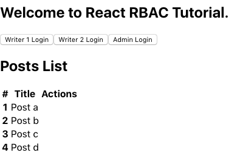
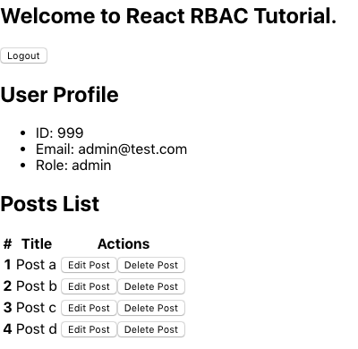

アクセス制御の手法のひとつである **Role-based Access Control (RBAC)** は、ユーザと権限とを直接紐付けるのではなく、間にロールを挟みこむことで権限管理をシンプルにする手法です。これを React ベースのアプリに組み込むための、簡単な実装例を作成しました。

実装したリポジトリはこちらです；  
https://github.com/suzukalight/study-rbac-client

# Role-based Access Control

通常、ユーザに認可を割り付ける場合、直接的に紐付けることが多いかと思います。「〇〇さんは ×× ができる」という関係性です；

```
User - Permission
```

Role-based Access Control は、ユーザと許可とを直接紐付けるのではなく、**間に役割(Role)を挟みこんだ 3 段階の権限管理を行っています**；

```
User - Role - Permission
```

誰が何をできるか？という設定は緻密で具体的ではありますが、その繊細さゆえに設定ミスを誘発しがちになります。Role を挟むことにより、「**その役割の人なら、これらの振る舞いが認可される**」という関係性を定義することができるようになります。

たとえば異動したユーザに対して、許可をひとつひとつ剥がしてひとつひとつ付け直すよりも、役割を 1 つだけ付け直すほうが、明らかにミスが減りますよね。

# セットアップ

## 何を作るか？

投稿管理システムを素振りしてみます。役割として「ビジター」「執筆者」「管理者」の 3 種類を想定し、それぞれの役割に応じて閲覧や操作の許可をコントロールできる機能を実装していきます；



このスクリーンショットの場合は、執筆者 1 でログインしており、執筆者 1 が書いた記事 2 件について、編集が許可されている感じです。他の記事への編集許可や、自身の記事も含めた削除許可は得ていません。

## 参考にした実装

実装する側としては、段階が 1 つ増えるため実装コストが上がってしまうのではないか、という懸念が発生しますが…、実際に作成してみると、それほどでもありませんでした。

https://auth0.com/blog/role-based-access-control-rbac-and-react-apps/

こちらの実装を基本としつつ、Consumer を useContext に置き換えたり、typescript で書き換えたりなど、より現代的な実装に移したものが、今回の実装になります。

## 環境構築

素振り用に create-react-app --typescript します；

```bash
$ npx create-react-app study-rbac-client --typescript
$ cd study-rbac-client
$ yarn
```

react-router-dom をインストールします；

```bash
$ yarn add react-router-dom @types/react-router-dom
```

# 権限

## Permission

「**何に対して**」と「**どういう振る舞い(perform/action)か**」という 2 つの述語を用いて記述します。文字列定数として表現します；

```typescript
[
  'posts:list',
  'posts:create',
  'posts:edit',
  'posts:delete',
  'users:get',
  'users:getSelf',
  'home-page:visit',
];
```

## ルールテーブルの作成

Role と Permission の関係を記述するテーブルを用意します。関係性は大きく **static** と **dynamic** に分けています。

```typescript
const rules: Rule = {
  visitor: {
    static: ['posts:list', 'home-page:visit'],
  },
  writer: {
    static: ['posts:list', 'posts:create', 'users:getSelf', 'home-page:visit'],
    dynamic: {
      'posts:edit': ({ userId, postOwnerId }: PostsEditParams) => {
        if (!userId || !postOwnerId) return false;
        return userId === postOwnerId;
      },
    },
  },
  admin: {
    static: [
      'posts:list',
      'posts:create',
      'posts:edit',
      'posts:delete',
      'users:get',
      'users:getSelf',
      'home-page:visit',
    ],
  },
};
```

**static: string[]**  
「その Role を持っている場合、**無条件で Permission を得られる**」という関係性です。たとえば「Admin であれば、すべての記事の削除権限を得る」などです。

**dynamic: { [key: string]: Function }**  
「その Role を持っている場合、**指定した関数を実行し、結果が true であれば Permission を得られる**」という関係性です。たとえば「その記事のオーナーであれば、編集権限を得る」などです。この場合、記事の OwnerId と、actor の userId とが検査対象となり、それらを dynamic 関数に引き渡してチェックします。

## 権限チェック関数

ルールテーブルを用いて、当該 actor が対象への Permission を持つかをチェックする関数を用意します；

```typescript
import { Rule } from './rbac-rules';

export const check = (rules: Rule, role: string, action: string, data?: Object) => {
  const permissions = rules[role];
  if (!permissions) return false;

  const staticPermissions = permissions.static;
  if (staticPermissions && staticPermissions.includes(action)) return true;

  const dynamicPermissions = permissions.dynamic;
  if (dynamicPermissions) {
    const permissionCondition = dynamicPermissions[action];
    if (!permissionCondition) return false;
    return permissionCondition(data);
  }

  return false;
};
```

**check: (rules: Rule, role: string, action: string, data?: Object) => boolean**

- rules: ルールテーブル情報
- role: 当該 actor の持つ権限
- action: どの振る舞いに対する Permission をチェックするか
- data?: dynamic permission に渡すデータ

static ルールであれば配列内検索の結果を、dynamic ルールであれば関数の実行結果を、それぞれ評価して戻り値にしている、というシンプルな実装です。

# 権限の利用

## ヘルパコンポーネント：権限があれば子ノードを表示する

「Permission を持っている actor の場合にのみ、子ノードを表示する」という機能を提供するコンポーネントを作ります；

```typescript
import { check } from '../../../check';
import rules from '../../../rbac-rules';

interface CanParams {
  role: string;
  perform: string;
  data?: Object;
  yes?: Function;
  no?: Function;
}

const Can: React.FC<CanParams> = ({ children, role, perform, data, yes, no = () => null }) => {
  if (!check(rules, role, perform, data)) return no();
  if (yes) return yes();
  return children;
};

export default Can;
```

## 自身の情報を取得できる場合にプロフィールを表示する

Can コンポーネントを利用して、プロフィール表示コンポーネントを作成してみます；

```typescript
import React from 'react';

import Can from '../../atoms/Can';
import { useAuth } from '../../contexts/Auth';

const Profile: React.FC = () => {
  const { user } = useAuth();

  return (
    <Can role={user.role} perform="users:getSelf">
      <div>
        <h2>User Profile</h2>
        <ul>
          <li>ID: {user.id}</li>
          <li>Email: {user.email}</li>
          <li>Role: {user.role}</li>
        </ul>
      </div>
    </Can>
  );
};

export default Profile;
```

処理としては最も単純で、role が perform を許可されているかを static にチェックするだけです。

## 自身の記事か、管理者の場合のみ、編集できる

```typescript
import React from 'react';

import Can from '../../atoms/Can';

interface PostParams {
  user: User;
  post: Post;
  index: number;
}

const Post: React.FC<PostParams> = ({ user, post, index }) => (
  <tr>
    <th scope="row">{index + 1}</th>
    <td>{post.title}</td>
    <td>
      <Can
        role={user.role}
        perform="posts:edit"
        data={{
          userId: user.id,
          postOwnerId: post.ownerId,
        }}
      >
        <button>Edit Post</button>
      </Can>
      <Can role={user.role} perform="posts:delete">
        <button>Delete Post</button>
      </Can>
    </td>
  </tr>
);
```

**編集処理（posts:edit）**  
ルールテーブルによると、writer の場合は dynamic、admin の場合は static に permission チェックが行われます。dynamic permission を使用するため、data オブジェクトも付与しています。

この例では、writer ロールの場合、そのユーザの ID と、記事のオーナー ID とを比較し、合致している場合のみ、子ノードが表示されるという振る舞いを想定しています。

**削除処理（posts:delete）**  
admin ロールを持つ場合にのみ、削除が許可されます。

# 認証認可 Context

認証状態を管理できる、AuthContext と useAuth hook を作成しました；

```typescript
import React, { useState, useContext, createContext, useCallback, useMemo } from 'react';

const visitor: User = {
  id: '',
  email: '',
  role: 'visitor',
};

interface AuthContextValues {
  authenticated: boolean;
  user: User;
  accessToken: string;
  login: (email: string, password: string, options: Object) => void;
  logout: Function;
}

const AuthContext = createContext<AuthContextValues>({
  authenticated: false,
  user: visitor,
  accessToken: '',
  login: () => {},
  logout: () => {},
});

export const AuthProvider: React.FC = ({ children }) => {
  const [authenticated, setAuthenticated] = useState(false);
  const [user, setUser] = useState<User>(visitor);
  const [accessToken, setAccessToken] = useState('');

  const login = useCallback(
    (email, password, { id, role }) => {
      setAuthenticated(true);
      setUser({ id, email, role });
      setAccessToken('1234567890abcdef1234567890abcdef');
    },
    [setAuthenticated, setUser, setAccessToken],
  );

  const logout = useCallback(() => {
    setAuthenticated(false);
    setUser(visitor);
    setAccessToken('');
  }, [setAuthenticated, setUser, setAccessToken]);

  const contextValue = useMemo(() => ({ authenticated, user, accessToken, login, logout }), [
    authenticated,
    user,
    accessToken,
    login,
    logout,
  ]);

  return <AuthContext.Provider value={contextValue}>{children}</AuthContext.Provider>;
};

export const useAuth = () => {
  const { authenticated, user, accessToken, login, logout } = useContext(AuthContext);

  return {
    authenticated,
    user,
    accessToken,
    login,
    logout,
  };
};
```

サインイン・サインアウトの操作を行う場合は、この AuthContext から useAuth hook を経由して操作関数を受け取り、実行させることを想定しています；

```typescript
import React from 'react';

import { useAuth } from '../../contexts/Auth';

const Login = () => {
  const { authenticated, login, logout } = useAuth();

  if (authenticated)
    return (
      <button className="btn btn-sm btn-primary" onClick={() => logout()}>
        Logout
      </button>
    );

  return (
    <div>
      <button
        className="btn btn-sm btn-primary"
        onClick={() => login('one@test.com', 'password', { id: '1', role: 'writer' })}
      >
        Writer 1 Login
      </button>
    </div>
  );
};

export default Login;
```

ご覧の通り、サインイン処理はダミー実装ですので、実際に運用する場合は、間に API コールなどを挟む必要があります。Auth0 を利用しても良いと思いますし、passport などで自前実装しても良いと思います。

# 実行結果

**visitor**  
記事の一覧が表示されるだけになっています；



**writer**  
自分が書いた記事に対して、編集操作が行えるようになります；


**admin**  
すべての記事に対して、編集と削除操作が行えるようになります；



# 完成品

実装したリポジトリはこちらです；  
https://github.com/suzukalight/study-rbac-client
