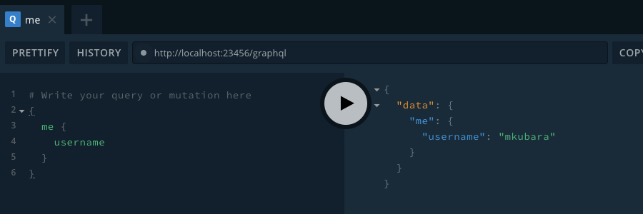

突然ですが、[@suzukalight](http://twitter.com/suzukalight) は来年からジョブチェンジして、バックエンドエンジニアとして働くことになりました！

弊社の開発環境としては、Node, GraphQL, koa, apollo-server, RxJS などを採用しているのですが、順次キャッチアップするとして、まずは基本中の基本からしっかり押さえておきたいと思い、GraphQL の素振りを始めています。

Apollo-Server を使った GraphQL サーバの具体的なチュートリアルとして、[こちらの素晴らしい記事](https://www.robinwieruch.de/graphql-apollo-server-tutorial)がありましたので、これをなぞりつつ、TypeScript で記述したり、適宜改造したりしながら素振りをしていこう、というのが本記事の主旨になります。なお数回のシリーズとして書いていく予定です。

今回実装したリポジトリはこちらです；  
https://github.com/suzukalight/study-graphql-apollo-server

# セットアップとテスト実行

まずは GraphQL サーバのための環境をセットアップし、Playground でクエリをテスト実行できるところまでをセットアップします。

## パッケージインストールと環境設定

サーバを動かすための **apollo-server, express, graphql** と、TypeScript で開発するための **typescript, ts-node-dev** をインストールします。あわせて各種設定ファイルを生成しています；

```bash
$ mkdir study-graphql-apollo-server
$ cd study-graphql-apollo-server/
$ yarn init -y
$ git init
$ gibo dump macos node > .gitignore
$ yarn add apollo-server apollo-server-express express graphql cors
$ yarn add -D typescript @types/node
$ npx tsc --init
$ yarn add -D ts-node ts-node-dev
```

## 最初のコードを書く

自分自身の username を返す、me リゾルバを作成します。apollo-server ではこれらを schema, resolvers に記述して設定し、express へ紐付けて立ち上げるというフローになります；

```typescript:./src.index.ts
import express from 'express';
import cors from 'cors';
import { ApolloServer, gql } from 'apollo-server-express';

const app = express();

app.use(cors());

const schema = gql`
  type Query {
    me: User
  }

  type User {
    username: String!
  }
`;

const resolvers = {
  Query: {
    me: () => ({ username: 'mkubara' }),
  },
};

const server = new ApolloServer({
  typeDefs: schema,
  resolvers,
});

server.applyMiddleware({ app, path: '/graphql' });

app.listen({ port: 23456 }, () => {
  console.log('server on http://localhost:23456/graphql');
});
```

`schema` でどのような情報をサーバにリクエストできるかを定義し、`resolvers` でそのリクエストをどのように解決するかの具体的な実装を記述しています。これらを apollo-server に設定して、express 上で動かせるようにしているのが、上記のコードになります。

## サーバ起動とテスト実行

`yarn dev` で起動するように package.json へ記述しておきます；

```json:package.json
  "scripts": {
    "dev": "ts-node-dev ./src/index.ts"
  }
```

スクリプトを実行します；

```bash
$ yarn dev

yarn run v1.19.2
$ ts-node-dev ./src/index.ts
Using ts-node version 8.5.4, typescript version 3.7.3
server on http://localhost:23456/graphql
```

http://localhost:23456/graphql へアクセスすると、**apollo-server に付属している GraphQL Playground が起動します。**ここから API を叩けるようになっていますので、下記の query を入力して実行すれば、レスポンスが表示されるはずです；

```graphql:query
{
  me {
    username
  }
}
```

```json:response
{
  "data": {
    "me": {
      "username": "mkubara"
    }
  }
}
```



## まとめ

- **graphql, apollo-server, ts-node-dev でサーバを構築する**
- `schema` : **Query や Entity の定義を書く**
- `resolver` : **schema で定義したデータを解決する、具体的な実装を書く**
- `GraphQL Playground` : **apollo-server に付属。API のテスト実行ができる**

# 型定義とクエリ

最初のサンプルで返していた User エンティティを拡張していきます。今回は `{ id, username }` を持つ User エンティティの型定義を行います。

## TypeScript での型定義

interface と、サンプルデータを定義します。me は user の id=1 ということにしてみましょう；

```typescript:./src/index.ts
interface User {
  id: string;
  username: string;
}
interface Users {
  [key: string]: User;
}

const users: Users = {
  '1': { id: '1', username: 'mkubara' },
  '2': { id: '2', username: 'suzukalight' },
};
const me = users[1];
```

## GraphQL schema での型定義

Query として user 全体と単体をそれぞれリクエストできるものを追加し、User には先ほど定義した id フィールドを追加します；

```typescript{4-5,9}:./src/index.ts
const schema = gql`
  type Query {
    me: User
    users: [User!]
    user(id: ID!): User
  }

  type User {
    id: ID!
    username: String!
  }
`;
```

- `users` : 戻り値は配列になるため、`[ ]`で囲います。さらに配列の要素として User エンティティが返ってくることを保証するため、必須オプション `!` を付与しています。
- `user(id: ID!)` : どの user を取得するかを指定する引数を与えられるようにしています。

## resolvers で具体的な実装を行う

User エンティティを取得するための、具体的な実装を記述していきます；

```typescript{1,6-7}:./src/index.ts
import { ApolloServer, gql, IResolvers } from 'apollo-server-express';

const resolvers: IResolvers = {
  Query: {
    me: () => me,
    users: () => Object.values(users),
    user: (parent, { id }) => users[id] || null,
  },
};
```

- `users` : users 全体を配列化して返しています。
- `user(id: ID!)` : **クエリから与えられた引数は、リゾルバの第 2 引数として渡されます。**この値をもとに、仮想 DB から user 情報を取り出して、レスポンスとしています。

## クエリを実行

作成した users, user(id) をそれぞれ実行してみます。GraphQL なら複数のクエリを同時に発行しても OK なので、まとめてテストしてみます；

```graphql:query
{
  users {
    username
  }
  user(id: "2") {
    id
    username
  }
  me {
    username
  }
}
```

```json:response
{
  "data": {
    "users": [
      {
        "username": "mkubara"
      },
      {
        "username": "suzukalight"
      }
    ],
    "user": {
      "id": "2",
      "username": "suzukalight"
    },
    "me": {
      "username": "mkubara"
    }
  }
}
```

期待通り、users 全体と、特定の user とが、追加でリクエストできるようになりました。

## 柔軟なデータリクエストを実現

GraphQL がいわゆる REST API と異なるのは、欲しい情報だけを特定してリクエストすることができることと、複数の情報を一つのクエリで同時にまとめてリクエストできる点です。フロントエンドエンジニアとしては、欲しい情報を好きな形でリクエストできるようになった点に、とても柔軟性を感じたところでした。

## まとめ

- **schema で、得たい情報の型情報と、リクエストに必要な引数を定義する**
- **resolver の第 2 引数で、クエリ側から与えられた引数を受け取ることができ、これを使って取得したいデータを解決する**
- **欲しい情報だけに絞ってリクエストすることや、複数の情報を一つのクエリで同時にリクエストすることができる**

# ネストした resolver と、context による情報共有

## ネストした resolver

resolver はネストすることができます。例えばエンティティの子要素についての resolver を書くと、子要素フィールドを解決するための専用の関数を定義することができます。

下記は username を上書きする例です；

```typescript
const resolvers: IResolvers = {
  Query: {
    ...
  },
  User: {
    username: () => "resolver name",
  },
};
```

```json:response
{
  "data": {
    "users": [
      {
        "username": "resolver name"
      },
      {
        "username": "resolver name"
      }
    ]
  }
}
```

上記の例では具体的なメリットはありませんが、たとえば username を firstName と lastName の合成結果にする例を作成してみましょう；

```typescript{5-6,12-13,17-18,23}:./src/index.ts
const schema = gql`
  type User {
    id: ID!
    username: String!
    firstName: String!
    lastName: String!
  }
`;

interface User {
  id: string;
  firstName: string;
  lastName: string;
}

const users: Users = {
  '1': { id: '1', firstName: 'masahiko', lastName: 'kubara' },
  '2': { id: '2', firstName: 'suzuka', lastName: 'light' },
};

const resolvers: IResolvers = {
  User: {
    username: (user: User) => `${user.firstName} ${user.lastName}`,
  },
};
```

```json:response
{
  "data": {
    "users": [
      {
        "username": "masahiko kubara"
      },
      {
        "username": "suzuka light"
      }
    ]
  }
}
```

users 配列から username フィールドが削除されていますが、**resolver によって firstName, lastName から username が合成されて、レスポンスとして返されています。**

## context による情報共有

resolver に渡される引数は全部で 4 つあります；

- **parent**: 上位のリゾルバで解決した結果を含むオブジェクト
- **args**: このリゾルバに、クエリから渡された引数
- **context**: 外部から依存関係を注入するために使用する、共有引数
- **info**: クエリの実行状態に関する情報

**第 3 引数 context を利用すると、リゾルバ全体で共有したい情報を伝えることができます。**ここではログインユーザ（me）の情報を伝えてみます；

```typescript{3,10}:./src/index.ts
const resolvers: IResolvers = {
  Query: {
    me: (parent, args, { me }) => me,
  },
};

const server = new ApolloServer({
  typeDefs: schema,
  resolvers,
  context: { me: users[2] },
});
```

context にログインユーザ情報として `{ me: users[2] }` を与えています。resolver の Query:me では、第 3 引数 context からこの情報を取り出すことで、ログインユーザとして返しています。

## まとめ

- **リゾルバをネストすることで、エンティティに直接存在しない、新しいデータを解決することができる**
- `parent` : **リゾルバの第 1 引数。親エンティティの情報を受け取ることができ、その情報から、ほかの情報を検索したり、新しい情報を計算できたりする**
- `context` : **リゾルバの第 3 引数。共有情報を受け取ることができる。ログインユーザや会社情報など**

# relation

GraphQL はエンティティの関係性を柔軟に記述することができるのが特徴の 1 つです。まずはその基本形として、User が Message を投稿できるという関係性を試します；

## Message → User

Message エンティティに userId フィールドで relation を定義します；

```typescript{4}
interface Message {
  id: string;
  text: string;
  userId: string;
}
interface Messages {
  [key: string]: Message;
}

const messages: Messages = {
  '1': { id: '1', text: 'Hello, world!', userId: '1' },
  '2': { id: '2', text: 'from GraphQL and Apollo-Server.', userId: '2' },
  '3': { id: '3', text: 'textextext', userId: '2' },
};
```

schema として `user: User!` という関係性を記述しました；

```typescript{7-8,11-15}
const schema = gql`
  type Query {
    me: User
    users: [User!]
    user(id: ID!): User

    messages: [Message!]!
    message(id: ID!): Message!
  }

  type Message {
    id: ID!
    text: String!
    user: User!
  }
`;
```

resolver でこの user に紐付けを行わせます；

```typescript{6-7,12-15}
const resolvers: IResolvers = {
  Query: {
    me: (parent, args, { me }) => me,
    users: () => Object.values(users),
    user: (parent, { id }) => users[id],
    messages: () => Object.values(messages),
    message: (parent, { id }) => messages[id],
  },
  User: {
    username: (user: User) => `${user.firstName} ${user.lastName}`,
  },
  Message: {
    user: (message, args, { me }) => users[message.userId],
  },
};
```

Message に user フィールドを定義します。引数で受けた親エンティティ（Message）の userId をもとに、users データから当該 user を検索して、フィールドを解決しています。

```graphql:query
{
  messages {
    id
    text
    user {
      id
      username
    }
  }
}
```

```json:response
{
  "data": {
    "messages": [
      {
        "id": "1",
        "text": "Hello, world!",
        "user": {
          "id": "1",
          "username": "masahiko kubara"
        }
      },
      {
        "id": "2",
        "text": "from GraphQL and Apollo-Server.",
        "user": {
          "id": "2",
          "username": "suzuka light"
        }
      },
      {
        "id": "3",
        "text": "textextext",
        "user": {
          "id": "2",
          "username": "suzuka light"
        }
      }
    ]
  }
}
```

結果として、メッセージ一覧に加え、そのメッセージを書いたユーザに関する情報も合わせて取得することができるようになりました。

## User → Message

逆方向の relation も定義できます。User に messages を追加してみます；

```typescript{4,11-15}
const schema = gql`
  type User {
    ...
    messages: [Message!]
  }
`;

const resolvers: IResolvers = {
  User: {
    username: (user: User) => `${user.firstName} ${user.lastName}`,
    messages: (user: User) =>
      Object.values(messages)
        .filter(m => +m.userId === +user.id)
        .map(m => messages[m.id]),
  },
};
```

```graphql:query
{
  me {
    id
    username
    messages {
      id
      text
    }
  }
}
```

```json:response
{
  "data": {
    "me": {
      "id": "2",
      "username": "suzuka light",
      "messages": [
        {
          "id": "2",
          "text": "from GraphQL and Apollo-Server."
        },
        {
          "id": "3",
          "text": "textextext"
        }
      ]
    }
  }
}
```

結果として、ユーザ情報に加え、そのユーザが書いたメッセージの一覧も合わせて取得できるようになり、逆方向の relation が記述できました。

# 完成品

実装したリポジトリはこちらです；  
https://github.com/suzukalight/study-graphql-apollo-server
