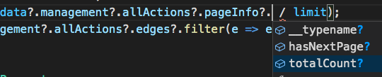

[GraphQL Code Generator | GraphQL Code Generator](https://graphql-code-generator.com/)

GraphQL code generator は、**シンプルな CLI を使用して、GraphQL スキーマから型情報などのコードを生成することができるツールです。**

今回は GraphQL スキーマから TypeScript の型情報を取得する目的で利用しています。

### 特徴

- CLI コマンド 1 つで、簡単に型情報を生成できる
- 状況に合わせた、様々なカスタマイズも可能
- Java, Kotlin, C# などへの出力も対応

### どういう人なら使えるか？

**TypeScript でフロントエンド開発**を行っている環境であれば利用可能です。型安全な開発者体験が得られます。さらに **apollo-client と親和性が高い**ため、apollo-client を使っている場合は強く推奨できます。

# 具体例


解説のための具体例として、下記の機能を考えます；

- マネージャが、各メンバーに対する TODO リストを持っている
- TODO リストを、指定した filters, orders, paging 条件で Fetch する API について考える

## セットアップ

### インストール

バックエンドに GraphQL を使っているプロジェクトであれば、下記の要領で codegen を追加できます；

```bash
yarn add -D @graphql-codegen/cli @graphql-codegen/typescript @graphql-codegen/typescript-document-nodes @graphql-codegen/typescript-graphql-files-modules @graphql-codegen/typescript-operations @graphql-codegen/fragment-matcher
```

```json
// package.json

{
	**"scripts": {
		"codegen": "graphql-codegen --config codegen.yml",
	}
}**
```

### 設定ファイルを作成

パッケージ設定が完了したら、下記のような**設定ファイル**をプロジェクトルートに置きます；

```yaml
# codegen.yml

overwrite: true
schema: 'http://localhost:3000/graphql'
documents: 'src/**/*.graphql'
generates:
  src/generated/introspection-result.ts:
    plugins:
      - 'fragment-matcher'
  src/generated/graphql.ts:
    plugins:
      - 'typescript-document-nodes'
      - 'typescript-operations'
      - 'typescript'
  src/generated/modules.d.ts:
    plugins:
      - typescript-graphql-files-modules
```

設定している事項のなかで、重要なポイントとしては、下記の 3 点です；

- schema の置き場として GraphQL サーバを指定している
- すべての .graphql ファイルを型生成の起点とする
- 生成物として typescript の .ts ファイルを期待している

## GraphQL スキーマから型情報を自動生成する

### クエリのスキーマを定義

「引数としてマネージャとメンバーの ID を渡すと、allActions サブクエリを通して TODO リストが取得できる」という getManagement クエリを考えます。ページネーションは Relay Cursor Connections 形式です；

```graphql
type Query {
  getManagement(managerId: ID!, memberId: ID!): Management
}

type Management {
  manager: User
  member: User

  allActions(
    filters: MemberActionFilter
    orders: [MemberActionOrder]
    paging: MemberActionPaging
  ): ActionConnection
}

type ActionConnection {
  edges: [ActionConnectionEdge]
  pageInfo: PageInfo
}

type ActionConnectionEdge {
  node: Action
  cursor: String
}

type PageInfo {
  totalCount: Int
  hasNextPage: Boolean
  endCursor: String
}

type Action {
  id: ID!
  status: ActionStatuses
  title: String
  # ...
}

enum MemberActionOrderKey {
  id
  createdAt
  updatedAt
}

enum OrderByEnum {
  ASC
  DESC
}

input MemberActionFilter {
  date: DateRangeInput
  isDone: Boolean
}

input MemberActionOrder {
  field: MemberActionOrderKey
  orderBy: OrderByEnum
}

input MemberActionPaging {
  cursor: String
  page: Int
  limit: Int
  field: MemberActionOrderKey
}
```

### .graphql ファイルを作成（TODO リスト取得クエリ）

TODO リストを取得するための GraphQL クエリを作成し、graphql ファイルとして保存します。前節の設定ファイルにおいて、クエリを .graphql ファイルとして保存することで、codegen の対象になるようにしましたので、このファイルは CLI 経由で自動的に型処理されます；

```graphql
# GetMemberActions.graphql

query GetMemberActions(
  $managerId: ID!
  $memberId: ID!
  $actionFilters: MemberActionFilter
  $actionOrders: [MemberActionOrder]
  $actionPaging: MemberActionPaging
) {
  management: getManagement(managerId: $managerId, memberId: $memberId) {
    member {
      id
      displayName
    }

    allActions(filters: $actionFilters, orders: $actionOrders, paging: $actionPaging) {
      edges {
        node {
          ...__Action
        }
        cursor
      }
      pageInfo {
        totalCount
        hasNextPage
      }
    }
  }
}
```

### 型情報を自動生成

では型情報を生成してみましょう。CLI を実行する npm script を使います；

```bash
yarn codegen
```

たったこれだけです！

実行結果として、3 つのファイルが生成されますが、このうち実際に利用するのは **generated/graphql.ts** です。

## 型情報を使ってコーディングする

### 自動生成された型情報を import して利用する

```tsx
import {
  GetMemberActionsQuery,
  GetMemberActionsQueryVariables,
  GetMemberActions,
  MemberActionOrderKey,
  OrderByEnum,
} from '../../../../../../generated/graphql';
```

generated/graphql.ts に、すべての型情報が生成されています。具体的にはクエリ型、引数型、enum 型の各種型情報が自動生成されます。これらを import することで、コードに型情報を持ち込むことができます。

### 引数の型＋ enum の型が利用できる

```tsx
const variables: GetMemberActionsQueryVariables = {
  memberId,
  managerId,
  actionFilters: { isDone },
  actionPaging: {
    page,
    limit,
    field: MemberActionOrderKey.Id,
  },
  actionOrders: [
    {
      field: MemberActionOrderKey.Id,
      orderBy: OrderByEnum.Desc,
    },
  ],
};
```

クエリの引数である variables に対して型情報が付与できます。型情報を頼ることで、**必要な引数がサジェストされ、不要な引数は型エラーになることから、DX が大幅に向上します！**


もうひとつ嬉しい点は、**GraphQL で定義した enum を、型として利用できる**点です。誤ったオプションを指定してしまう可能性がさらに減少します；


誤った引数指定に起因するサーバエラーも減らせそうですね。

### クエリの戻り値にも型がついている

apollo-client の useQuery は、型情報もセットで指定することができます；

```tsx
const { data, loading, error, refetch } = useQuery<
  GetMemberActionsQuery,
  GetMemberActionsQueryVariables
>(GetMemberActions, { variables });
```

useQuery のジェネリクスでクエリの戻り値型を指定できることから、**クエリの実行結果 data にも型が付与されます。**以下のスクリーンショットから、戻り値にも型がついていることがわかります；




開発者体験が大幅に向上することは明白ですね。

### フロントエンド・バックエンドで型情報を同期できる

codegen で得られる戻り値型情報は、そのままバックエンドのエンティティ型情報になっていることが多いと思われます。つまり実質的に、フロントエンド・バックエンドで同じ型情報を使っていることになります。

もしスキーマに変更ができてしまった場合（ないほうが嬉しいですが…）、その変更は型エラーという結果でフロントエンドに伝わってきます。コンポーネントやロジックの修正が必要になるということが一瞬でわかるため、デグレが起きてしまう期間を極めて小さくできます。


presenter コンポーネントも、スキーマ提供の型情報（今回だと Action など）を使って組んでいれば、同様にエラー検知できますので、デグレもだいぶ怖くなくなります！

## メリット・デメリット

### メリット

- 型情報を使うことで、開発者体験が向上し、高速に開発ができる
- 型情報に守られることで、バグを作りづらくなる
- 型を同期することで、デグレが起きづらくなる

### デメリット

- 型ファイルが肥大化していく
  - とはいえ graphql ファイルで記述しているぶんだけなので、必要な肥大化ではある
- 毎度 Diff が出るため、GitHub 上でレビューするときに毎度 Viewed をつけるのが少し手間
  - コミットはするけど、レビュー対象から外す。みたいなことができると嬉しい

# まとめ

GraphQL のスキーマ情報を TypeScript の型に自動変換することで、フロントエンドに型情報を提供し、開発者体験を向上させていった取り組みをご紹介しました。

型情報によって、より高速に、より安全に開発ができるようになりました。こういった体験は単に開発者のためだけでなく、プロダクトの堅牢性を向上させ、バグ検出率を下げる効果が期待できるものでもあるため、開発者だけでなくユーザの体験も良くなるものと感じます。

今回の件で、体験の向上をヒシヒシと感じましたので、バックエンドにも型情報をつけていきたくなりました。やっていくぞ！
