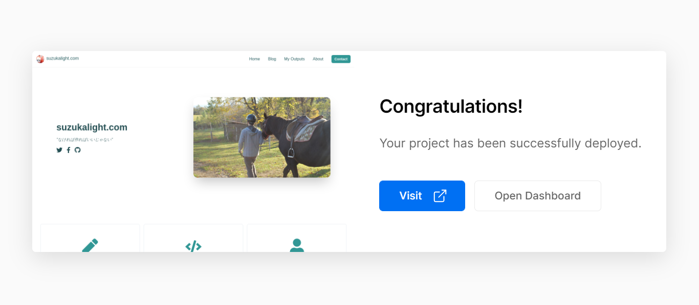

Vercel は、Next.js の制作元であり、同時に Next.js で作成されたサイトのホスティングサービスも展開しています。このサービス、デプロイまでが恐ろしく簡単であると聞いていましたので、気軽な気持ちで試してみました。

結論から言うと、初見で 5 分かからずに完了しました。選択に迷う余地がなく、めちゃくちゃ体験が良いです。以下に手順を残しておきますが、たぶん記事いらないんじゃないか説があります。

- https://vercel.com/
  - **Start Deploying**
- Import Existing Project
  - **Continue with GitHub**
  - **Authorize Vercel**
- Import a Git Repository
  - _{デプロイしたいプロジェクトの URL を入力}_
- Is this your personal GitHub account?
  - **Yes**
- Select Vercel account
  - **Personal Account**
- Install Vercel
  - **Only select repositories** > _{your project}_
  - **Install**
- Import Project
  - Project Name: _{your project name}_
  - Framework Preset: **Next.js**
  - Environment Variables: _{必要があれば入力}_

以上でデプロイが開始されます。完了すると、下記のようなスプラッシュが表示されて、成功をお祝いされます。同時に閲覧用の URL が自動で発行されており、Visit を押すとリモートにデプロイされたサイトが閲覧できるようになっています。静的サイトであれば、本当にこれだけで完了です。

お祝いされて嬉しい！
