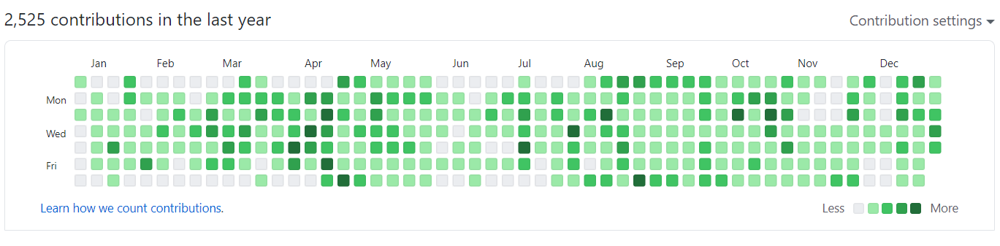
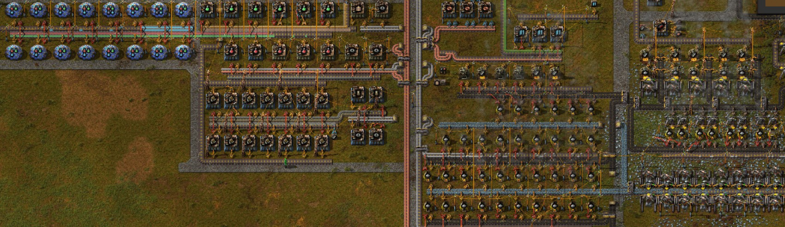

2020 年を振り返って。「技術」「ゲーム」「競馬」の 3 つと、全体的な生活を主に振り返ります。

# 技術

今年の芝生はこんな感じでした。平日は仕事のコミット、休日は個人の素振りのコミット、という感じでだいたい手を動かせていた模様。

素振り成果は積極的に GitHub に公開するようにしていましたが、いま見たら [clean-architecture-nodejs-graphql-codegen](https://github.com/suzukalight/clean-architecture-nodejs-graphql-codegen) が ☆11 になってた嬉しい。

### デザインシステム

1Q で Wistant にデザインシステムが導入された。統一感ある UI が提供できるようになったのは大きかったし、デザイナとエンジニアで色々な対話がなされたことも良かった。**作ってみてまだまだ改良の余地はあるなと思うが、それも含めて「システム」なんだと思う。**継続的な改善ができるような仕組みも作っていきたい。

### Clean Architecture

[https://github.com/suzukalight/clean-architecture-nodejs-graphql-codegen](https://github.com/suzukalight/clean-architecture-nodejs-graphql-codegen)

2020 年はバックエンドも担っていくことになり、ならばアーキテクチャから知る必要があると考えて、学習を始めたもの。自分の中ではかなりパラダイムシフトになった。ドメインをキーアイテムとして、旧来のレイヤードとは依存関係を逆転させながら実装していく。この学習の過程で、何が不変で何が壊れやすいものか、**何が最も大事なもので何はすげ替えても良いものなのか**、という視点が自分の中にできたのは大きかった。

### Terraform

[https://github.com/suzukalight/study-aws-ecr-ecs-terraform](https://github.com/suzukalight/study-aws-ecr-ecs-terraform)

これもバックエンドやインフラのために勉強したもの。現在のデプロイ環境が OpsWorks+Chef の半手動型なので、これを全自動にしたかった。Docker+ECS+CircleCI の環境を作って、サーバプログラムを自動デプロイできるところまでは素振りできた。**コードでインフラを記述でき、コマンド 1 つでサーバが完成して、世界に公開できるのは快感だった。**コミットごとに dev/stg/prod を作ったりスイッチできるようにはなりたい。

### Jest (testing)

[https://zenn.dev/suzukalight/articles/jest-test-each](https://zenn.dev/suzukalight/articles/jest-test-each)  
[https://zenn.dev/suzukalight/articles/apollo-server-testing-sqlite](https://zenn.dev/suzukalight/articles/apollo-server-testing-sqlite)

**継続的インテグレーションにはテストが大事**、ということで Jest による単体・統合テストの学習を続けていた。t_wada さんに怒られない開発にはまだ遠いけれども、テストのないコードをリリースすることがないようにしていく（仕組みとしても）。

### Auth0

[https://github.com/suzukalight/sample-auth0-react-nodejs](https://github.com/suzukalight/sample-auth0-react-nodejs)

エンタープライズ向けの機能強化が最近の至上命題だったので、**SAML-SSO での認証に対応するために学習を始めた。**Auth0 はドキュメントが非常に整っており、調べやすく実装しやすいのはとても良かった。他方、エンプラ向けの機能を素振りしたり公開したりしてくれている人は少なくて、そこを自分たちで開拓していく必要があったのが難しかった。SSO 機能は年末にリリース済み。

使いやすいので個人プロジェクトでもやっていきたいが、お金もかなりかかる（だいたい 1ID=10 円/月）ので、プロダクトとして認証に重きを置くようなサービスに関われたら使っていきたい。

### TypeScript + ApolloClient + GraphQL Code Generator

[GraphQL code generator で、スキーマから TypeScript の型情報を自動で手に入れよう！](/blog/posts/2020-06-22-graphql-codegen)

**GraphQL のスキーマ情報から自動的に TypeScript の型情報を出力できるもの。**こうすると ApolloClient のメソッドコールが型のついた状態でできるようになり、GraphQL の Query を受け取ったり、Mutation を叩いたりできる。今ではこれなしの開発は考えられない。

### Next.js + ChakraUI

[https://github.com/suzukalight/suzukalight-com](https://github.com/suzukalight/suzukalight-com)

個人的に最高のコンビになった。

Next.js はその設計思想含めてもはやデファクトな概念だと思う。フロントエンドエンジニアの仕事が再編された感じ。SSG や ISR も含めると、**一部のバックエンド領域も取り込んだ、新しい「クライアントサイド」な仕事が必要になってくる。**必要な UI/UX を提供するためには、現時点で必要な流れだと思う。

TailwindCSS を経て会得した ChakraUI の使いやすさが身にしみている。型がついたスタイル props は最高だし、React やるなら見た目と振る舞いの療法を JSX で完結できたほうが良い。かゆいところに手が届くコンポーネント群も提供されている。**最高なので、もはや技術で言い訳はできなくなり、あとは自分のデザイン能力だけが試されている感じ。がんばろう。**

# ゲーム

2020 年は結構ゲームもできてたと思う。リモートになって可処分時間が増えたのと、旅行のかわりにゲーム楽しむ時間が増えたおかげかな。

### Factorio

マルチでプレイ。「**自分がやっちゃいけないゲーム筆頭**」だと思っていた、効率厨御用達のゲーム。やりはじめるとやっぱりそのとおりで、工場のラインをどう最適化したら良いか、ずっと考え続けてしまう。そしてそれを実践できたときが快感すぎる。そんな状況なので睡眠時間がガリガリ削られていった。通勤時間のない在宅勤務で本当に良かった。

### テトリス 99 + ぷよテト

ふと「自分テトリス好きだけど、頑張ったらどれくらいやれるようになるんだろ」と思い立ってはじめたテトリス 99。T スピンの基礎から、開幕 DT 砲、リカバリ技術などを順に学習。オンラインでは TOP10 にすら入れない日々が続いていたが、**リカバリや T スピンの感覚をひたすら馴染ませていく地味な練習を続けて、無事テト 1 を獲得。**ターゲティングなども駆使して、最終的には安定して TOP10 に入れるようになった。頑張ったらこれくらいやれた案件。

### ダービースタリオン(Switch)

自分の原体験が Switch で復活。過去作やり込みすぎているし、たぶん普通にやったら普通に G1 全制覇できるので、**今回は「初期牝馬の産駒限定」「金策なし」縛りでプレイしている。**2 世代目で G3 を制覇したものの、続く世代も G3 止まりな現状。牧場拡張ペースが遅い地道経営なのが問題点かな。ひとまずこのまま楽しみつつ、世間に攻略情報が満ちてきたら改めて攻略するつもり。

**一口馬主になってダビスタの楽しみ方が明らかに変わってきて面白い。**昔なら OP 入りできない馬なんかすぐに引退させてたと思うけど、**いまは一勝できるだけで嬉しい。**

### その他

- **Starbound**: マルチでプレイ。Terraria やっていたのでその流れで始めてみた。Terraria よりやれることが何倍も多くて良いんだけど、結局建築ばっかりやってるので、敵をしばくことより箱庭に人を住まわせることのほうが好きな気がした。
- **ドラクエウォーク**: たぶん一番長く触っている。全然ウォークできてないけど。Lv.65 にしたり、メガモンしばいたりとか、まったりやっている感じ。ウマ娘がリリースされたら時間がそっちに持っていかれるかもしれぬ。
- **ウマ娘**（未リリース）: ずっと追いかけ続けてきた。そしてついに 2011/2/24 リリース予定に決まった。これ合わせでスマホを買い換える予定。Xperia 5 II が SIM フリーになってくれることを願う。リリースされるよね？

# 競馬

2019 年から一口馬主を始めた。キャロットクラブに無事入会（[このとき書いたブログ](/blog/posts/2019-09-06-join-carrot-club)が Google の検索 1 ページ目に載り続けててちょっと誇らしい）。出資した 1 歳馬 2 頭が、明け 2 歳になった 2020 年。ついにデビューの年を迎えた。今年はこの 2 頭がデビューに向けて頑張ってくれました。

### ホワイトクロウ

[https://db.netkeiba.com/horse/2018105544/](https://db.netkeiba.com/horse/2018105544/)

父ヘニーヒューズ・母ピエリーナの牡馬。育成期間では軽い頓挫があったものの、その後のゲート試験や調教は順調に進み、10 月に再入厩、1 ヶ月ほどでデビュー予定になった。

だが中間の調教では「**とぼけていましたね**」とか「**ちょっと渋かったですね…**」などの散々なコメントを頂いており、迎えたデビュー戦は「まぁとにかく無事に回ってくれれば良し！！！」みたいな運動会の親御さんの気持ちで応援していた。

その結果が、アッと驚くような**鮮やかな先行押し切り勝ち。**

正直自分でも「**あれ…勝った…うちの子…？**」みたいな半分呆然としていたが、終わってしばらくして「**ああ…勝ったんだな…**」という気持ちがジワジワこみ上げてきた。この日は今年最高に盛り上がった一日のひとつとなった。感動した！

厳しい競走馬の世界の中で、デビューもできて、ましてや新馬勝ちしてくれる、しかもそれが初出資馬、という幸運に恵まれ、私の一口馬主ライフはとても満足度の高いものになりました。追加の喜びとして、つい先日賞金分配を 14,000 円ほどいただき、クリスマスプレゼントだなーと（一口馬主で収入なんか 1 円もないと思ってた人の発想）。**ホワイトクロウ、ありがとう！**

### フォルトゥナータ

[https://db.netkeiba.com/horse/2018105547/](https://db.netkeiba.com/horse/2018105547/)

父ミッキーアイル・母フォルテピアノの牝馬。小柄で小顔の可愛らしいお馬さん。こちらも育成期間で軽い頓挫があったものの無事に入厩。しかしフォルトゥナータの場合はここからがさらなる難関だったようで、スクミを起こしてしまった。**怖がりさんなんだろうなぁ…。**環境変化に気をつけつつ調教していただいているよう。

ゲート試験は無事に合格、再放牧して、12 月に帰厩。**順調にいけば 1 月頭のダート 1200m 戦でデビューするようなので、**年明け早速の楽しみができました。応援していくぞ！でもまずは無事にデビューしてね！

### 今年の出資

今年は、[クルージンミジーの 2019](https://db.netkeiba.com/horse/2019105170/) への出資が新たに決まりました。最終的に 6 頭に応募したのですが、キャロットクラブの抽選はホント狭き門ですね。。。2021 年も引き続き応援＋チャレンジしていきます！

# 生活

### 新型コロナ（COVID-19）

3 月には全社的に原則出勤禁止が決まり、これ以降ずっとリモートワークで過ごした。もともとインドア派なのであまり生活に変化はなく、通勤がなくなったぶん可処分時間が増えて、そのぶんゲームなどをやれる時間が増えた感じ。

一方、帰省したときの定例の飲み会や、ゲーム合宿、両親とのコミュニケーションなどの機会が失われたのは残念だった。帰省方面では全然成果が出せていないのが悔やまれる一年。オフラインゲームはどうしてもやりづらくなるなぁと。

毎年 10 日ほど旅行もしているが、今年はゼロ。GoTo なども使う気は全くなれなかった。リスク・リターンを考えればセーフな人もいるだろうけど、ウチの場合は「何かに怯えながら旅行を楽しむことは難しい」という判断になった。

### リモートワーク

会社的にはもともとリモートワーク可だったし、今後はリモートワーク文化が日本にどんどん根付くことを期待している。やるべきことが見えている環境ならパフォーマンスは確実に上がるし、やるべきことを模索しているときはビデオ会議やチャットでどんどんやり取りすれば良い。

リモートワークになったので、そのぶん在宅勤務環境を強くした。具体的には[ハーマンミラーの椅子](https://www.hermanmiller.com/ja_jp/products/seating/office-chairs/sayl-chairs/)を買ったり、[USB-C で MacBook と接続＋給電できる 4K ディスプレイ](https://www.lg.com/jp/monitor/lg-27UL850-W)を買ったりした（2 枚目）。

コミュニケーションについては、やはり意識しないと一気に減るなぁと感じた。なので Discord やってみたり、Slack での絡みを増やしたり、技術共有会を厚くするなど工夫もしてみた。それがうまく行ったかは正直わからないけど、やってよかったのではと思う。

# 2021 年に向けて

2021 年は、まず「誰かが苦しまなければならない状況」というのは早くなくなれば良いと切に願う。

個人としては、**2021 年はチャレンジの年だと決めていた**ので、それを実現すべく、年初から仕込みと学習をしていく。春にはその成果が出始めると思う。健康には留意しつつも、チャレンジを続けていきたい。

まずはこのブログが公開できるように、サイトリニューアル＋勉強を頑張るぞ！
