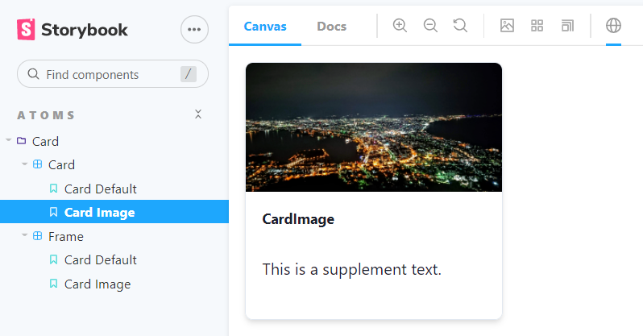

タイトルの通りです。ポイントは下記のとおりでした；

- preview.tsx で `ChakraProvider` を呼んでおく
- main.ts で **emotion へエイリアス**をしておく
- 画像を読む際は `declare module '*.png'` しておく

# セットアップ

## インストール

```bash
npx sb init
```

[Storybook 公式のインストール手順](https://storybook.js.org/docs/react/get-started/install)に則って進めれば OK です。

## 設定

[Chakra UI 公式サイトのリポジトリの設定](https://github.com/chakra-ui/chakra-ui)を持ってきて、一部を改変しました；

```tsx:/.storybook/preview.tsx
import * as React from 'react';
import { ChakraProvider, extendTheme } from '@chakra-ui/react';
import { StoryContext } from '@storybook/react';

/**
 * Add global context for RTL-LTR switching
 */
export const globalTypes = {
  direction: {
    name: 'Direction',
    description: 'Direction for layout',
    defaultValue: 'LTR',
    toolbar: {
      icon: 'globe',
      items: ['LTR', 'RTL'],
    },
  },
};

const withChakra = (StoryFn: Function, context: StoryContext) => {
  const { direction } = context.globals;
  const dir = direction.toLowerCase();
  return (
    <ChakraProvider theme={extendTheme({ direction: dir })}>
      <div dir={dir} id="story-wrapper" style={{ minHeight: '100vh' }}>
        <StoryFn />
      </div>
    </ChakraProvider>
  );
};

export const decorators = [withChakra];
```

```ts:/.storybook/main.ts
const path = require('path');

const toPath = (_path) => path.join(process.cwd(), _path);

module.exports = {
  stories: ['../src/**/*.stories.mdx', '../src/**/*.stories.@(js|jsx|ts|tsx)'],
  addons: [
    '@storybook/addon-links',
    '@storybook/addon-essentials',
  ],
  typescript: {
    check: false,
    checkOptions: {},
    reactDocgen: 'react-docgen-typescript',
    reactDocgenTypescriptOptions: {
      shouldExtractLiteralValuesFromEnum: true,
      propFilter: (prop) => (prop.parent ? !/node_modules/.test(prop.parent.fileName) : true),
    },
  },
  webpackFinal: async (config) => {
    return {
      ...config,
      resolve: {
        ...config.resolve,
        alias: {
          ...config.resolve.alias,
          '@emotion/core': toPath('node_modules/@emotion/react'),
          'emotion-theming': toPath('node_modules/@emotion/react'),
        },
      },
    };
  },
};
```

```ts:/import-image.d.ts
declare module '*.jpg';
declare module '*.png';
```

# Story を作成

## stories.tsx を記述

```tsx:/src/components/atoms/Card/__stories/Card.stories.tsx
import React from 'react';
import { Story, Meta } from '@storybook/react/types-6-0';
import { Box, Icon, Image } from '@chakra-ui/react';
import { FaCode } from 'react-icons/fa';

import { Card, CardProps } from '../Card';

import image from './hakodate-night.jpg';

export default {
  title: 'atoms/Card/Card',
  component: Card,
} as Meta;

const Template: Story<CardProps> = (args) => (
  <Box w={64} h={64}>
    <Card {...args} />
  </Box>
);

export const CardDefault = Template.bind({});
CardDefault.args = {
  image: <Icon as={FaCode} boxSize={8} fill="teal.500" />,
  title: 'CardDefault',
  supplement: 'This is a supplement text.',
} as CardProps;

export const CardImage = Template.bind({});
CardImage.args = {
  image: <Image src={image} />,
  title: 'CardImage',
  supplement: 'This is a supplement text.',
} as CardProps;
```

- `export default` : story タイトルとコンポーネントを提供
- `Template` : story 全体のテンプレートコンポーネントを作成
- `named export` : 個別の story を記述
  - export したコンポーネント名が、**そのまま story 名になる**
  - `.args` にコンポーネントの props を指定する
- 画像を使いたい場合は、`import image from './image.png'` で取り込める

## storybook を実行

```bash
yarn storybook
```



[http://localhost:6006/](http://localhost:6006/) に storybook が起動し、記述した story が表示できれば OK。
