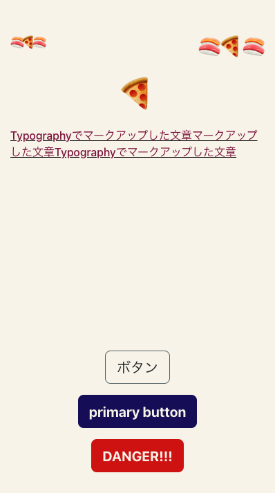
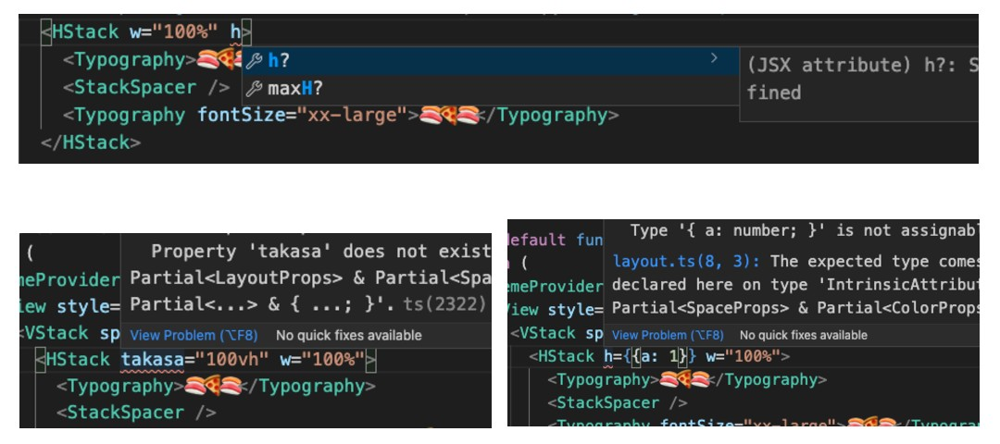

**3 行まとめ**

- css mixin を使うことで、複数のコンポーネントで使い回せるスタイルヘルパを作成できる
- csstype を使って、Typography, Space, Color などの型付き props を作ることができる
- 基礎コンポーネントに型付き props を混ぜて受けられるようにし、mixin で受けてスタイリングさせることで、Chakra UI のような型安全なスタイル記述ができるようになる

# 何がしたかったか

こういう Chakra UI みたいな書き方がしたかったので、styled-components でやれるかを試したのが今回の記事の主題です。

```tsx
export default function App() {
  return (
    <VStack spacing={4} w="100vw" h="100vh" px={4} py={8} bgColor={palette.white}>
      <HStack w="100%">
        <Typography>🍣🍕🍣</Typography>
        <StackSpacer />
        <Typography fontSize="xx-large">🍣🍕🍣</Typography>
      </HStack>

      <Typography fontSize="xxx-large">🍕</Typography>

      <Typography color={palette.brown} textDecoration="underline">
        Typographyでマークアップした文章マークアップした文章Typographyでマークアップした文章
      </Typography>

      <StackSpacer />

      <Button label="ボタン" onPress={() => console.log('pressed')} />
      <Button label="primary button" primary onPress={() => console.log('pressed')} />
      <Button label="DANGER!!!" danger onPress={() => console.log('pressed')} />
    </VStack>
  );
}
```



先例として [Magnus UI](https://magnus-ui.com/) などがありますが、今回は自分で実装するとどんな感じになるのかを試したかったので、styled-components によるスタイリングと、csstype を使った型定義を行ってみることにしました。

### 開発環境

```json
{
  "dependencies": {
    "csstype": "^3.0.7",
    "expo": "~40.0.0",
    "react": "16.13.1",
    "react-dom": "16.13.1",
    "react-native": "https://github.com/expo/react-native/archive/sdk-40.0.1.tar.gz",
    "react-native-web": "~0.13.12",
    "styled-components": "^5.2.3"
  },
  "devDependencies": {
    "@types/styled-components": "^5.1.9",
    "@types/styled-components-react-native": "^5.1.1",
    "typescript": "~4.0.0"
  }
}
```

### 作成したソースコード

以下のリポジトリに PUSH しています。

https://github.com/suzukalight/study-styled-components-mixin-csstype-expo

# styled-components の Mixin パターンを使う

ここではフォントに関する CSS 型定義を取り上げ、具体例として Typography コンポーネントを作ってみます。

まずは fontMixin から作成します；

```ts
import * as CSS from 'csstype';
import { css } from 'styled-components';

export type FontProps = {
  fontSize: CSS.Property.FontSize;
  fontWeight: CSS.Property.FontWeight;
  lineHeight: CSS.Property.LineHeight;
};

export const fontMixin = css<Partial<FontProps>>`
  ${({ fontSize }) => fontSize != null && `font-size: ${fontSize};`}
  ${({ fontWeight }) => fontWeight != null && `font-weight: ${fontWeight};`}
  ${({ lineHeight }) => lineHeight != null && `line-height: ${lineHeight};`}
`;
```

**CSS の TypeScript 型定義には [csstype](https://github.com/frenic/csstype) を利用しました。** Chakra UI でも利用されています。`CSS.Property.X` で X に対する有効な値が取得でき、これを型として各変数に割り当てます。

**mixin の作成には、styled-components の `css` ヘルパ関数を使います。** CSS 生成ロジックを分離することができ、複数のコンポーネントにまたがったスタイル処理を定義することができます。

# Mixin を自作の基礎コンポーネントで使用する

次に Typography コンポーネントを作成し、実際に mixin を使用してみます；

```tsx
import React, { ReactNode } from 'react';
import styled from 'styled-components/native';

import { colorMixin, ColorProps } from '../../styles/color';
import { FontProps, fontMixin } from '../../styles/typography';

export type TypographyStyledProps = Partial<FontProps> & Partial<ColorProps>;

export const TypographyStyled = styled.Text`
  ${fontMixin}
  ${colorMixin}
`;

export type TypographyProps = TypographyStyledProps & {
  children?: ReactNode;
};

export const Typography = ({ children, ...styles }: TypographyProps) => (
  <TypographyStyled children={children} {...styles} />
);
```

コンポーネントの Props として、さきほど定義した FontProps を自身の Props にマージします。このとき **Partial としてマージすることで、オプションプロパティとして反映します。** これにより自分が指定したプロパティだけをスタイルへ上書きできます。

スタイルの上書きは、さきほど作成した fontMixin を、自身のスタイル記述部に取り込むだけで OK です。もしコンポーネント固有のスタイルも設定したい場合は、mixin の下に続けて記述すれば良いと思います。

この例では別途作成した colorMixin もミックスインしていますが、このような感じで layout, space, background などの mixin を作成し、あわせて利用していく形が最終目標になると思います。様々な自作コンポーネントが、統一感ある props 指定でスタイリングできる環境ができれば、生産性抜群になること間違いなしですね！

# 実際に props でスタイリングしてみる

作成した基礎コンポーネントを利用する側は、props でスタイル指定できるようになります；

```tsx
const Page = () => (
  <VStack spacing={4} w="100vw" h="100vh" px={4} py={8} bgColor={palette.white}>
    <HStack w="100%">
      <Typography>🍣🍕🍣</Typography>
      <StackSpacer />
      <Typography fontSize="xx-large">🍣🍕🍣</Typography>
    </HStack>

    <Typography color={palette.brown} textDecoration="underline">
      Typographyでマークアップした文章マークアップした文章Typographyでマークアップした文章
    </Typography>
  </VStack>
);
```

以下が、実際に Typography コンポーネントを使ってコーディングしたときの、vscode によるサジェストです。**定義していない props を追加したり、不正な型の引数を props として渡したりすると、エラーになっているのが確認できます**；



# 応用編

主題に対する記事の内容は前節までで、以下は特殊ケースへの応用です。

## "x-large" のようなデザイントークンを追加したい

デザインシステムを運用している場合だと、CSS 値そのものではなく、より利用範囲を絞り込んだ `x-large` のようなデザイントークンを使いたい場合もあると思います；

```ts
export type StyleSize = 'large' | 'medium' | 'small';
```

このような場合は、その型定義と、それを CSS として変換する前処理を追加すると良いと思います；

```ts
import { StyleSize } from './type';

const fontSizes: { [key in StyleSize]: string } = {
  small: '0.875rem',
  medium: '1rem',
  large: '1.25rem',
};

export type FontSize = StyleSize | CSS.Property.FontSize;
export type FontProps = {
  fontSize: FontSize;
  /* 以下省略 */
};

export const fz = (fontSize?: FontSize) => {
  if (typeof fontSize === 'string') return fontSizes[fontSize as StyleSize] ?? fontSize;
  if (typeof fontSize === 'number') return `${fontSize}px`;
  return 'inherit';
};

export const fontMixin = css<Partial<FontProps>>`
  ${({ fontSize }) => fontSize != null && `font-size: ${fz(fontSize ?? 'medium')};`}
`;
```

## spacing で Stack 間にマージンを追加したい

Web の React であれば問題ないのですが、React Native の場合は CSS について擬似的にサポートしているだけなので、一部の CSS 記法が利用できません。具体的には隣接セレクタが利用できず、`& > * + *` のような Stack を記述することができませんでした（やり方があれば教えて下さい）。

そこで今回は CSS ではなく JS で対応することとしました。具体的には children に `margin-top: x` を付与することで対応しています；

```tsx
export const VStack = ({ children, spacing, ...styles }: VStackProps) => {
  const childrenWithProps = spacing
    ? React.Children.map(children, (child) => {
        if (!React.isValidElement(child)) return child;
        return React.cloneElement(child, { style: { marginTop: sp(spacing) } });
      })
    : children;

  return <VStackStyled children={childrenWithProps} {...styles} />;
};
```

### references

- [csstype](https://github.com/frenic/csstype)
- [styled-components: API Reference](https://styled-components.com/docs/api#css)
- [javascript - How to pass props to {this.props.children} - Stack Overflow](https://stackoverflow.com/questions/32370994/how-to-pass-props-to-this-props-children)
