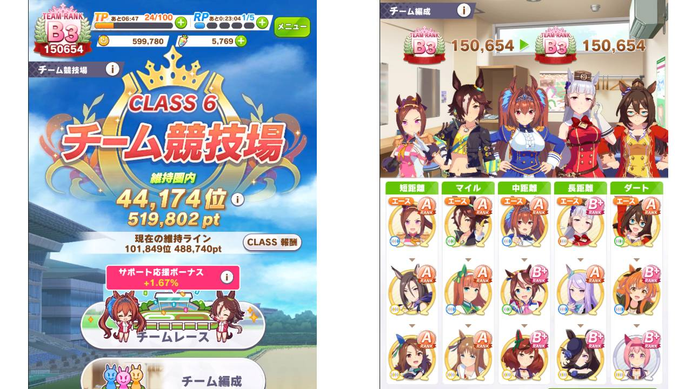
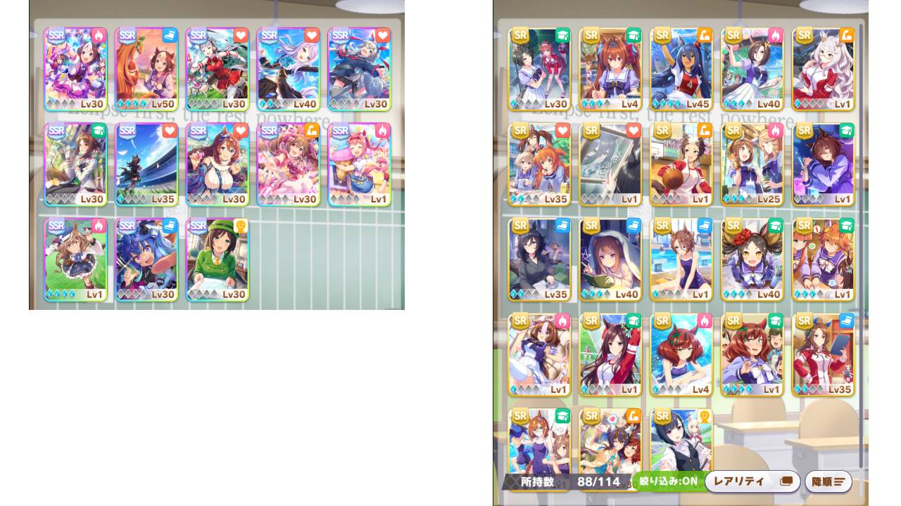
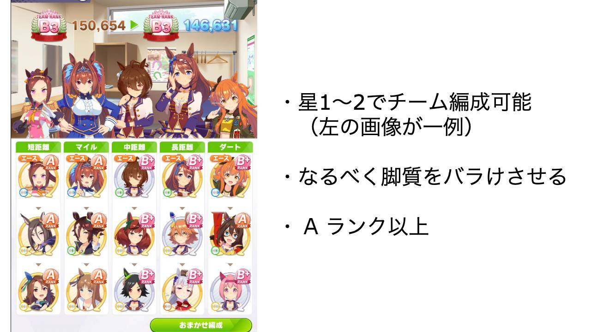
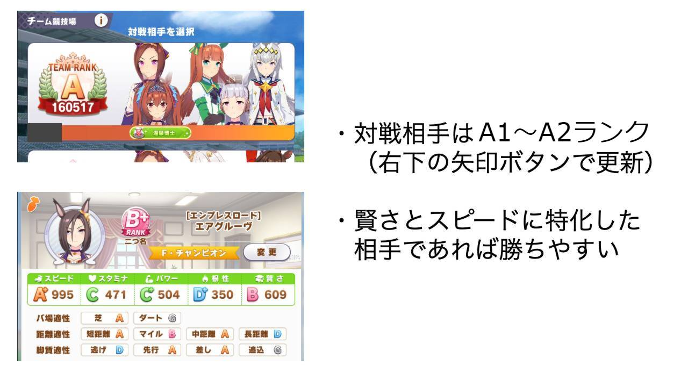
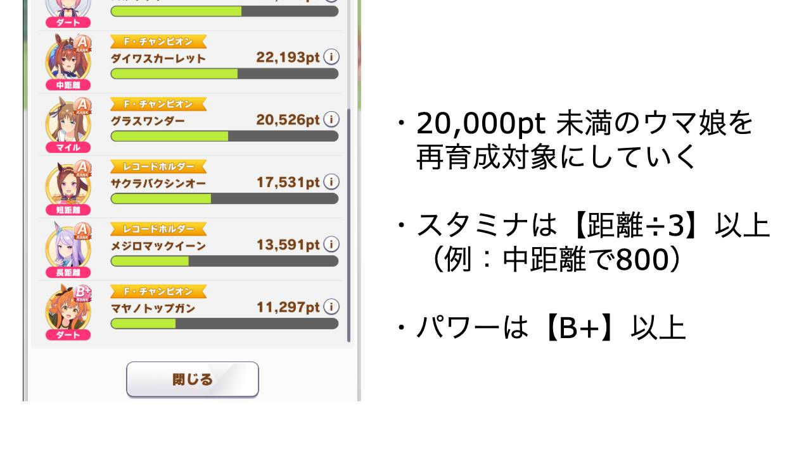

ウマ娘、無事に**チーム競技場でのクラス 6 維持に成功**したので、育成や編成で意識したことをまとめました。無課金～微課金者向けの攻略記事になります。

ざっくり概要。

- **クラス 6 維持ボーダーは 50 万**。これを獲得できるチーム編成と対戦相手を考える
- **チームランク B3 でクラス 6 挑戦権獲得**。星 1 ～ 2 編成でも十分作れます
- **育成は目標ステータスを必ず決める**。ステ 2 つを厳選して成長させる
- **対戦相手は常に A ランクを選ぶ**。スタミナやパワーが低い相手と、パフェを使って全力勝負する
- **稼げないキャラからローテーション再育成する**。戦績下位、20,000pts. が基準

参考までに、私のチーム編成と、サポカのカードプールです。

# チーム編成

## 星 1 ～ 2 こそ主戦力

| コース | 育成キャラ（脚質）                                                     |
| ------ | ---------------------------------------------------------------------- |
| 短距離 | サクラバクシンオー（逃）、キングヘイロー（差）、エアグルーヴ（差）     |
| マイル | ダイワスカーレット（逃）、ウオッカ（先）、グラスワンダー（差）         |
| 中距離 | アグネスタキオン（先）、ナイスネイチャ（差）、ウイニングチケット（差） |
| 長距離 | スーパークリーク（先）、マチカネフクキタル（差）、ゴールドシップ（追） |
| ダート | マヤノトップガン（逃）、エルコンドルパサー（先）、ハルウララ（差）     |

**星 1 ～ 2 でチーム競技場の編成を埋めることが可能です**。星 3 については短距離とダートのキャラがいれば非常に心強いです。私はどちらもいませんので魔改造で苦労させられています。。。

上記編成で魔改造が必要なキャラは、エアグルーヴ（短距離 ×2）、マヤノトップガン（ダート ×3、マイル ×3）の 2 名です。マヤノの改造が非常に厳しく、ダート ×3 をレンタルし、手持ちでマイル ×3 の赤因子を作り、さらに継承イベントでお祈りする必要があります。これは厳しいのでマヤノは「いてくれるだけでもありがたいです…！」の気持ちで適性 B/B くらいの運用でも十分だと思います。

**編成時はなるべく脚質をバラけさせ**、全員がナイスポジション+1000 点をゲットできるようにします。ナイスポジションは脚質ごとに 1 名選ばれるそうです。噂ではポジションごとの先頭キャラに与えられるのではないかと耳にしています。

**チームランクは B3 ランク以上を目指します**。A ランクの対戦相手に全勝できることがクラス 6 維持の基準になり、A ランクの対戦相手が選択肢に出る条件がこちら B3 以上なためです。B3 ランク達成は、編成キャラの半分が B+ で半分が A になっていれば可能です。

# 育成

## まず目標ステータスを決める

| コース＼脚質   | 育成優先度 | 逃げ                   | 先行                | 差し・追込           |
| -------------- | ---------- | ---------------------- | ------------------- | -------------------- |
| 短距離         | SP > PW    | **SS+**/C+/A/D/D+      | **SS**/C+/A+/D/D+   | **SS**/C+/S/D/C      |
| マイル・ダート | SP > PW    | **SS+**/B/A/D+/D+      | **S+**/B/A+/D+/D+   | **S**/B/S/D+/C       |
| 中距離         | ST = SP    | **S+**/**B+**/B+/D+/D+ | **S**/**A**/A/D+/D+ | **A+**/**A**/A+/D+/C |
| 長距離         | ST > SP    | A+/**A**/B/C/D+        | A/**A+**/B/C/D+     | B+/**A+**/B+/C/C     |

（5/2: パラメータを更新）

目標ステータスは、上位ランカーのステータスを参考に決めています（実際の上位ランカーは、この 2 段階上のパラメータです！）

**スタミナが最も重要で、距離の 1/3 を目指します**。たとえば中距離であれば 2400m が最大ですから、800=A が目標になります。スタミナ不足は中長距離において致命的で、特に長距離はスタミナと回復スキル量だけでだいたい勝負が決まります。長距離は 2500〜3600m と幅が広いため、幅広く対応するためにも 1 人だけスタミナ 1100 にしておくと良いかもしれません。

**どんな脚質であれ、パワーの要求値は高めに見ておいたほうが良い印象です**。実際にレースを見てみると、パワーが足りない場合、番手がとれなくなったり、前列を割れなかったり、ラストスパートの加速が足りなかったりなど、結構負けに響いている印象です。

**賢さは C を目標とします**。以前は D を目標としていましたが、**差し追込の場合は賢さが低いと馬群を捌けずに沈むことが多くなってきたため、目標値を 2 段階上げました**。ただそれ以上に基礎パラメータがないとそもそも勝てないので、優先度としては引き続き低めです。

スピードについては全距離で重要ですが、長距離になるほどスタミナにも振らないとダメなので、長距離ほど相対的に重要度は下がっていきます。根性についてはスタミナへのプラスポイントと考えて差し支えないと思います。スタミナ調教すると根性もつくので、スタミナ調教のスタミナボーナス感覚でしょうか。

## サポートカードのデッキ構成は狙いをつけて

| コース         | 育成優先度 | デッキ構成                 | 因子継承 |
| -------------- | ---------- | -------------------------- | -------- |
| 短距離         | SP > PW    | SP / SP / SP / SP / PW / ※ | PW > ST  |
| マイル・ダート | SP > PW    | SP / SP / SP / PW / PW / ※ | ST > PW  |
| 中距離         | ST = SP    | SP / SP / SP / ST / ST / ※ | PW       |
| 長距離         | ST > SP    | SP / SP / ST / ST / ST / ※ | PW > SP  |

**サポートカードは 2 種類のステータスに狙いをつけてデッキ構成します**。例えば「SP / SP / SP / PW / PW / 友」という感じです。

ここから目標距離に応じた変化をつけていきます。短距離の場合はスピード SS を狙うために SP を 4 枚に増やします。長距離の場合はスタミナ A+ を狙うために ST を 3 枚積みしています。

「※」にはウマ娘ごとに必要なスキルやステを差し込んでください。逃げ枠には「コンセントレーション」や「逃亡者」などのスキルカード、長距離で SP の伸びがキツイときは SP カードなどが良いかと思います。

**SSR だけではなく、SR も十分利用可能です**。有名なのはスイープトウショウ、マヤノトップガンあたりでしょうか。これらのカードは凸状態が良ければトレーニング性能が SSR より良い可能性があります。私も完凸スイープトウショウにだいぶお世話になっています。このほか、エイシンフラッシュ、キングヘイロー、マーベラスサンデー、桐生院葵あたりもスキル性能が高く優秀です。

レンタルサポカは「キタサンブラック完凸」一択です。スキルもイベントも何もかも強いので。例外としては長距離の場合で回復金スキルが 2 個確保できない場合に、スーパークリークかウオッカをレンタルしましょう。

## 獲得スキルは金 4、銀 7 を目標に

| コース＼脚質   | 逃げ            | 先行            | 差し・追込              |
| -------------- | --------------- | --------------- | ----------------------- |
| 短距離         | コンセ、ポジ系  | コンセ、加速系  | コンセ、加速系、視野系  |
| マイル・ダート | ポジ系          | 加速系          | 加速系、視野系          |
| 中距離         | 回復、ポジ系    | 回復、加速系    | 回復、加速系、視野系    |
| 長距離         | 回復 x2、ポジ系 | 回復 x2、加速系 | 回復 x2、加速系、視野系 |

取るべきスキル種別については、距離や脚質などでいくつかポイントがあります。

- **短距離: コンセントレーション**。ゲート失敗の 1 秒差が短距離だと重たくなるため
- **長距離: 回復スキルを 2 個以上**。スタミナのあるなしで勝負が決まるため
- **逃げ: ポジションスキルを 3 個以上**。先頭のままなら押し切れることが多いため
- **差し追込: 加速スキルと視野スキル**。追い上げと馬群捌きに必要なため

ほか、**全体共通として、末脚と直線巧者**の取得をおすすめします。ラストスパートの伸びに関わるためです。これらの上位スキルは全身全霊とハヤテ一文字です。

**金スキル 4 つ、銀スキル 7 つを目標**にスキルを獲得します。必要なスキルポイントについては、半期で 3 つの G1 レースに出ると、これに近いポイントが稼げます。SR 桐生院がいる場合は、レース出走のかわりにおでかけすることでポイントがまかなえます（全部で 250 ほど）

**固有スキルが発動できる脚質を選択しましょう**。単純に金スキル 1 つ分を超える価値になるためです。

**各距離においてデバフキャラを 1 人**定めておき、彼女にはなるべくデバフ獲得をお願いしておきます。エアグルーヴ、グラスワンダー、ナイスネイチャ、スーパークリークあたりが適任です。各距離ごとに 3 人で 5〜6 個ほどデバフを持っていると良いと感じています。

## 継承はデッキ構成の補完を

**継承する青因子は、サポートカードで選ばなかった 3 種類目を選びます**。基本的に ST9 か PW9 を選ぶ感じになります。

上記の青因子が選べる、レンタル可能な 1 日 3 回が勝負です。余った TP は基本的に因子周回します。手持ちで ST9 や PW9 が作れると非常に強いですが、3B 育成して確率 2%を 3 回必要なので難しいですね。私は持っていません。。。

## 無課金、とにかくレンタルを吟味する。

まずは、**「サポカで足りない 3 種類目」を埋められるフレンドを探します**。具体的には「`スタミナ9 因子`」などで Yahoo のリアルタイム検索をすると良いです。ID 公開してくれている皆様、本当にありがとうございます…！

**バ場と距離についてマッチする赤因子を 2 つ以上入れます**。適性 S になると、体感でステ+50 くらいの価値を感じます（バ場はパワー、距離はスピード、脚質は賢さに補正がつくようです）。獲得は運任せになりますが狙っておいて損はないです。

**逃げはサイレンススズカかダイワスカーレット、差しはシンボリルドルフをレンタル**しましょう。単純に固有スキルが強いためです。

「以上を満たすキャラをレンタルする旅に出る」ことが事前準備として最も難しいことかもしれません。ただしっかりレンタルを吟味できていると、無課金でも半身が重課金者になれるので、非常に大切ですね。

# 育成

## 育成中は Lv5 友情トレーニング回数を意識

ステータスの上振れには、Lv5 友情トレーニングを何回行えたかが最も関わってきます。この回数を増やすために、育成開始後は、**夏合宿以外はサポカで選んだ 2 種類のトレーニングしか叩かないつもりで進めます**。トレーニングの 9 割をこの 2 種類に投下し、絆が 3 人以上稼げるときのみ、その他のトレーニングを行います。

具体的な数字でいうと、育成 78 週間のうち 18 レース出て、1/3 をお休みすると、**40 回程度しかトレーニングできないことになります**。Lv5 のトレーニングを引き出すためには 16 回の事前トレーニングが必要なので、Lv5 で友情 3 人トレーニングを複数回狙えるのは実質 1 種類目のみになるでしょう。

**夏合宿期間は、目標ステータスから逆算して、最も不足するトレーニングを行っていきます**。おそらく 3 種類目のトレーニングと賢さトレーニングが主体になるでしょう。育成下振れ中の場合はここでのリカバリもある程度想定します。

## イベント選択肢とレース選択

イベント選択肢は、**休み＞育成 2 種以外のステータス＞＞＞育成 2 種のステータス**、を基準に選択します。休むことで Lv5 トレーニング叩ける回数増やすほうが最終的には得かなと思います。

レース出走は、目標レースを含め、**半期で 3 つの G1 レースに出る**ことを目指します。それを超えるとスキルポイントが余り、それ未満だと足りなくなります。雰囲気は実際の競馬と同じですね。原作再現、素敵だと思います！

# ボーダーラインと対戦相手

## ボーダーライン

| 日付      | CLASS6 ボーダー | suzukalight |
| --------- | --------------- | ----------- |
| 2021/4/11 | 483,000         | -           |
| 2021/4/18 | 492,190         | 514,639     |
| 2021/4/25 | 493,393         | 519,802     |
| 2021/5/2  | 500,334         | 532,062     |
| 2021/5/9  | 507,000         | 514.974     |

ここ最近の クラス 6 維持ボーダーの履歴は上記のとおりでした。**おおよそ 50 万点を稼げば良いことになっています**。~~ゴルシウィーク~~GW 期間で一気にクラス 6 維持のボーダーラインが上がってきましたね。

## 対戦相手は A ランクを選ぶ

**常に A ランクの相手を選びます。A ランクに全勝できればクラス 6 維持圏に乗ることが可能です**。A ランクが出ない場合は、右下の更新ボタンを押せば、リシャッフルしてくれます。なお A ランクの対戦相手は、自分が B3 ランク以上であることが出現条件になります。

A ランクの人を選んだあと、ステータスが勝てそうな場合であれば、パフェで盛って全力勝負に行きましょう！　**具体的には「スタミナが低い」＋「賢さが高い」チームが攻略対象となります**。対戦相手のステータスはキャラアイコンを長押しして確認できます。時間がなければエースだけでも確認しましょう。

あとはひたすらお祈りです。理論上は 84 回ガチャできます。調子などで上振れ下振れあるので、上振れ願って繰り返しお祈りし続けていきましょう！

[[details | B3ランクの対戦相手でも50万点稼げる？]]
| 結論から言うと難しそうです。チームランク 152,000 ほどの対戦相手を選んで対戦し続けてみましたが、全勝しても 487,952pt が最大でした。（N=30）
|
| |WIN|最大|平均|
| |---|---|---|
| |0|355,290|351,136|
| |1|399,901|364,795|
| |2|395,299|385,968|
| |3|443,728|431,010|
| |4|485,848|452,265|
| |5|487,952|469,364|

# うまくポイントが稼げないときは…

**レース時 1 人あたり 20,000 pts. を稼ぐのが最低基準と考えています**。そこに達しないキャラがいれば、再育成を検討していきます。私は対戦ごとに 20,000 pts. に達しないキャラをカウントしていて、一番カウントの多いキャラを再育成対象とし、育成完了したらカウントをリセット、以下ローテーションする、という感じで進めています。

逆に 40,000 pts. 以上を稼げているキャラがいれば、そのキャラを参考にして、他のキャラもそれに近くなるように育成できると良いですね。

**スタミナは距離の 1/3 が必須です**。育成時にスタミナやパワーが不足していると負けやすいのですが、特に中長距離のスタミナ不足はラストスパートに大きく影響しますので、まずはスタミナを見直しましょう。

聞いたところによると、**道悪 ◎ チームを組んで雨乞いする**という手もあるようですね…とても攻略っぽくて面白い。

# おわりに

長くなりましたが、読んでいただきありがとうございます。あくまで自分の考えなので、抜け漏れミスなどあるかと思いますが、一応この通りやっていればクラス 6 維持できたので、全くハズレでもないと思います。参考になりましたら幸いです。

今後は少しずつポイントを上乗せして（週ごとに 5,000pts.くらい？）、クラス 6 維持を続けていくことを目標に、攻略を楽しんでいこうと思います。

細かいネタは Twitter: [@suzukalight](https://twitter.com/suzukalight) で書いていくかも。ちなみに私のトレーナー ID は「360142291」です！（因子 SP6ST3 のダスカ、サポカ完凸イベスペです）

## 補足事項

- 本記事はすべて個人の意見であり、実際の仕様とは異なる場合があります。またバージョンアップなどによって変更される可能性があります
- 本記事は 2021/4/25 現在のクラス 6 維持を念頭に書いています。目標ステータスやポイントは随時変化していくかと思います
- 本記事は無課金攻略ですが、健全なゲーム運営には、健全な課金も必要だと私は考えています。私はマチカネタンホイザの実装待ちです。でももしかしてカノープスは星 1 実装なのかな…？

## 更新履歴

- 2021/4/19: 投稿
- 2021/4/24: 画像追加、目標パラメータ更新、ほか調整
- 2021/4/25: ボーダーライン更新、目標パラメータ更新、ほか調整
- 2021/5/2: ボーダーライン更新、目標パラメータ更新、ほか調整
