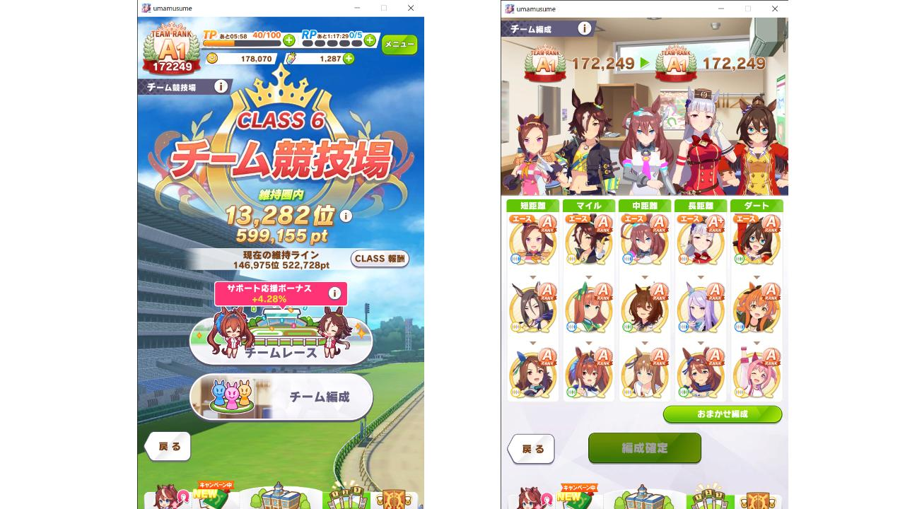
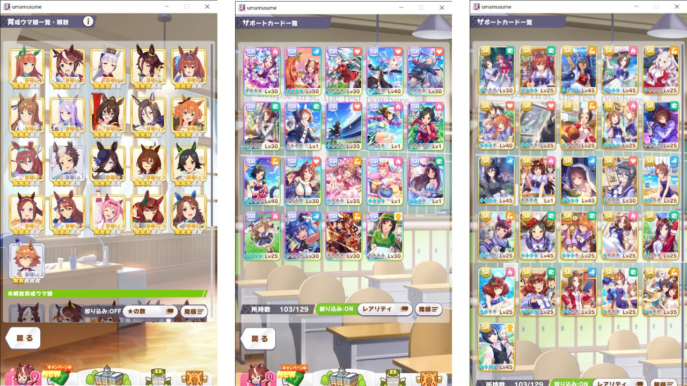
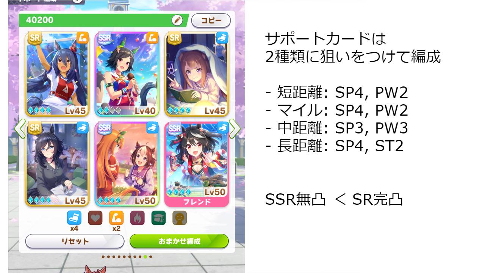
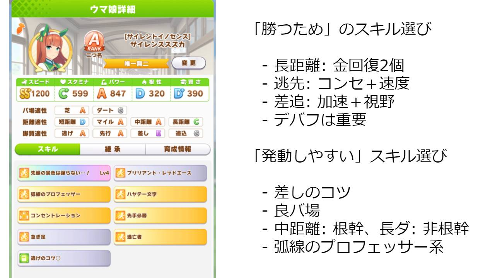

ウマ娘、無事に**チーム競技場でのクラス 6 維持に成功**したので、育成や編成で意識したことをまとめました。無課金～微課金者向けの攻略記事になります。

ざっくり概要。

- **クラス 6 維持ボーダーは今後 53 万点台になる予定**。
- **チームランク A でクラス 6 挑戦権獲得**。星 1 ～ 2 編成でも十分作れます
- **育成は目標ステータスを必ず決める**。ステ 2 つを厳選して成長させる
- **対戦相手は A1 ランク以上を選ぶ**。スタミナやパワーが低い相手へ全力勝負
- **稼げないキャラから再育成する**。戦績下位、20,000pts. が基準

参考までに、私のチーム編成と、サポカのカードプールです。

# ボーダーライン

| 日付      | CLASS6 ボーダー | 上昇    | (suzukalight) |
| --------- | --------------- | ------- | ------------- |
| 2021/4/11 | 483,000         | -       |               |
| 2021/4/18 | 492,190         | +9,190  | (514,639)     |
| 2021/4/25 | 493,393         | +1,203  | (519,802)     |
| 2021/5/2  | 500,334         | +6.941  | (532,062)     |
| 2021/5/9  | 507,284         | +6,950  | (514,974)     |
| 2021/5/16 | 513,430         | +6,146  | (534,779)     |
| 2021/5/23 | 514,870         | +1,440  | (538,304)     |
| 2021/5/30 | 524,899         | +10,029 | (599,155)     |
| 2021/6/6  | 529,471         | +5,572  | (545,250)     |
| 2021/6/13 | 530,729         | +1,258  | (574,729)     |
| 2021/6/20 | 530,364         | -365    | (574,109)     |
| 2021/6/20 | **533,087**     | (+)    | (570,252)     |

ここ最近の クラス 6 維持ボーダーの履歴は上記のとおりでした。**今後、クラス 6 維持ボーダーは 53 万点台になることが予想されます。**

6/27 のボーダーラインは 365 点アップし、533,087 となりました。再び上昇に転じましたが、上昇幅は以前よりも小さくなっており、現環境ではボーダーラインが 53 万点台に落ち着く気配を見せています。

[[details | 過去のボーダーラインに関する寸評を表示]]
| - 6/20 のボーダーラインは 365 点ダウンし、530,364。ついに前回のボーダーより減少となりました。現環境では 53 万点がボーダーに落ち着く気配を見せています。
| - 6/13 のボーダーラインは 1,258 点アップし、530,729 と 53 万点を超えました。しかしながら平均上昇ペースより減速しており、現環境の上限が見えてきたのかもしれません。あるいはジェミニ杯の育成で皆様忙しいのかもしれませんが…？
| - 6/6 のボーダーラインは 5,572 点アップし、529,471 とわずかに 53 万点を下回りました。ここ数回の平均上昇ペースは 6,000 点前後で、今後もこれを基準に考えると良さそうです。
| - 5/30 のボーダーラインは一気に 10,029 点アップし、524,899 になりました。前週の競技場トラブルで増加しなかったぶんが今週になって一気に追加された形です。さらにパカライブでスイーツが 30 個配られたことや、イベントで汎用アイテムが配られたことも関係しているものと思われます。
| - 5/23 のボーダーラインは 1,440 点のアップでした。ここ最近のペースほど上昇しなかった理由としては、チーム競技場の不具合があり 1 日以上プレイできなかったことと、タウラス杯に参加している人はそちらの調整が忙しかったこともあったかと思います。さて来週はどうなるでしょうか？
| - 5/16 のボーダーラインは約 6,000 点アップし、513,430 と 51 万点を超えました。このペースで行くと 5/23 は 52 万点前後がボーダーラインとなりそうです。
| - 5/9 のボーダーラインはさらに 7,000 点アップしました。スマートファルコン実装でダートが強化されたことや、スーパークリーク＆たづな SSR ピックアップによる育成強化も影響があると考えられます。
| - 5/2 のボーダーラインは約 7,000 点増加し、50 万点の大台を超えました。~~ゴルシウィーク~~GW 期間で一気にクラス 6 維持のボーダーラインが上がってきましたね。

# チーム編成

## 星 1 ～ 2 こそ主戦力

| コース | 育成キャラ（脚質）                                                     |
| ------ | ---------------------------------------------------------------------- |
| 短距離 | サクラバクシンオー（逃）、キングヘイロー（差）、エアグルーヴ（差）     |
| マイル | ダイワスカーレット（逃）、ウオッカ（先）、グラスワンダー（差）         |
| 中距離 | アグネスタキオン（先）、ナイスネイチャ（差）、ウイニングチケット（差） |
| 長距離 | スーパークリーク（先）、マチカネフクキタル（差）、ゴールドシップ（追） |
| ダート | マヤノトップガン（逃）、エルコンドルパサー（先）、ハルウララ（差）     |

**星 1 ～ 2 でチーム競技場の編成を埋めることが可能です**。星 3 については短距離とダートのキャラがいれば非常に心強いです。~~私はどちらもいませんので魔改造で苦労させられています。。。~~ 6/13 マルゼンスキーが来てくれたのでかなり解消されました、嬉しい。

上記編成で魔改造が必要なキャラは、エアグルーヴ（短距離 ×2）、マヤノトップガン（ダート ×3、マイル ×3）の 2 名です。マヤノの改造が非常に厳しく、ダート ×3 をレンタルし、手持ちでマイル ×3 の赤因子を作り、さらに継承イベントでお祈りする必要があります。これは厳しいのでマヤノは「いてくれるだけでもありがたいです…！」の気持ちで適性 B/B くらいの運用でも十分だと思います。

**編成時はなるべく脚質をバラけさせ**、全員がナイスポジション+1000 点をゲットできるようにします。ナイスポジションは脚質ごとに 1 名選ばれるそうです。噂ではポジションごとの先頭キャラに与えられるのではないかと耳にしています。

チームランクは A ランク以上を目指します。A1 ランクの対戦相手に全勝できることがクラス 6 維持の基準になり、A1 ランクの対戦相手が選択肢に出る条件はこちらが A 以上であるためです。A ランク達成は、編成キャラの平均ランクが A になっていれば可能です。

# 育成

## まず目標ステータスを決める

| コース＼脚質   | 育成優先度 | 逃げ                  | 先行                  | 差し・追込          |
| -------------- | ---------- | --------------------- | --------------------- | ------------------- |
| 短距離         | SP > PW    | **SS+**/C+/A+/D/C      | **SS**/C+/S/D/C      | **SS**/C+/S+/D/C+    |
| マイル・ダート | SP > PW    | **SS+**/B/A/D+/D+     | **SS**/B/A+/D+/D+     | **S+**/B/S/D+/C     |
| 中距離         | ST = SP    | **SS**/**A**/B+/D+/D+ | **S+**/**A+**/A/D+/D+ | **S**/**A**/A+/D+/C |
| 長距離         | ST > SP    | S+/**A+**/B/D+/D+      | S/**S**/B+/D+/D+       | S/**A+**/A/D+/C    |

（5/30: パラメータを更新）

目標ステータスは、上位ランカーのステータスを参考に決めています（実際の上位ランカーは、この 2 段階上のパラメータです！）

**スタミナが最も重要で、距離の 1/3 を目指します**。たとえば中距離であれば 2400m が最大ですから、800=A が目標になります。スタミナ不足は中長距離において致命的となり、特に長距離はスタミナと回復スキル量だけでだいたい勝負が決まります。長距離は 2500〜3600m と幅が広いため、1 人だけでも頑張って「スタミナ 1100 ＋金回復スキル 2 個」にしておくと良いかもしれません。

**スピードは全員が S を確保することが必要**になります。短距離であれば SS+ を狙い、長距離であれば S を狙いましょう。

**どんな脚質であれ、パワーの要求値は高めに見ておいたほうが良い印象です**。実際にレースを見てみると、パワーが足りない場合、番手がとれなくなったり、前列を割れなかったり、ラストスパートの加速が足りなかったりなど、結構負けに響いている印象です。

**賢さは C を目標とします**。以前は D を目標としていましたが、**差し追込の場合は賢さが低いと馬群を捌けずに沈むことが多くなってきたため、目標値を 2 段階上げました**。ただそれ以上に基礎パラメータがないとそもそも勝てないので、優先度としては引き続き低めです。

根性についてはスタミナへのプラスポイントと考えて差し支えないと思います。スタミナ調教すると根性もつくので、スタミナ調教のスタミナボーナス感覚でしょうか。今後の研究で、根性の重要性が解明されていくかもしれません。

## サポートカードは 2 種類に狙いをつけて

| コース         | 育成優先度 | デッキ構成                  | 因子継承 |
| -------------- | ---------- | --------------------------- | -------- |
| 短距離         | SP > PW    | SP / SP / SP / SP / PW / PW | PW > ST  |
| マイル・ダート | SP > PW    | SP / SP / SP / SP / PW / PW | ST > PW  |
| 中距離         | ST = SP    | SP / SP / SP / PW / PW / PW | ST > PW  |
| 長距離         | ST > SP    | SP / SP / SP / SP / ST / ST | ST > PW  |

**サポートカードのデッキ構成は、2 種類のステータスに狙いをつけて構成するのがオススメです**。例えば「SP / SP / SP / SP / PW / PW」という感じです。ここから目標距離に応じた変化をつけていきます。私のオススメ構成とトレーニング指針は以下のとおりです；

- 短距離: SP4/PW2。因子とトレで PW と賢さを確保
- マイル: SP4/PW2。因子と PW トレで ST を確保
- 中距離: SP3/PW3。因子と PW トレで ST を確保（マイルより多く意識）
- 長距離: SP4/ST2。因子でさらに ST を盛り、PW は SP トレで確保

**SSR 無凸よりも、SR 完凸のほうが優秀な場合があります**。有名なのはスイープトウショウ、マヤノトップガン、マンハッタンカフェあたりでしょうか。これらのカードは凸状態が良ければトレーニング性能が SSR より良い可能性があります。私も完凸スイープトウショウにだいぶお世話になっています。このほか、エイシンフラッシュ、キングヘイロー、マーベラスサンデー、桐生院葵あたりもスキル性能が高く優秀です。

**レンタルサポカは「キタサンブラック完凸」一択です**。スキルもイベントも何もかも強いので。例外もほぼありませんが、長距離の場合で回復金スキルが 2 個確保できない場合に、スーパークリークかウオッカをレンタルしても良いかもしれません。

デバフ要員を 1 名設ける場合は、サポートカードを 1 枚、マーベラスサンデーと取り替えましょう。賢さが鍛えられるとともに、逃げ先行デバフのスキルヒントが得られます。

## 獲得スキルは金 4、白 5 を目標に

| コース＼脚質   | 逃げ             | 先行             | 差し・追込       |
| -------------- | ---------------- | ---------------- | ---------------- |
| 短距離         | コン、ポジ、速度 | コン、速度、加速 | コン、加速、視野 |
| マイル・ダート | コン、ポジ、速度 | コン、速度、加速 | 速度、加速、視野 |
| 中距離         | 回復、ポジ、速度 | 回復、速度、加速 | 回復、加速、視野 |
| 長距離         | 回復、回復、速度 | 回復、回復、速度 | 回復、回復、視野 |

スキル選びの観点は 2 つあり、「**勝つためのスキルを選ぶ**」ことと「**発動しやすいスキルを選ぶ**」ことです。狙いはそれぞれ以下のようになります。

- 勝つための: **着順ポイント**を得やすくするため
- 発動しやすい: **スキル発動ポイント**を得やすくするため

**金スキル 4 つ、白スキル 5 つを目標**にスキルを獲得します。必要なスキルポイントについては、半期で 3 つの G1 レースに出ると、これに近いポイントが稼げます。SR 桐生院がいる場合は、レース出走のかわりにおでかけすることでも同等のポイントが得られます（5 回で 250 ほど）。

### 勝つためのスキルを選ぶ

勝つために取るべきスキル種別については、距離や脚質などでいくつかポイントがあります。

- **長距離: 金回復スキルを 2 個以上**。スタミナのあるなしで勝負が決まるため
- **逃げ先行: コンセントレーション**。ポジション取りに重要、かつ出遅れ抑止
- **差し追込: 加速スキルと視野スキル**。追い上げと馬群捌きに必要なため

ほか、**全体共通として、末脚と直線巧者**の取得をおすすめします。ラストスパートの伸びに関わるためです。なおこれらの上位スキルは全身全霊とハヤテ一文字です。

**チーム競技場においてデバフスキルはかなり重要**で、特に速度低下スキルは効果的です。またスタミナ低下スキルも相手のラストスパートタイミングを遅らせる効果があります。これらのデバフスキルは可能であれば全員がまんべんなく持っているとよいのですが、育成の注力ポイントがバラけてしまって育成が難しくなる側面もあります。

そのため、**各距離においてデバフキャラを 1 人**定めておき、彼女にはなるべくデバフ獲得をお願いしておきます。もともと金デバフを持っているエアグルーヴ、グラスワンダー、ナイスネイチャ、スーパークリークあたりが適任です。各距離ごとに 3 人で 5〜6 個ほどデバフを持っていると良いと感じています。

**「一匹狼」はある意味デバフスキルになり得ます**。相手が持っていれば打ち消してデバフになり、相手が持っていなければ単純に自分へのバフになります。各距離に 1 名ずつ配置すると良いでしょう。

### 発動しやすいスキルを選ぶ

発動しやすいスキルとは、「差しのコツ」のように**こちらが調整すれば確定条件になるもの**です。無条件でスキル発動できるものはポイントの下支えになるので、優先的に取っていきましょう。

- **差しのコツ**: 確定発動、賢さは差しに重要（ほかの〇〇のコツも同様）。
- **良バ場**: 馬場状態良は 80%で発生、パワーは全員に重要
- **根幹距離／非根幹距離**: 中距離は根幹距離が多く、長距離やダートは非根幹距離が多い
- **弧線のプロフェッサー系**: 中長距離だと 2 回発動する場合があるため

**固有スキルが発動できる脚質を選択しましょう**。単純に金スキル 2 個ぶんの価値になるためです。

**スキル発動ポイントは固有が 2400、金が 1200、白が 500 です**。金スキルは白スキルの 2.4 倍の価値になりますので、できるならば金スキルを優先して取っていきましょう。逆に ◎ をつけても上乗せはありませんので、ポイント的な意味で ◎ をつけることはおすすめできません（コストが安いので勝つために取るのはアリ）。

固有 1, 金 4, 白 5 を獲得し、すべて発動させると 9,700 ポイントのスキルポイントボーナスが得られます。これは 1 着を取ったのとほぼ同じポイントになります。実際には賢さで発動率が変わり、C で発動率が体感 80% なので、約 8,000 ポイントをスキル発動で獲得できることになるでしょう。

## 継承はデッキ構成の補完を

**継承する青因子は、サポートカードで選ばなかった 3 種類目を選びます**。基本的に ST9 か PW9 を選ぶ感じになります。

上記の青因子が選べる、レンタル可能な 1 日 3 回が勝負です。余った TP は基本的に因子周回します。手持ちで ST9 や PW9 が作れると非常に強いですが、3B 育成して確率 2% を 3 回ツモる必要があるので難しいですね（私は持っていません…）。さらに最近は URA シナリオ因子の重要度が高いため、これの付与も必要…。因子ガチャの沼は深い。

## 無課金、とにかくレンタルを吟味する。

まずは、**「サポカで足りない 3 種類目」を埋められるフレンドを探します**。具体的には「`スタミナ9 因子`」などで Twitter や Yahoo リアルタイムから検索をすると良いです。ID 公開してくれている皆様、本当にありがとうございます…！

**URA シナリオ因子は非常に強力なため、必ず含めます**。具体的には URA シナリオ ★3 が最大発動すると、「SP+30 ST+30」のステータスボーナスが獲得できます。友情トレーニング 1 回分以上の効果が見込めますので、レンタル吟味の際には必須要件と考えたほうが良いです。こちらも「`URA9`」などで検索させていただきましょう。

**バ場と距離についてマッチする赤因子を 2 つ以上入れます**。適性 S になると、体感でステ+50 くらいの価値を感じます（バ場はパワー、距離はスピード、脚質は賢さに補正がつくようです）。獲得は運任せになりますが狙っておいて損はないです。

**逃げはサイレンススズカかダイワスカーレット、差しはシンボリルドルフをレンタル**しましょう。単純に固有スキルが強いためです。

「以上を満たすキャラをレンタルする旅に出る」ことが事前準備として最も難しいことかもしれません。ただしっかりレンタルを吟味できていると、無課金でも半身が重課金者になれるので、非常に大切ですね。

# 育成

## 育成中は Lv5 友情トレーニング回数を意識

ステータスの上振れには、Lv5 友情トレーニングを何回行えたかが最も関わってきます。この回数を増やすために、育成開始後は、**夏合宿以外はサポカで選んだ 2 種類のトレーニングしか叩かないつもりで進めます**。トレーニングの 9 割をこの 2 種類に投下し、絆が 3 人以上稼げるときのみ、その他のトレーニングを行います。

具体的な数字でいうと、育成 78 週間のうち 18 レース出て、1/3 をお休みすると、**40 回程度しかトレーニングできないことになります**。Lv5 のトレーニングを引き出すためには 16 回の事前トレーニングが必要なので、Lv5 で友情 3 人トレーニングを複数回狙えるのは実質 1 種類目のみになるでしょう。

**夏合宿期間は、目標ステータスから逆算して、最も不足するトレーニングを行っていきます**。おそらく 3 種類目のトレーニングと賢さトレーニングが主体になるでしょう。育成下振れ中の場合はここでのリカバリもある程度想定します。

## イベント選択肢とレース選択

イベント選択肢は、**休み＞育成 2 種以外のステータス＞＞＞育成 2 種のステータス**、を基準に選択します。休むことで Lv5 トレーニング叩ける回数増やすほうが最終的には得かなと思います。

レース出走は、目標レースを含め、**半期で 3 つの G1 レースに出る**ことを目指します。それを超えるとスキルポイントが余り、それ未満だと足りなくなります。雰囲気は実際の競馬と同じですね。原作再現、素敵だと思います！

# 対戦相手

## 対戦相手は A1 ランク以上を選ぶ

**常に A1 ランク以上の相手を選びます。A1 ランクに全勝できればクラス 6 維持圏に乗ることが可能です**。A1 ランクが出ない場合は、右下の更新ボタンを押せば、リシャッフルしてくれます。なお A1 ランクの対戦相手は、自分が A ランク以上であることが出現条件になります。

A1 ランクの人を選んだあと、ステータスが勝てそうな場合であれば、パフェで盛って全力勝負に行きましょう！　**具体的には「スタミナが低い」＋「賢さが高い」チームが攻略対象となります**。対戦相手のステータスはキャラアイコンを長押しして確認できます。時間がなければエースだけでも確認しましょう。

あとはひたすらお祈りです。理論上は 84 回ガチャできます。調子などで上振れ下振れあるので、上振れ願って繰り返しお祈りし続けていきましょう！

[[details | B3ランクの対戦相手でも50万点稼げる？]]
| 結論から言うと難しそうです。チームランク 152,000 ほどの対戦相手を選んで対戦し続けてみましたが、全勝しても 487,952pt が最大でした。（N=30）
|
| |WIN|最大|平均|
| |---|---|---|
| |0|355,290|351,136|
| |1|399,901|364,795|
| |2|395,299|385,968|
| |3|443,728|431,010|
| |4|485,848|452,265|
| |5|487,952|469,364|

# うまくポイントが稼げないときは…

**レース時 1 人あたり 20,000 pts. を稼ぐのが最低基準と考えています**。そこに達しないキャラがいれば、再育成を検討していきます。私は対戦ごとに 20,000 pts. に達しないキャラをカウントしていて、一番カウントの多いキャラを再育成対象とし、育成完了したらカウントをリセット、以下ローテーションする、という感じで進めています。

逆に 40,000 pts. 以上を稼げているキャラがいれば、そのキャラを参考にして、他のキャラもそれに近くなるように育成できると良いですね。

**スタミナは距離の 1/3 が必須です**。育成時にスタミナやパワーが不足していると負けやすいのですが、特に中長距離のスタミナ不足はラストスパートに大きく影響しますので、まずはスタミナを見直しましょう。

聞いたところによると、**道悪 ◎ チームを組んで雨乞いする**という手もあるようですね…とても攻略っぽくて面白い。

# おわりに

長くなりましたが、読んでいただきありがとうございます。あくまで自分の考えなので、抜け漏れミスなどあるかと思いますが、一応この通りやっていればクラス 6 維持できたので、全くハズレでもないと思います。参考になりましたら幸いです。

今後は少しずつポイントを上乗せして（週ごとに 5,000pts.くらい？）、クラス 6 維持を続けていくことを目標に、攻略を楽しんでいこうと思います。

細かいネタは **Twitter: [@suzukalight](https://twitter.com/suzukalight)** で書いていくかも。ちなみに私のトレーナー ID は「**360142291**」です！（因子 SP6/ST3 のダスカ、サポカ完凸イベスペです）

## 補足事項

- 本記事はすべて個人の意見であり、実際の仕様とは異なる場合があります。またバージョンアップなどによって変更される可能性があります
- 本記事は 2021/5/30 現在のクラス 6 維持を念頭に書いています。目標ステータスやポイントは随時変化していくかと思います
- 本記事は無課金攻略ですが、健全なゲーム運営には、健全な課金も必要だと私は考えています。私はマチカネタンホイザの実装待ちです

## 更新履歴

- 2021/4/19: 投稿
- 2021/4/24: 画像追加、目標パラメータ更新、ほか調整
- 2021/4/25: ボーダーライン更新、目標パラメータ更新、ほか調整
- 2021/5/2: ボーダーライン更新、目標パラメータ更新、ほか調整
- 2021/5/9: ボーダーライン更新、ほか調整
- 2021/5/16: ボーダーライン更新、目標パラメータ更新、ほか調整
- 2021/5/23: ボーダーライン更新、目標パラメータ更新、ほか調整
- 2021/5/30: ボーダーライン更新、目標パラメータ更新、ほか調整
- 2021/6/6: ボーダーライン更新、画像差し替え、ほか調整
