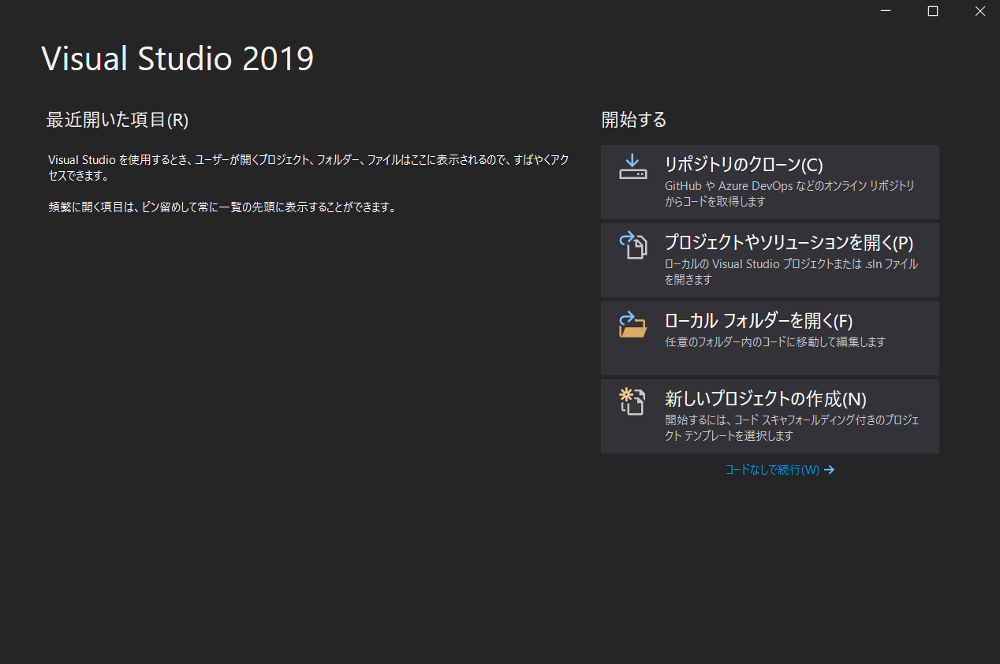
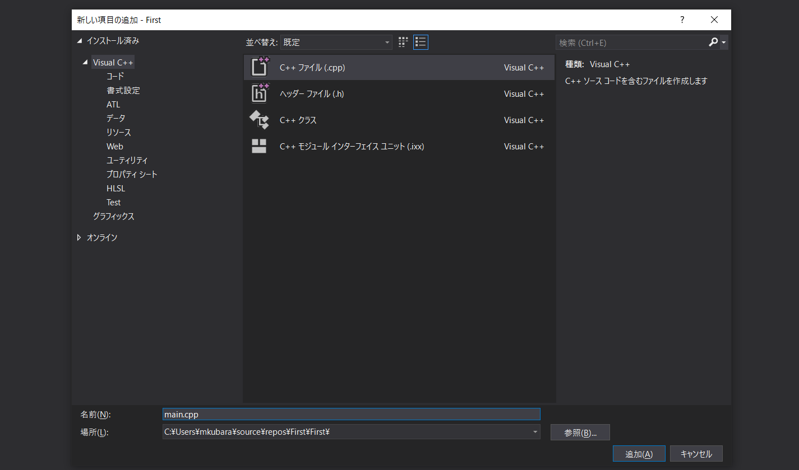
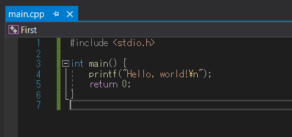
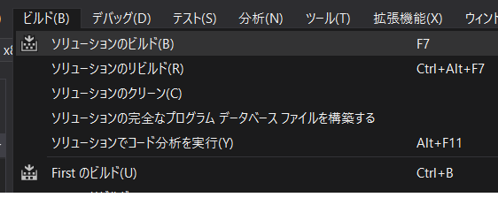
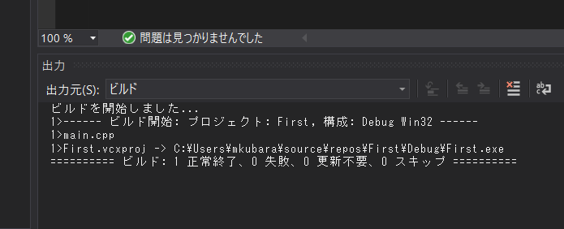
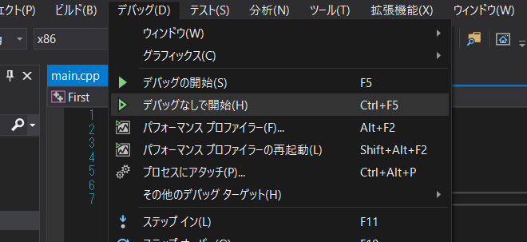
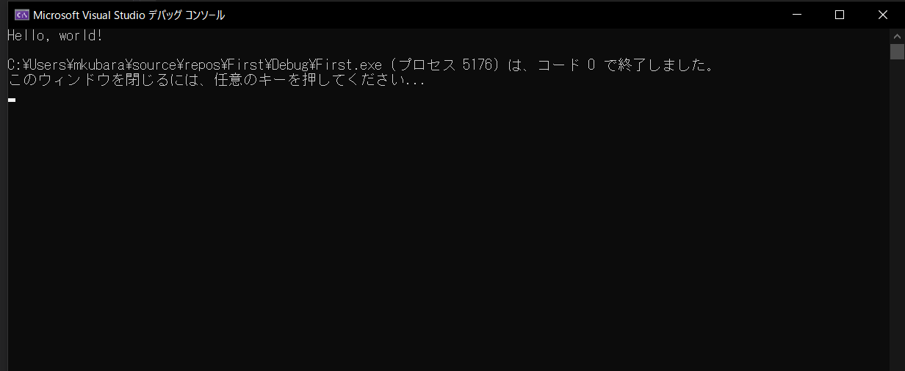

こちらのガイドを元に、開発環境をセットアップしていきます；  
https://docs.microsoft.com/ja-jp/cpp/build/vscpp-step-0-installation?view=msvc-160

# インストール

- https://visualstudio.microsoft.com/ja/downloads/
  - **コミュニティ**を「**無料ダウンロード**」
- 作業を開始する前に～～
  - 「**続行**」
- ダウンロード・インストール
  - 完了するまで待つ
- Installer
  - ワークロード: 「**C++ によるデスクトップ開発**」を追加
  - Installer: 完了するまで待つ
  - 再起動が必要です: 「**再起動**」を選択して再起動する

# 環境設定

- 再起動して、Visual Studio 2019 を起動する
  - サインイン
    - 「**後で行う**」
  - 慣れた環境で開始します
    - 開発設定: **Visual C++**
    - 配色テーマ: **濃色**（好みで OK）
    - 「**Visual Studio の開始**」

# 新しいプロジェクトの作成



- 最近開いた項目
  - 「**新しいプロジェクトの作成**」
- 新しいプロジェクトを構成します
  - 「**空のプロジェクト**」を選択し、「**次へ**」
- 空のプロジェクト
  - プロジェクト名: **任意の名前** (First など)
  - 「**作成**」

# Hello, world! の作成

## ソースファイルの追加

### ソリューションエクスプローラー


- **ソースファイルを右クリック**
- 「**追加**」→「**新しい項目**」

### 新しい項目の追加



- 「**C++ ファイル (.cpp)**」を選択
- 名前: **任意の名前** (main.cpp など)

### ソースコードを記述



```cpp:main.cpp
#include <stdio.h>

int main() {
	printf("Hello, world!\n");
	return 0;
}
```

## ビルドとデバッグ

### ビルド




- 「**ビルド**」→「**ソリューションのビルド**」
- `ビルド: 1 正常終了` が表示されれば OK

### デバッグ




- 「**デバッグ**」→「**デバッグなしで開始**」
- `Hello, world!` が表示されれば OK
