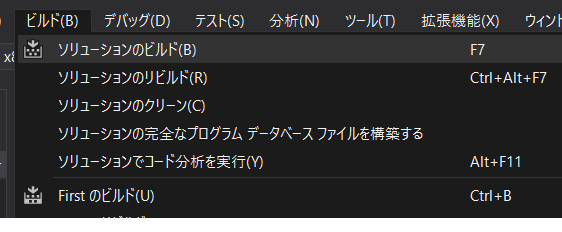

本章では下記の内容を学習します。

- **最初のプログラム**： プログラムの作り方
- **printf 関数とエスケープシーケンス**： 様々な文字列の出力方法
- **コンパイルとリンク**： 動くプログラムを作り出す
- **デバッグと良くあるミス**： プログラムを修正する

# 最初のプログラム


コンピュータプログラムの業界で、最初に書くプログラムといえば、「**`Hello, World!` という文字列を画面に表示する**」で、これができればプログラミング初心者デビューです。まずはこれを表示してみましょう！

## プロジェクトの作成法


プログラムを記述するために使用するプログラム（卵が先か鶏が先かみたいな話ですが…）はいくつかあるのですが、ゲーム制作などで広く使われているのが「**Visual Studio**」という開発環境です。Visual Studio は様々な開発言語に対応しているのですが、私たちは今回「**Visual C++**」という言語を選択します。

Visual Studio を使って C 言語のプログラムを制作するには、決まった手順を踏んでいく必要があります。まずはこれを体が覚えるまで繰り返していきます。これについては『[開発環境を整える](./01-setup)』のページで詳しく解説していますので参照してください。

[[exercise | 練習問題: プロジェクトを作成する]]
| Visual Studio で C++ プロジェクトを 3 回作成し、手順を体に染み込ませてください

プロジェクトが作成でき、プログラムコードが書き込める状態になったでしょうか？　初回ですのでゆっくりやっていきますから、わからないことがあればすぐに周りのみんなに訊くか、講師を呼んでください。

## 最初のプログラム

```cpp
/* hello.c */ // (a)

#include <stdio.h> // (b)

int main() // (c)
{
  printf( "Hello, World!\n" ); // (d)(e)(f)
  return 0;
}
```

### プログラムの流れ

プログラムは特に指定がなければ**上から下へと順番に実行**されていきます。ソースコードも上から下に書いていきます。

### 大文字/小文字、全角/半角は区別される

ソースコード上では、**大文字と小文字は区別されます**。INCLude や MAIN と書いた場合、それはもとの意味と違うものとして認識されますので注意してください。

同じように**全角と半角も区別**されます。日本語のような全角文字は、基本的には禁止されていると考えて良く、使って良い場所は今のところ「コメント」と「printf」だけです。

### (a) コメント

`/* */` で括ってある部分はコメントと呼ばれるもので、出来上がったプログラムには一切関係せず、**ソースコードを記述する際の覚え書きとして利用されます**。コメントを多く書くことで、後で見返したときにすぐに思い出せるようになったり、他人に見せるときに説明が楽になったりします。

コメントには `/* */` で括るほかに、`//` を行頭に打つ方法もあります。この方法の場合、// の打ってある一行がコメントとして有効です。

### (b) `#include`

`#include <stdio.h>` は、コードの下で利用している `printf( )` を使うために必要な一文です。include は「**含む**」という意味があり、今回だと printf という命令を自分のコードに含ませる役割があります。

> `#` が先頭についた文をプリプロセッサディレクティブと言いますが、詳細は次回以降に説明します。

### (c) エントリポイント

`main( )` は、**ここからプログラムが開始する**という部分であり、このカッコ内に記載された命令が、上から順に実行されていきます。main( ) 関数のことを一般にエントリポイントと呼びます。

### (d) セミコロン `;`

main( ) の中には、プログラムで行いたい命令をひとつひとつ記述していきます。命令の一文を「文」と呼びます。**各命令文の最後にはセミコロン `;` を打ち、これでひとつの命令を区切ります**。

> セミコロンがなければ文はいつまでも終わっていない扱いになります。改行の下にも命令文が続いていることになります。

### (e) インデント

main( ) の中の命令は、他より少し右にずれています。これはインデントと呼ばれるもので、日本語では字下げと呼びます。できるプログラマはインデントを施すことで、**どこからどこまでがひとつのブロックかを明示します。**

### (f) 関数

printf( ) は関数と呼ばれるもので、**行いたい処理の一部を、別に記載しておいたソースコードやライブラリに任せることができます**。printf( ) は与えられた文字列を表示する関数ですが、これを自前で作成することは大変なことですので、あらかじめ誰かに作っておいてもらい、利用するスタイルをとります。

皆さんも今後、自分が作成したいろいろな処理を関数としてまとめ、それをまた別途利用することが多くあると思います。自作関数がたくさんできて、それを改良しながらいろいろなプログラムで使い回すようになると、自分の頑張りがどんどん体感できてくるかなと思います。

[[exercise | 練習問題: 自己紹介]]
| 1. Hello, world! の部分を、自己紹介に変えてみましょう
| 2. 複数行の自己紹介をしてみましょう

# printf 関数とエスケープシーケンス

`printf( )` には、文字列のほかに **特殊な制御文字（エスケープシーケンス）** を与えることもでき、いろいろな処理を行うことができます。代表的なものに以下のものがあります；

- `\n`: 改行
- `\t`: タブ（8 文字単位になるようにスペースを埋めてくれる）
- `\\`: 『\』を文章で使いたいときに書く
- `\"`: 『"』を文章で使いたいときに書く

[[exercise | 練習問題: エスケープシーケンス]]
| 1. `"` を使った自己紹介をしてみましょう
| 2. `\t` を使って、以下の表示をしてみましょう

```
2       3       5       8       13
21      34      55      89      144
233     377     610     987     1597
```

# ビルドとデバッグ

プログラムコードを作成したら、いよいよ動かせるプログラムを作り出します。

## ビルド



メニューバーより「**ビルド**」→「**ソリューションのビルド**」を選ぶ（または Ctrl+Shift+B）


- 正常に終了すれば、画面下の出力欄に「**1 正常終了、0 失敗**」と表示される
- コードに問題があれば「**0 正常終了、1 失敗**」などが表示される。

## デバッグ実行


「**1 正常終了**」の場合は、実行ファイルが出来上がっているので、実行してみましょう。

- メニューバーより「**デバッグ**」→「**デバッグなしで開始**」を選ぶ（または Ctrl+F5）
- **黒いコンソールウィンドウが表示されます**。目的の結果が得られれば終了です


# デバッグ・良くあるミス

プログラミングは、すんなり成功することのほうが極めて稀であり、大概はビルドエラーを起こしたり、文法エラーを起こしたりしていくものです。そんなときは「**デバッグ**」作業をしていくことになります。

## デバッグ


『エラー: 2 』などと表示された場合は、書いたコードにミスがあります。**ミスを取り除く作業をデバッグ: Debug と呼び**、プログラミングの中で最も重要な作業の一つです。

Visual Studio では、コードエラーを簡単に取り除ける機能として、“出力”欄にエラー文を出力してくれる機能と、その文を**ダブルクリックすることでエラー箇所のコードを示してくれる**機能がありますので、ぜひ活用してください。

## 良くあるミス

初めてのプログラムはミスして当たり前ですので、気にする必要はありません。重要なのは「**同じ間違いを 2 度やらないようする**」ことです。もしエラーを起こしてしまった場合は、まずは下記の良くあるミスの一覧をチェックしてみてください；

- **かっこの閉じ忘れ**はありませんか？
- **セミコロンを打ち忘れ**ていませんか？
- **大文字/小文字**、**全角/半角**といったミスはありませんか？
- 文頭や文末に**全角のスペース**が紛れ込んでいませんか？
- プロジェクトの作成手順を間違えませんでしたか？　『[開発環境を整える](./01-setup)』のページで詳しく解説していますので、参照してください

## "デキる" プログラマになるには？

デキるプログラムを書ける人は、「**他人が見てもすぐ理解できるソースコード**」を記述する能力があります。ソースコードを見せただけでプログラムを理解してもらうためには、以下の作業がとても大切です。今でもできることは以下のものがあります；

- **インデント**を揃えましょう。段落が整っているコードは、どこからどこまでが一連の処理であるかが非常にわかりやすいです
- **コメント**を打ちましょう。コメントは他人がコードを読むときに理解しやすくなるだけでなく、「来週になったら忘れかけている自分」にも優しい一言になるはずです
