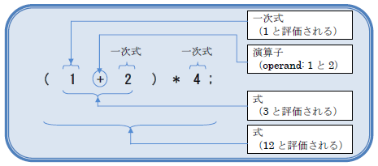

本章では下記の内容を学習します。

- **式と演算子**： 式とは、演算子とは、式を解釈していく方法
- **データ型と計算**： 小数点の切り捨て、整数の格上げ、型の自動変換
- **様々な演算子**： インクリメント、剰余、等号不等号、代入など

# 式

```cpp
#include <stdio.h>

int main()
{
  // 例1: 式と演算順位
  int  a = (1+2)*4;
  int  b = 1+2*3+4;

  printf( "a=%d, b=%d\n", a, b );

  return  0;
}
```

## 式とは

式: expression とは、変数や値などを使って演算を行ったりする、値・変数・演算子などの集まりです。前章で扱った a = a + 1; などが式に当たります。

## 演算子とは

演算子: operator とは、式の中に含まれている、演算のための記号です。基本的に数学と同じものを使います。

演算子は 1 つ以上の作用対象を持ちます。たとえば 1+2 の場合、演算子『+』は 1 と 2 という作用対象を持ちます。これらの作用対象のことを オペランド: operand と呼びます。

## 式の評価



プログラムでは、式全体を処理するために、式の中の要素を、より小さい単位の式として分解していき、一番細かくしてから処理を開始していくというスタイルをとっています。これは人間が計算を行う上での方法と似ています。

細かくし終えたら、プログラムではまず式を 評価: evaluation し、その結果を 値: value にします。評価とは、演算子が作用して計算などを行う処理であり、値とは、その評価した結果になります。

図を例にとってみましょう。まず即値（数値そのもの）などの一次式が評価されて値となります。その後、値同士を使って演算子が評価を行い、また値にして、また評価する、という作業を、式全体が値として評価されるまで地道に繰り返されます。式全体が値になれば、処理完了です。

## 演算子の優先順位

式が評価され、演算子が作用していく順番も、決められています。このことを演算子の 優先順位: precedence と言います。この順番も数学で決められているものについては、それと基本的には同じです。

# データ型と計算

## 小数点の切り捨て

```cpp
#include <stdio.h>

int main( void )
{
  // 例2: int型同士の割り算
  int    a=10, b=3;
  double c;

  // double型の変数に、割り算した結果を代入したはずだが…？
  c = a / b;
  printf( "%d ÷ %d = %f\n", a, b, c );

  return  0;
};
```

10÷3 を計算した場合、結果はどうなるでしょうか？　多くの人は、3.33333…と答えてくれると思います。数学の世界では、それが正解に近いでしょう。

プログラムの世界では、ちょっと違います。例 2 を実行してみてください。

驚くべきことに、結果は 3.000000 と表示されることでしょう。これはプログラムが**割り算を int 型同士の計算として評価した**ため、その結果も int 型で返してしまうのです。これはプログラム側にとっては意図したとおりの挙動になります。

格納する変数が double 型であっても、**評価する対象が双方とも int 型であれば、その段階では int 型で評価するのです**。そのため、余りの部分 0.3333…はばっさりと切り捨てられ（int 型は整数型です）、3 と評価されるのです。こういった間違いを犯さないため、変数の型は演算段階できっちり確認しておく癖をつけておきましょう。

また、この性質を逆用して、小数点以下を切り捨てた結果を double 型に格納する、といった処理に利用することもあります。

## 格上げ

```cpp
#include <stdio.h>

int main( void )
{
  // 例3: 計算の格上げ
  int     d = 12;
  double  e = 0.345;
  double  f;

  // int型＋double型は、double型になる
  f = d + e;
  printf( "%d + %f = %f\n", d, e, f );

  return  0;
};
```

int 型同士で計算して小数点以下が出てしまった場合は、その値は int 型で切り捨てられてしまいましたが、はじめから double 型の相手と計算した場合（double÷int など）はどうなるでしょうか？

この場合は、**最も大きな値を表現できる型に自動変換されます**。このことを 格上げ: promote と呼びます。異なる型同士での計算は、最適な結果が得られるように自動的に配慮されるのです。

## 型の自動変換

```cpp
#include <stdio.h>

int main( void )
{
  // 例4: 型の自動変換
  // 小数を整数に無理やり詰め込んだので、警告メッセージがでる
  int     g = 12.3 + 4.5;

  // double型＋double型を、int型に詰め込んだ場合、int型になる
  printf( "12.3 + 4.5 = %d\n", g );

  return  0;
};
```

double 型同士の計算結果を、int 型に代入するような文を記述した場合はどうなるでしょうか？　計算式の評価は double 型で行われますから、その結果も double 型になります。しかし、受け手側の変数は int 型です。

この場合は、**値は代入先の型に自動的に変換されます**。12.3+4.5 の結果は 16.8 ですから、その小数点以下の部分 0.8 については捨てられてしまいます。捨て方は VisualC++では切り捨てです。

# 各種演算子

## さまざまな演算子

C 言語では演算を簡単にするために、多種多様な演算子を用意しています。

| 演算子       | 内容                               |
| ------------ | ---------------------------------- |
| 関数呼び出し | printf( … ) などのカッコの部分     |
| 増分／減分   | 1 増やす、1 減らす                 |
| 乗除算       | 掛け算、割り算、割った余り         |
| 加減算       | 足し算、引き算                     |
| シフト演算   | 変数のビットをずらす               |
| 不等号演算   | 以上、以下、より大きい、より小さい |
| 等価演算     | 同じ、同じではない                 |
| ビット演算   | 変数のビットごとに演算を施す       |
| 論理演算     | ～かつ、～または                   |
| 3 項演算子   | もし～だったら A、そうでなければ B |
| 複合代入     | a=a+5; を a+=5; と書けるようにする |
| コンマ演算子 | 演算を複数並べて 1 文にする        |

多いですが、プログラムをするうえで徐々にボキャブラリーを増やしていけば問題ありません（そのうち全部覚えられます）ので、ひとつずつ確実に覚えていきましょう。

さて、以前に「演算子には優先順位がある」と解説しました。足し算より掛け算を先にする、という法則のことです。**優先順位はリストの順に高くなっています**。

また、演算子には結合規則: associativity があります。2+3+4 と書いた場合、どの順に処理されるか、というものです。同じ優先順位のものについては、その結合規則順に処理されていきます。たとえば加減算においては「→」となっており、2+3+4 なら、2, 3, 4 の順に処理されていくのです。もしこの順位を変えて計算したい場合は、数学同様に（）を使います。

[[exercise | 練習問題 : 評価順]]
| a = 5 – ( 1 + 2 ) \* 3 + 4; の評価順を考えてみましょう。

## インクリメント／デクリメント演算子

```cpp
#include <stdio.h>

int main( void )
{
  // 例 5: インクリメント／デクリメント演算子
  int i = 0;
  printf( "%d\n", i );

  // インクリメント(増分)
  i++;
  printf( "%d\n", i );

  // デクリメント(減分)
  i--;
  printf( "%d\n", i );

  return  0;
};
```

`a++, ++a` 増分: increment、および `a–-, -–a` 減分: decrement は、その変数の値を **1 増やす**、または **1 減らす**、という演算子です。加減算の記号を、変数の前か後ろに連続して 2 個書くことで実現することができます。

同じ効果は `a=a+1;` でも得られるのですが、この **1 増やす・減らすという処理はプログラム上で頻繁に出てくる**ため、より明示的にするために専用の演算子がある、と考えてください。

インクリメント／デクリメント演算子は、変数の前に書くか後ろに書くかで、その効果が変わります。変数の前に書くと、その変数が評価される前に 1 増減します。変数の後ろに書くと、その変数が評価された後で 1 増減します。

## 剰余演算子

```cpp
#include <stdio.h>

int main( void )
{
  // 例 6: 剰余演算子
  int k = 10 % 3;

  // printf で % を表示する場合は、2回重ねる
  printf( "10 %% 3 = %d\n", k );

  return 0;
};
```

`%` 剰余演算子: modulus operator は、**左のオペランドを右のオペランドで割った余りを返す演算子です**。たとえば 10 % 3 は 1 になります。この演算子は比較的良く使用しますので、覚えておきましょう。

## 等価・不等号演算子

```cpp
#include <stdio.h>

int main( void )
{
  // 例 7: 不等号演算子
  int t = 5;

  // 不等号演算子を使って、結果を表示する。
  // あっていれば1、違っていれば0
  printf( “t < 10は「%d」です\n”, t < 10 );
  printf( “t > 10は「%d」です\n”, t > 10 );
  return 0;
};
```

`==` 等価演算子: equality operator ・`!=` 非等価演算子: unequality operator は、左右のオペランドが等価／非等価であるかどうかを調べ、その結果を値として返してくれます。基本的に不等号のそれと同じ感覚で使えます。

1 つ注意事項があります。**= は代入演算子で、== は等価演算子なのですが、この = の数を良く書き間違えます**。「同じである」は == で表現する、ということを頭に入れておきましょう。

`<, >, <=, >=` 不等号演算子: inequality operator は、左右のオペランドを、演算子で書いてある通りの関係になっているかを調べ、その結果を値として返してくれます。

双方とも、実行結果は「1」か「0」で返されます。プログラムの世界では

- **「1」は正しい（真である）**
- **「0」は正しくない（偽である）**

という表現の仕方を良く行いますので、ここで覚えておきましょう。

## 代入演算子・複合代入演算子

```cpp
#include <stdio.h>

int main( void )
{
  // 例 8: 複合代入演算子
  int m = 3;

  m   += 5;
  printf( "m = %d\n", m );

  return 0;
};
```

`=` 代入演算子: assignment operator は、左オペランドの変数に、右の式の値を代入する演算子です。難しく言えばそうなりますが、今までやってきた代入文のそれと同じことです。

`+=, -=, *=, /=` 複合代入演算子: compound assignment operator は、左オペランドの変数の値に、右オペランドの値を加減乗除した値を、新しい変数の値として代入し直します。要は `a = a + 5;` を `a += 5;` と書いてもいいですよ、ということです。

## キャスト演算子

```cpp
#include <stdio.h>

int main( void )
{
  // 例 9: キャスト演算子を利用した、int 型同士の割り算
  int x=10, y=3;
  double z;

  // int型を、double型にキャスト。演算がdouble型で行われる
  // int型÷int型=int型になるが、double型÷int型=double型になる
  z = (double)x / y;
  printf( "%d ÷ %d = %f\n", x, y, z );

  return 0;
};
```

`(型名)式` キャスト演算子: cast operator は、式の型を、強制的に変更します。この効果が最も得られるのが、先述の「int 型の割り算は小数点以下が切り捨てられる」という問題です：

前回は a / b の結果が int 型だったため、c の値は 3.000000 になってしまいました。**今回は a をあらかじめ double 型に変換しましたので、double÷int の計算になります**。すると int が自動格上げされますから、結果的に double 同士の計算になります。

## sizeof 演算子

`sizeof( 式 ), sizeof( 型の名前 )` sizeof 演算子 は面白い演算子で、**その変数が何バイトの領域を必要とするかを返してくれます**。たとえば int 型は 32bit 変数でしたから、必要な領域は 4 バイトになります。 演算子の中には、型名・変数名・式などが記述できます。
