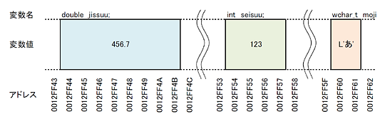
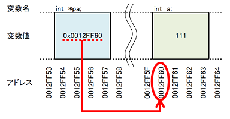

本章では下記の内容を学習します。

- **メモリの番地と変数の関係**: アドレス
- **番地による変数へのアクセス**: ポインタ
- **関数を超えて変数にアクセス**: スコープの突破
- **変数を書き換え状態で別関数に渡す**: ポインタ渡し

# アドレス

## 変数が格納されているメモリの番地



前回までに様々な場面で利用してきた変数は、宣言すると自動的にその領域が確保され、あとは自由に利用することができました。この変数は、いったいどこに生まれて、どのようにアクセスされているかはまだ考慮に入れていなかったと思います。ここでは変数というのがどのように生まれ利用されるのかを学習していきます。

変数が作成されると、ある一定の法則に従って**コンピュータのメモリの内部にその領域を確保されます**。このとき、メモリのどこに作成されたかを把握するために、メモリのアドレスが用いられます。

**アドレスは、変数の作成された領域の番地を示す、通し番号です**。通し番号の最大値は『何ビット OS か』で決まり、WindowsXP 32bit 版の場合、32bit≒42 億、ということになります。コンピュータに詳しい人は、『32bitPC はメモリ 4GB まで認識する』なんてことを耳にしたことはありませんか？　この 4GB というのは、32bit で表せる最大のアドレス数と一致しています。（4G≒42 億）

**2 バイト以上の領域を取る変数の場合、アドレスは一番若い値が採用されます**。0012FF44 の部分 などがそれにあたります。図では double, int, wchar_t 型の変数がメモリに作成されたときの状態を示しています。変数の大きさが違うので、確保されるメモリの量が違っているのがわかりますね。

**全ての変数は、メモリのどこかに配置され、アドレスを持ちます**。プログラムは、このアドレスを利用して変数の中身にアクセスしたり、書き換えたりしています。人間は変数名を通して変数を認識しますが、コンピュータは番地を通して変数を認識しているのです。

## アドレスの取得

```cpp:例1-アドレスの取得と表示
#include <stdio.h>
#include <locale.h>

int     main( void )
{
  ::setlocale( 0, "JPN" );

  // 複数の型の変数を作成しておく
  wchar_t moji    = L'あ';
  int     seisuu  = 123;
  double  jissuu  = 456.7;

  // 内容及びアドレスを表示
  printf( "  mojiのアドレスは%p, 値は%C\n", &moji, moji );
  printf( "seisuuのアドレスは%p, 値は%d\n", &seisuu, seisuu );
  printf( "jissuuのアドレスは%p, 値は%f\n", &jissuu, jissuu );

  return  0;
}
```


C 言語では、変数が格納されているメモリのアドレスを取得したり、そのアドレスを通して変数の内容を操作したりすることができます。

> なお、このようなアドレスを介して操作を行う処理は、C 言語のような OS と強力に結びついている言語にしか搭載されていないことが多く、例えばもう 1 つの代表的なプログラミング言語である Java では、アドレス操作を行うことができないようになっています。

**変数のアドレス取得には、アドレス演算子 `&` を利用します**。変数名の頭に & を記述すると、その変数のアドレスを取得することができます。例では 3 つの変数のアドレスを取得し、それらを printf 関数で表示しています。

**変数のアドレスは、動かしている PC の状態に応じて変動します**。例では 0012FF44 から始まる番地に変数が生成されていますが、毎回この通りとは限りません。また変数は生成された順にメモリが割り当てられることがほとんどです。このとき 4 バイトを 1 つの区切りとして生成することが多くなっています。

[[exercise | 練習問題: 変数のアドレス]]
| 1. 例題の変数の宣言順を `int, wchar_t, double` の順にしてください。そのとき変数のアドレスはどのように変わったかを報告してください
| 1. `double, wchar_t, int` の順にして、報告してください
| 1. 適当な変数を数個追加して、アドレスを報告してください

## 16 進数

**変数のアドレスは、通常 16 進数を利用して記述します**。16 進数とは、数字を数えるときに 16 で繰り上がるようにする数え方です。皆さんが使っている 10 進数は、10 になると位が 1 つ上がりますね。16 進数は、16 になったら位が 1 つ上がります。このとき 0 ～ 9 だけでは文字が足らないので、A ～ F が 10 ～ 15 に対応する文字として利用されます。

**プログラム上で 16 進数を使って数値を記述する際には、`0x` を頭につけます**。アドレス 0012FF44 を表す 16 進表現は `0x0012FF44` になります。ちなみに 16 進数で記述しても 10 進数で記述しても、その値はただの整数値なので、int 型の変数にそのまま代入できます。

**printf 関数で整数を 16 進数で表示するには、`%x` と記述します**。たとえば 32767 を%x で表示すると、7fff と表示されると思います。大文字で表示したい場合は %X と X を大文字にすれば OK です。

[[exercise | 練習問題: 16進数]]
| 1. 1234 を 16 進数で表示するといくつになりますか
| 1. 0×1234 を 10 進数で表示するといくつになりますか
| 1. 16777215 になる 16 進数はいくつですか
| 1. 0xFFFF になる 10 進数はいくつですか

# ポインタ

## ポインタ変数を利用したアドレス値の格納

```cpp:例2-ポインタ変数の定義と、アドレス値の代入
#include <stdio.h>

int     main( void )
{
  int a   = 111;  // int型の変数
  int *pa;        // ポインタ変数（int型変数用）

  // アドレスをポインタ変数へ代入
  pa = &a;

  // 変数の値とアドレスを表示
  printf( " aのアドレスは%p、値は%d\n", &a, a );
  printf( "paのアドレスは%p、値は%p\n", &pa, pa );

  return  0;
}
```

プログラム上では、実際にはアドレスを利用して変数を操作していると解説しました。ということは変数名を利用せずとも、アドレスを利用した操作ができるということになります。それを実現するのがポインタと言う仕組みです。

**ポインタは、アドレス値を利用して変数を操作するための仕組みです**。ポインタはアドレス値を保存しておくための特殊な変数として扱われ、この変数のことを特に**ポインタ変数**と呼びます。

**ポインタ変数は、変数名の前にアスタリスク `*` を付けて表現します**。このポインタ変数は、1 つのアドレスを保持することができます。変数のアドレスは前述のアンパサンド `&` を利用して取得することができます。例では 1 つの変数のアドレスを、1 つのポインタ変数に収める処理が記述されています。

例では、int 型の変数と、そのアドレス値を保存するためのポインタ変数を生成しています。printf 関数で表示されたポインタ変数の値は、int 型変数のアドレス値と一致しているのが判ると思います。このアドレス値が格納されているポインタ変数を利用すると、様々な操作を行うことができるようになります。

## アドレスを利用した変数の操作

```cpp:例3-ポインタ変数を利用した、変数の間接参照
#include <stdio.h>

int     main( void )
{
  int a   = 111;  // int型の変数
  int *pa;        // ポインタ変数（int型変数用）

  // アドレスをポインタ変数へ代入
  pa = &a;

  // 変数の値とアドレスを表示
  printf( " aのアドレスは%p、値は%d\n", &a, a );
  printf( "paのアドレスは%p、値は%p\n", &pa, pa );

  // ポインタ変数を通して、int型変数の中身を操作
  *pa = 222;

  // 変数の値とアドレスを表示
  printf( "------------------------------------\n" );
  printf( " aのアドレスは%p、値は%d\n", &a, a );
  printf( "paのアドレスは%p、値は%p\n", &pa, pa );

  return  0;
}
```

**ポインタ変数を利用すると、そのポインタが持っているアドレス値が指し示している変数に対してアクセスすることができるようになります**。このように変数を直接操作するのではなく、ポインタなどを通して間接的に操作することを間接参照と呼びます。

**ポインタ変数による間接参照を行うためには、ポインタ変数のまえにアスタリスク `*`をつけて操作を行います**。例ではポインタ変数 pa を通して int 型変数 a を操作するために、pa にアスタリスク`*`をつけて、`*pa` と記述して操作を行っています。

間接参照の模式図は以下のようになります：



ポインタ変数には、対象の変数のアドレス値が入っており、このアドレス値を利用して、この変数のメモリを直接書き換えに行くというイメージです。ポインタは『**指し示すもの**』という意味の英語ですから、その言葉の通り、ポインタが変数への指差し矢印を持っており、そこに向けて操作を行っているとイメージすると良いでしょう。

[[exercise | 練習問題: 様々な変数へのポインタ]]
| 1. double 型変数 d を作成し、456.7 で初期化しておきます。この変数を、ポインタを利用して 123.4 に書き換え、printf で表示して確認してください
| 1. wchar_t 型変数 wc を作成し、L’あ’ で初期化しておきます。この変数を、ポインタを利用して L’亜’ に書き換え、printf で表示して確認してください

# スコープの突破

## 関数越しに変数を書き換える

```cpp:例4-関数を超えて、変数を書き換える
#include <stdio.h>

// 与えられた変数のアドレス値をポインタ変数として受け取り、
// その値を 456 に書き換えてしまう関数
void kakikae( int *pi )
{
  *pi = 456;
  return;
}

int main( void )
{
  int a = 123;

  // 変数の値とアドレスを表示
  printf( " aのアドレスは%p、値は%d\n", &a, a );

  // 関数にアドレスを渡すと、その変数を書き換えできる
  kakikae( &a );

  // 変数の値とアドレスを表示
  printf( "------------------------------------\n" );
  printf( " aのアドレスは%p、値は%d\n", &a, a );

  return  0;
}
```

以前、関数はスコープを持つため、その関数に存在する変数はローカル変数となり、別の関数からはその存在が見えないと解説しました。**ある関数のローカル変数は、別の関数からは操作できないというのがプログラミング言語の基本です**。これを強引に解決する方法として、変数をグローバル変数とし、全ての関数から書き換えを許すという方法がありましたが、あらゆる関数から書き換え可能であるということには弊害もあると解説しました。

ここで、ポインタ変数とアドレスを利用すると、ある関数のローカル変数を、別の関数から書き換えることができるようになります。その仕組みの肝は、アドレスを利用して、メモリを直接書き換えてしまうという仕組みです。

**関数の引数にアドレス値を渡し、ポインタ変数で受け取ると、そのポインタ変数を通して、引数の変数を書き換えることができます**。ローカル変数は他の関数からその存在を知られることはありませんが、アドレスがばれてしまえば、その住所に直接押しかけて、操作できてしまう、というのが間接参照のすごいところです。この仕組みを利用すれば、関数のスコープを突破することができるようになります。

これを実践するためには、操作する側の関数は、ポインタ変数でアドレス値を受け取れるように準備し、操作される側の関数は、変数のアドレス値を渡すようにします。例ではこれらを実行しており、int 型のポインタ変数と、int 型の変数のアドレス値を、それぞれ用意して渡しています。

**関数のスコープが局所的に突破できるようになると、グローバル変数を介さなくても、変数の書き換えが行えるようになります**。この仕組みは特に、大きなデータをやり取りする際に頻繁に利用されることになります。特に、配列変数や、構造体と呼ばれる複合変数を扱う場合です。これらは次回以降、順次紹介していきます。

[[exercise | 練習問題: 書き換え可能関数の作成]]
| 与えられた変数を 3 倍に書き換える関数 `void sanbai( int *pi )` を作成してください

## 変数の値渡しとポインタ渡し

```cpp:例5-値を入れ替える処理の関数化
#include <stdio.h>

//
// ここに「値を入れ替える関数」を書く予定
//

int main( void )
{
  int b = 3, c = 5;

  // 今の値を表示
  printf( "b=%d, c=%d\n", b, c );

  // ここに値を入れ替える処理を書く

  // 入れ替えた結果を表示
  printf( "b=%d, c=%d\n", b, c );

  return  0;
}
```

ここでは「値を入れ替える処理を関数化する」例を通して、**変数の値渡しとポインタ渡し**について学びます。すべて実践形式で行いますので、ここでは例題に具体的な処理は記述していません。

実際の講義手順は以下のようになっています。これらのステップを通して、別関数に書き換えを依頼できる参照渡しについて学びましょう。

[[practice | 実践問題: 値を入れ替える関数]]
| 1. main 関数の中で、2 つの変数の**値を入れ替える**処理を記述する
| 2. それを `swap1` 関数として**外部化する**。ただしそのままコピーしても上手く動きません
| 3. **ポインタ渡し**というスタイルを利用して、正常動作する関数 `swap2` を作成します

[[practice | 応用問題: 順序つき入れ替え関数]]
| 1. 2 つの int 型変数のアドレスを受け取り、1 番目を小さい値、2 番目を大きい値に入れ替える関数 `swapMin` を作成してください
| 2. 上記の逆で、大きい・小さいの順にする関数 `swapMax` を作成してください
