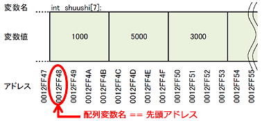
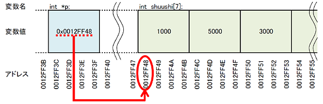

本章では下記の内容を学習します。

- **配列の生成とアドレスの関係**: 配列要素のアドレス
- **ポインタ演算を利用した配列操作**: ポインタ演算
- **配列の大カッコ**: 添字演算子
- **配列を関数の引数に使う**: ポインタ渡し

# 配列要素のアドレス

## 配列要素のアドレスを取得

```cpp:例1-配列要素のアドレス
#include <stdio.h>

int main( void )
{
  int shuushi[7]  = { 1000, 5000, 3000, -6000, -4000, 0, 8000 };

  // &配列名[要素番号]　で配列要素のアドレスが取得できる
  for( int i=0; i<7; i++ )
  {
    printf( "shuushi[%d]=%6d, address=%p\n", i, shuushi[i], &shuushi[i] );
  }

  return  0;
}
```

変数のアドレスを取得するためには、アンパサンド `&` を利用すれば良いことになっていました。配列のアドレスを取得方法もこれと基本的には同じで、**大カッコで要素番号を指定したうえで、頭にアンパサンドをつければ OK です**。



**配列要素は、メモリ上に隙間なく連続して配置されます**。例を実行すると、配列要素の各領域のアドレスが表示されます。このとき表示されるアドレス値に注目してください。きれいに 4 刻みになっていると思います。

C 言語では配列が隙間なく連続すると確約しているため、**配列の n 番目の要素がどこにあるかというのは、即座に計算することができるようになっています**。たとえば int 型の配列であれば、要素番号 4 の要素は、先頭から 4×4 バイトうしろの位置にあると簡単に計算することができます。これにより C 言語では、配列要素のアクセスを瞬時に行うことができるのです。配列を 0 番目から数えはじめる理由もここから来ています。要素番号 0 の要素は、0×4 バイトうしろの位置、つまり先頭位置になるからです。

[[exercise | 練習問題: 配列アドレスの計算]]
| 1. int 型の配列で、先頭アドレスが 0x00884400 のとき、要素番号 4 の要素のアドレスはいくつですか
| 1. wchar_t 型の配列で、先頭アドレスが 0x00884400 のとき、要素番号 96 の要素のアドレスはいくつですか
| 1. double 型の配列で、先頭アドレスが 0x00884400 のとき、要素番号 64 の要素のアドレスはいくつですか

## 配列変数名 == 配列の先頭アドレス

```cpp:例2-配列名==配列の先頭アドレス
#include <stdio.h>

int main( void )
{
  int shuushi[7]  = { 1000, 5000, 3000, -6000, -4000, 0, 8000 };

  // 配列変数名の値と、配列の先頭アドレスを表示
  printf( " shuushi   =%p\n", shuushi );
  printf( "&shuushi[0]=%p\n", &shuushi[0] );

  // 同じであるかを比較演算で確かめる
  printf( "-----------------------------------\n" );
  if( shuushi == &shuushi[0] )
  {
    printf( "shuushi == &amp;shuushi[0] でした\n" );
  }

  return  0;
}
```

配列は、要素番号をつけて利用するものでした。では要素番号を付けずに、配列変数そのものを利用すると、どうなっているのでしょうか？

**配列名は、配列の先頭アドレスを表現するポインタになっています**。例を実行すると、`shuushi == &shuushi[0]` であることが表示されます。このように配列とポインタは密接な関係を持ち、その扱いはほとんど同様であるといえます。次章でこれらの具体的な例を紹介していきます。

# ポインタ演算

## ポインタの加減算

```cpp:例3-ポインタによる配列の走査
#include <stdio.h>

int main( void )
{
  int shuushi[7]  = { 1000, 5000, 3000, -6000, -4000, 0, 8000 };

  // ポインタの宣言と初期化
  int *p  = shuushi;

  for( int i=0; i<7; i++ )
  {
    // ポインタ変数と、その指している要素の内容を表示
    printf( "address=%p, *p=%6d\n", p, *p );

    // p++で次の要素に移動できる
    // int型のポインタなので、アドレス値は4加算される
    p++;
  }

  return  0;
}
```

**ポインタ変数は、それ自体が変数ですので、ポインタの値を書き換えたり、計算したりすることができます**。この特徴は配列をポインタ変数で受け取ったときに強力に働き、ポインタを加減算すると、次の配列要素、前の配列要素、といったように配列を順番に操作することができるようになります。

例では、ポインタを利用して、配列要素を次々にアクセスしていっています。このとき for 文のループカウンタを使って配列要素にアクセスするのではなく、ポインタのインクリメントによって配列にアクセスしていることに注目してください。



ポインタに対して行うことのできる演算には、以下のようなものがあります：

- `p++` : p の指す要素の、**次の要素**へ進む
- `p–` : p の指す要素の、**前の要素**へ戻る
- `p += 5` : p の指す要素の、**5 つ先の要素**へ進む
- `p2 – p1` : p2 と p1 の間にある**要素の数**を返す

特筆すべき演算は、やはり `p++` です。これによって配列要素を順番にアクセスすることができるようになります。

**ポインタ演算を行った結果は、そのポインタの型に依存します**。例では int 型のインクリメントを行っていますが、この演算結果は『アドレス値+1』ではなく『アドレス値+4』になります。int 型のサイズは 4 バイトなので、プログラム側がこれを自動的に判断し、このサイズ分だけアドレスを進めてくれているのです。wchar_t 型なら 2、double 型なら 8 進みます。この演算は、ポインタ演算を利用して配列を操作する際にとても強力に働きます。

[[exercise | 練習問題: ポインタ演算]]
| 1. 上記の例題で、ポインタ演算を使って、配列を末尾から先頭方向へアクセスすることで、逆順に表示できるようにしてください。
| 2. 上記の例題で、ポインタ演算を使って、偶数番号要素のみ表示してください

## 添字演算子

```cpp:例4-添字演算子による配列の走査
#include <stdio.h>

int main( void )
{
  int shuushi[7]  = { 1000, 5000, 3000, -6000, -4000, 0, 8000 };

  // ポインタの宣言と初期化
  int *p  = shuushi;

  for( int i=0; i<7; i++ )
  {
    // ポインタ変数に添字演算子を使って、配列のようにアクセス
    printf( "address=%p, *p=%6d\n", &p[i], p[i] );
  }

  return  0;
}
```

配列名は、配列の先頭アドレスを表現する、ということを前章で解説しました。`int shuushi[7];` のとき、`shuushi == &shuushi[0]` であるというものです。ここで登場する配列要素の大カッコは、いままで配列要素を指定するための記号として扱ってきましたが、実はもう少し広い働きがあります。

**添字演算子（大カッコ）は、ポインタに利用した場合、配列要素のアクセスをしているかのように振る舞います**。つまり大カッコを利用した要素のアクセスに置いて、対象が配列であろうが、ポインタであろうが、それは挙動としては同じであるということです。

正確に言うと、**添字演算子はオペランドのポインタに対する加算命令となります**。例題の `p[4]` の場合は、`*(p+4)` を行っているのと同じです。まずポインタに 4 を加算（つまりアドレス値に 4×4 で 16 加算）し、そのアドレスにある値を読み出す（ポインタに対するアスタリスク\*演算子）という処理をしています。

話を単純化すると、**添字演算子はポインタに使っても、配列に使っても、得られる結果は同じということです**。どちらもそのポインタまたは配列が指す要素の n 番目が得られます。C 言語では、**配列とポインタはほとんど同一視して扱われる**のです。

# 配列を引数にする

```cpp:例5-配列要素の平均値を算出するaverage関数
#include <stdio.h>

// 配列要素の平均値を算出する
// 数値配列を関数で利用する場合は、
// 関数側は配列の要素数を知らないため、要素数も受け取ること！
int     average( int *a, int len )
{
  int sum = 0;

  for( int i=0; i<len; i++ ){
    sum += *a;
    a++;
  }

  return  sum / len;
}

int main( void )
{
  int shuushi[7]  = { 1000, 5000, 3000, -6000, -4000, 0, 8000 };

  // 平均値を計算
  printf( "平均収支は%d\n", average( shuushi, 7 ) );

  return  0;
}
```

配列とポインタは、扱われ方がほとんど同じであるということが、前章までに理解できたと思います。配列はポインタで操作できるということです。この性質を利用すると、関数の受け渡しにおいてもポインタが有効に働きます。

**配列を関数の引数として渡したい場合は、ポインタとして渡します**。例では平均収支を求めるために average 関数を作成していますが、このとき呼び出し側は配列名を渡し、関数側はポインタとして受け取っています。これは配列名 == 配列の先頭アドレス値 == ポインタであるという前章までの流れを踏襲した受け渡しの方法になります。

**配列をポインタとして受け取った関数側は、それをポインタ演算または添字演算子を利用して、配列にアクセスすることができます**。例ではポインタ演算を利用して配列にアクセスしています。このとき受け取り関数側は配列へのポインタだけではなく、**配列要素数も引数として受け取っている**ことに注目してください。受け取った側の関数は、その配列の要素数がいくつであるかは知らないため、配列要素数がいくつであるかは、呼び出し側が明示してやらなければならないのです。

**受け取った側の関数は、配列要素のアクセスだけではなく、配列要素の書き換えも可能です**。これはメリットであると同時に、デメリットでもあります。つまりこの方法で配列を関数に渡す場合、その配列は関数側で書き換えられることを覚悟したうえで渡せという意味になります。これを回避したい場合は、const 修飾子を利用することになりますが、それは後日お話したいと思います。

[[exercise | 練習問題: 添字演算子の利用]]
| 添字演算子（大カッコ）を利用して平均値を計算する average2 関数を作成してください

[[practice | 実践問題: 統計関数の作成]]
| 1. 配列の最大要素を返す max_array 関数を作成してください
| 1. 配列の最小要素を返す min_array 関数を作成してください

[[details | チャレンジ問題もあります]]
| [[practice | チャレンジ問題: 範囲を指定した統計関数]]
| | average 関数を改造し、ｍ番目～ n 番目の要素の平均値を返す average_range 関数を作成してください。`int average_range( int *a, int m, int n )` という関数になります
|
| [[practice | チャレンジ問題: 配列要素の並び替え]]
| | 配列要素を大きい順に並び替える sort_array 関数を作成してください
