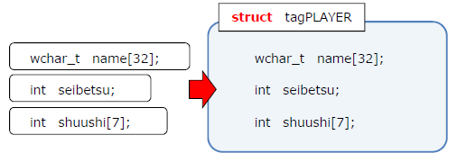

本章では下記の内容を学習します。

- **複数のデータによる集合体を作る**: 構造体
- **長い型名へあだ名をつける**: typedef
- **構造体のコピーと配列化**: コピーと配列化
- **構造体を関数で受け渡す**: ポインタ渡し

# 構造体

## 構造体とは



配列を学んだことで、私たちは複数のデータを 1 つの変数を通して扱うことができるようになりました。しかしながら、配列に格納できるのは 1 つの型のデータのみとなります。異なったデータ型の情報をまぜこぜにいれておくことはできません。

たとえば人間 1 人のデータを考えたとき、名前、年齢、性別などはそれぞれ wchar_t 型の配列・int 型などと、扱うべき型名が変わります。そういったデータをひとまとめにして扱おうとしたとき、1 つの型の集合体である配列ではまかないきれないことになります。

今回学ぶ構造体は、こういった**数値・文字列・配列などの異なった型の変数を、1 つの変数として扱うことができる仕組み**を提供するものです。複数の異なるデータ型の情報を、**1 つの新しいデータ型として定義**することができるようになります。例えば上記の人間情報を、PLAYER 型の変数として定義して、その中に名前、年齢、性別など異なったデータ型の情報を登録しておくことができるようになります。

## 構造体の定義

```cpp:例1a-構造体の型枠定義
// プレイヤ型構造体の型枠定義
struct  tagPLAYER
{
  wchar_t name[32];       // 名前
  int     seibetsu;       // 性別: 0=無回答, 1=男性, 2=女性
  int     shuushi[7];     // 7日分の収支
};
```

**構造体は複数の変数群を、1 つの変数としてまとめて定義することができます**。例ではゲームをプレイするプレイヤ情報を格納することを目的に `tagPLAYER` 構造体を作成し、そのメンバとして名前・性別・7 日分の収支を登録しています。

**構造体は、利用する前にその構造体に何が入っているかの型枠を定義する必要があります**。型枠定義は通常グローバル領域に記述します。こうするとすべての関数からその構造体の定義を利用することができるようになります。

**構造体は `struct` キーワードを頭につけて定義し、中カッコでくくってその内部に必要な変数を記述します**。

**構造体の各要素のことをメンバと呼びます**。各メンバは通常の変数宣言のように記述していき、これを必要な分だけ記述することで、その構造体のメンバを構成することができます。最後に構造体を記述し終わったら、セミコロンを忘れずにつけてください。

[[exercise | 練習問題: 商品管理構造体]]
| 「名前」「値段」「在庫の数」「値引率（小数値）」を持つ、商品構造体を作ってください

## 構造体の宣言と操作

```cpp:例1b-構造体の宣言・初期化・使用
#include <stdio.h>
#include <locale.h>

// プレイヤ型構造体の型枠定義
struct  tagPLAYER
{
  wchar_t name[32];       // 名前
  int     seibetsu;       // 性別: 0=無回答, 1=男性, 2=女性
  int     shuushi[7];     // 7日分の収支
};

int     main( void )
{
  setlocale( 0, "JPN" );

  // プレイヤ構造体の宣言と初期化
  struct tagPLAYER p = {
    L"久原政彦",
    1,
    { 4000, -2000, -1000, 5000, 0, -6000, 7000 }
  };

  // 各種情報の表示
  printf( "名前: %Sさん\n", p.name );

  printf( "収支---------------\n" );
  for ( int i=0; i<7; i++ )
  {
    printf( "%d日目: %d\n", i+1, p.shuushi[i] );
  }

  return  0;
}
```

定義した構造体を利用する際には、ふつうの変数と同じように変数宣言します。このとき **`struct` を頭につけて、構造体であることを明示します**。例では `struct tagPLAYER p;` という形で宣言しています。

構造体は通常の変数と同様、宣言と同時に初期化を行うことができます。構造体の初期化には複数の値が入りますから、配列の初期化のときと同じように、中カッコとカンマを利用します。

構造体に入っている各メンバにアクセスするためには、**宣言した変数名の後ろにドットをつけて、どのメンバにアクセスするかを明示します**。例では名前にアクセスするために `p.name` 、収支にアクセスするために `p.shuushi[0]` というようにアクセスしています。『p の name』という感じで、`.` を『の』と読めば自然に理解できるでしょう。

[[exercise | 練習問題: 性別の表示]]
| 性別を表示するプログラムを追加してください

[[practice | 実践問題: 情報の入力]]
| 名前・性別・収支を `scanf_s` 関数で入力できるようにしてください

# 型名の簡略記法

## typedef キーワード

```cpp:例2-typedefによる型名の簡略化
// プレイヤ型構造体の型枠定義
typedef struct tagPLAYER
{
  wchar_t name[32];       // 名前
  int     seibetsu;       // 性別: 1=男性, 2=女性, 3=なし
  int     shuushi[7];     // 7日分の収支
} PLAYER;

int main( void )
{
  setlocale( 0, "JPN" );

  // プレイヤ構造体の宣言と初期化
  PLAYER p = {
    L"久原政彦",
    1,
    { 4000, -2000, -1000, 5000, 0, -6000, 7000 }
  };

  // 以下省略
}
```

構造体変数は struct をつけることで構造体であることを明示しますが、その分長い記述を要求されることになります。多くのプログラマは struct を省略することを好み、実際にこの struct を省略することができる記法が存在します。

**平たく言えば、`typedef` キーワードは型名にあだ名をつけることができる仕組みです**。より正しく説明すると、`typedef` はキーワードの後ろに続く型定義を、文章の最後に記述した単語に置き換えることができる仕組みです。

例では `typedef struct tagPLAYER { ... } PLAYER;` という構成になっています。この場合 `struct tagPLAYER` に `PLAYER` というあだ名をつけるという意味になります。これで 15 文字が 6 文字に縮みました。

main 関数では、typedef されたあだ名を利用しています。単に PLAYER と記述していますが、きちんと struct tagPLAYER 構造体の変数が宣言でき、利用できています。このとき**構造体にあだ名をつける場合は、すべて大文字で記述することが多いです**。

**typedef キーワードは、構造体のあだ名だけではなく、あらゆる型名のあだ名付けに利用できます**。たとえば `unsigned int` を `UINT` とするなら、`typedef unsigned int UINT;` と記述すれば、以降あだ名を利用できます。

[[exercise | 練習問題: 商品構造体にあだ名を付ける]]
| 練習問題で作成した商品構造体に、typedef であだ名を付けてください

# 構造体のコピーと配列化

## 構造体のコピー

```cpp:例3-構造体のコピー
// 前略

int main( void )
{
  setlocale( 0, "JPN" );

  // プレイヤ構造体の宣言と初期化
  PLAYER p = {
    L"久原政彦",
    1,
    { 4000, -2000, -1000, 5000, 0, -6000, 7000 }
  };

  // 構造体のコピー
  PLAYER  p2  = p;

  // 内容の変更
  swprintf( p2.name, 32, L"%s", L"プログラミングコース" );

  // 各種情報の表示
  printf( "名前: %Sさん\n", p2.name );

  printf( "収支---------------\n" );
  for( int i=0; i<7; i++ ){
      printf( "%d日目: %d\n", i+1, p2.shuushi[i] );
  }

  return  0;
}
```

構造体は複数の変数の集合体ではありますが、それ自体は 1 つの変数ですから、値のコピーを行うこともできます。

**構造体を代入文でコピーした場合、その内容全てがコピーされます**。構造体の内容物は何があっても良く、例えば内容の一部に配列があっても、それごとコピーされます。

構造体のコピーは強力な機能ですが、構造体は大きな変数であるため、コピーにはそれなりの時間がかかる可能性があります。安易にコピーするのはお勧めできません。

## 構造体の配列化

```cpp:例4-構造体の配列化
// 前略

int main( void )
{
  setlocale( 0, "JPN" );

  // プレイヤ構造体の宣言と初期化
  PLAYER p = {
    L"久原政彦",
    1,
    { 4000, -2000, -1000, 5000, 0, -6000, 7000 }
  };

  // 構造体配列の作成
  PLAYER  pa[10];

  // 構造体のコピー
  pa[0]   = p;

  // 内容の変更
  swprintf( pa[0].name, 32, L"%s", L"プログラミングコース" );

  // 各種情報の表示
  printf( "名前: %Sさん\n", pa[0].name );

  printf( "収支---------------\n" );
  for( int i=0; i<7; i++ ){
      printf( "%d日目: %d\n", i+1, pa[0].shuushi[i] );
  }

  return  0;
}
```

構造体を配列として作成し利用することもできます。作成方法は通常の変数と同じで、利用も同じです。各要素を大カッコで指定したうえで、ドット演算子を利用して各メンバにアクセスします。

# 構造体とポインタ

## 構造体のポインタ

```cpp:例5-構造体のポインタ
// 前略

int main( void )
{
  setlocale( 0, "JPN" );

  // プレイヤ構造体の宣言と初期化
  PLAYER p = {
    L"久原政彦",
    1,
    { 4000, -2000, -1000, 5000, 0, -6000, 7000 }
  };

  // 構造体のポインタを作成
  PLAYER  *pp = &p;

  // 各種情報の表示
  printf( "名前: %Sさん\n", pp->name );

  printf( "収支---------------\n" );
  for( int i=0; i<7; i++ ){
    printf( "%d日目: %d\n", i+1, pp->shuushi[i] );
  }

  return  0;
}
```

構造体の受け渡しには、構造体をコピーして行うこともできますが、構造体が大きなサイズを有している場合も多いため、直接的な複製ではなく、間接的なアクセスによってその情報を受け渡しする手法が多く取られます。間接アクセス権を与えることのできる仕組みと言えば、ポインタです。

**構造体の授受には、ポインタを利用します**。構造体のポインタ変数を作成する方法、および構造体変数のアドレスを取得する方法は、通常の変数と同じです。型名にアスタリスク `*` を付けてでポインタ変数を生成し、変数名にアンパサンド `&` をつけてアドレスを取得します。

**構造体ポインタを利用して構造体の各メンバにアクセスするには、アロー演算子 `->` を利用します**。アロー演算子はその形状が示す通り、『アドレス値を利用して、そのメモリにアクセスします』という意味があります。ポインタが『指している』メンバを操作と覚えると良いでしょう。

## 構造体を関数に渡す

```cpp:例6-構造体を関数に渡す
// 前略

void showPlayer( PLAYER \*pp )
{
  // 各種情報の表示
  printf( "名前: %S さん\n", pp->name );

  printf( "収支---------------\n" );
  for( int i=0; i<7; i++ ){
    printf( "%d日目: %d\n", i+1, pp->shuushi[i] );
  }
}

int main( void )
{
  setlocale( 0, "JPN" );

  // プレイヤ構造体の宣言と初期化
  PLAYER p = {
    L"久原政彦",
    1,
    { 4000, -2000, -1000, 5000, 0, -6000, 7000 }
  };

  // 各種情報の表示
  showPlayer( &p );

  return  0;
}
```

構造体のアドレスとポインタが取得できましたので、これを利用して関数へ受け渡しを行うことができるようになります。

**構造体を関数へ渡すためには、ポインタ変数を利用します**。ポインタが登場するシチュエーションのおよそ半分は、構造体を関数へ受け渡しすることです。ここでしっかり押さえてください。

例ではプレイヤ情報を表示する `showPlayer` 関数を作成しています。showPlayer 関数は引数として PLAYER 構造体へのポインタを受け取り、関数内ではアロー演算子を通して各メンバにアクセスしています。

構造体を渡す側である main 関数では、引数として渡す際に、構造体のアドレスを渡しています。これによって showPlayer 関数側はポインタを通して構造体を操作できるようになっています。

[[practice | 実践問題: 統計情報表示関数]]
| プレイヤの収支の統計情報を表示する関数　`void showStatPlayer( PLAYER *pp )` を作成してください。必要な統計情報は以下のとおりです；
| 1. 最大値
| 2. 最小値
| 3. 平均値
