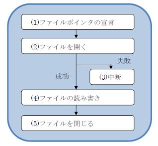

本章では下記の内容を学習します。

- **プログラムで使うデータの保存と読み出し**: ファイル操作
- **文字データの読み書き**: テキストファイル
- **構造体や配列の読み書き**: バイナリファイル
- **特定のデータを取り出す**: ランダムアクセス

# ファイル操作

## ファイルとは

前回までのプログラムで、収支表などを作成してきましたが、このデータはプログラムが実行を終えると、すべて消えてしまっていました。そのためせっかく入力や操作を行ったデータがあったとしても、あとで再び操作したりすることはできませんでした。

一般的なアプリでは、操作した結果を保存したり、読み出したりすることができます。たとえば画像処理アプリでは画像が保存され、Word ではドキュメントが、Excel ではシートが保存されます。こういった**ユーザが編集したデータを PC 上に保存したものをファイルと呼んでいます**。

ファイルを利用すると、以下のような様々なメリットを得ることができるようになります；

- プログラムで処理を行った**データの保存**と、**処理の再開**ができるようになります。
- **画像・音声・動画**などのマルチメディアファイルを外部から読み出すことによって、様々な演出を施すことができるようになります。
- **設定ファイル**などを外部から読み出せるようにすると、プログラムを再コンパイルすることなく、**アプリの振る舞いを変更**することができるようになります。

## ファイルの種類

ファイルには、大きく分けて 2 つの種類があります；

1. **テキスト**ファイル: 文章やソースファイルなど
1. **バイナリ**ファイル: 画像・音声・動画などのマルチメディア、構造体データなど

これらの種類は、扱いたいデータが文字情報かそうでないかで振り分けられます。本講義では、設定ファイルにテキストファイルを、マルチメディア読み出しにバイナリファイルを、それぞれ利用していく予定です。

## ファイル操作の基本的な流れ

```cpp:例1-ファイル操作の基本的な流れ
#include <stdio.h>

int     main( void )
{
  // (1) ファイルポインタの宣言
  FILE *fp;

  // (2) ファイルを開く
  fopen_s( &fp, "test.txt", "wt" );
  if( fp == NULL )
  {
    // (3) ファイルオープンに失敗したときの処理
    puts( "ファイルオープンに失敗しました" );
    return  -1;
  }

  // (4) ファイルに書き込む
  fprintf( fp, "test string.\n" );

  // (5) ファイルを閉じる
  fclose( fp );
  printf( "ファイル書き込みに成功\n" );

  return  0;
}
```



ファイル操作は、基本的には上記の 5 つのステップを通して行います。

1. まずプログラム上でファイルを操作するための窓口になるファイルポインタを生成します。
2. それを利用してファイルを開く指示を送ります。
3. もしファイルが開けなければ、即座に処理を中断します。
4. 無事開けたら、読み書き処理を行います。
5. 最後にファイルを閉じる操作を行えば、ファイルへの操作が終了します。

## ファイルポインタ

**ファイルポインタは、開いているファイルが現在どのような状態かを記憶するための変数です**。ポインタですから、そのポインタが指し示す先に具体的なデータがあるのですが、私たちは今回、この指し示す先のことについては面倒を見なくてよいということになっています。ですから、1 つのファイルを開くごとに、1 つのファイルポインタを作成すればよい、ということだけしっかり覚えれば OK です。

## ファイルを開く

**ファイルを開くためには、`fopen_s` 関数を利用します**。ファイルを開く操作を行うと、そのプログラムでファイルを読んだり書いたりする権利を得ることができます。プログラムはいくつでもファイルを開くことができますが、1 つのファイルを開けるのは 1 つのプログラムのみです。ですからファイルは必要な時だけ短時間だけ開くようにすることが求められます。プログラムを実行している間、ずっと開きっぱなしというのはお勧めできないというわけです。

ファイルを開くときに指定する引数は、**ファイルポインタ**、**パス名**および**開き方の指定**です。

**パス名は、ファイルがどこにあるかを示す文字列です**。パスの指定には『絶対パス』と『相対パス』があり、絶対パスはドライブ名からすべて指定する方式で、『C:\Program Files\… 』のように指定します。相対パスはアプリの位置を基準とした指定方式で、『test.txt』と指定すれば、アプリと同じフォルダにある test.txt ファイルが対象になります。

ファイルを開くオプションには、以下のものが指定できます；

| option  | 意味               |
| ------- | ------------------ |
| `r` `w` | 読む、書く         |
| `t` `b` | テキスト、バイナリ |
| `a`     | 追記               |

これらを連記して、文字列で指定します。たとえば **「テキスト読み込み」なら `rt`** **「バイナリ書き出し」なら `wb`** となります。

**ファイルを開くことに失敗した場合、ファイルポインタが `NULL` になります**。これをチェックしておき、失敗したときはファイル操作を中断するようにしてください。もし失敗したままファイル操作を行うと、プログラムが強制終了してしまいます。

## ファイルへ書き出す

テキストファイルへの書き出しにはいろいろな方法がありますが、ここでは `fprintf` 関数を利用しています。

**`fprintf` 関数は、ファイルに対して `printf` が実行できる便利な関数です**。プログラムで利用した様々な変数などを、文字列としてファイルへ出力する際にとても便利な関数です。

## ファイルを閉じる

**ファイルを閉じるには、`fclose` 関数を利用します**。書き込みしたファイルは、**閉じる操作を行わなければ、それまでの操作は保証されません**ので、必ず閉じる操作を行ってください。さらに閉じられなかったファイルは、ほかのファイルから操作することができなくなる可能性があります。処理が終わったら、必ず閉じる操作を行いましょう。`fopen_s` 関数を書いたら、同時に `fclose` 関数も書いておくと安心です。

# テキストファイル

## テキストファイル出力

```cpp:例2-プレイヤ情報のファイル出力
#include <stdio.h>
#include <stdlib.h> // wcstombs 関数
#include <locale.h>

// 以下の 3 つの構造体・列挙型・関数を、以前のプログラムからコピー
typedef enum tagSEIBETSU { ... } SEIBETSU;
typedef struct tagPLAYER { ... } PLAYER;

void showPlayer( PLAYER \*pp ) { ... }

// 例 2: プレイヤ情報のファイル出力
int writePlayerText( PLAYER *p, char *path )
{
  // (1) ファイルポインタの宣言
  FILE *fp;

  // (2) ファイルを開く
  fopen_s( &fp, path, "wt" );
  if( !fp )
  {
    // (3) ファイルオープンに失敗したときの処理
    printf( "プレイヤ情報のファイルオープンに失敗しました\n" );
    return  -1;
  }

  // (4) ファイルに書き込む
  char    str[32];
  size_t  len;
  wcstombs_s( &len, str, 32, p->name, 32 );
  fprintf( fp, "%s\n", str );             // 名前
  fprintf( fp, "%d\n", p->seibetsu );     // 性別
  for( int i=0; i<7; i++ )
  {
      fprintf( fp, "%d ", p->shuushi[i] );    // 収支情報
  }
  fprintf( fp, "\n" );                    // 収支情報の末尾を改行

  // (5) ファイルを閉じる
  fclose( fp );
  printf( "プレイヤ情報のファイル書き込みに成功\n" );

  return  0;
}

int main( void )
{
  setlocale( 0, "JPN" );

  PLAYER p = {
    L"久原政彦",
    1,
    { 4000, -2000, -1000, 5000, 0, -6000, 7000 }
  };

  writePlayerText( &p, "player.txt" );

  return  0;
}
```

テキストファイルの出力について、前回作成した PLAYER 構造体を利用して学習していきましょう。

**テキストファイルへの出力には、`fprintf` 関数を利用します**。利用方法は printf 関数と同じですから、すぐに応用できると思います。出力結果はプロジェクトと同じフォルダに、 player.txt ファイルとして出力されます。

**`wcstombs` 関数は、`wchar_t` 型の文字列を、`char` 型の文字列に変換する関数です**。私たちのプログラムでは通常 **UNICODE** という世界対応の文字列を利用しますが、ファイルへ保存するときには **Shift_JIS** という日本語のみ対応した文字列を利用することが多いため、この変換を行っています。

[[practice | 応用問題: PLAYER 情報の入力]]
| 1. プレイヤ情報を、コンソール画面から入力させる関数 `void inputPlayer( PLAYER \*pp )` を作成してください
| 2. その関数を main 関数から呼んで、コンソールから入力してもらい、その結果をファイルに出力するように改良してください

## テキストファイル入力

```cpp:例3-テキストファイルの読み取り
// 例 3: テキストファイルの読み取り
int readPlayerText( PLAYER *p, char *path )
{
  // (1) ファイルポインタの宣言
  FILE *fp;

  // (2) ファイルを開く
  fopen_s( &fp, path, "rt" );
  if( !fp )
  {
    // (3) ファイルオープンに失敗したときの処理
    printf( "プレイヤ情報のファイルオープンに失敗しました\n" );
    return  -1;
  }

  // (4) ファイルから読み込む
  char    str[32];
  size_t  len;
  fgets( str, 32, fp );                   // 名前
  mbstowcs_s( &len, p->name, 32, str, 32 );
  fscanf_s( fp, "%d", &p->seibetsu );     // 性別
  for( int i=0; i<7; i++ )
  {
    fscanf_s( fp, "%d", &p->shuushi[i] );   // 収支情報
  }

  // (5) ファイルを閉じる
  fclose( fp );
  printf( "プレイヤ情報のファイル読み込みに成功\n" );

  return  0;
}

int main( void )
{
  PLAYER p;
  readPlayerText( &p, "player.txt" ); // プレイヤ情報の読み込み
  showPlayer( &p ); // プレイヤ情報の表示
  return 0;
}
```

保存したテキストファイルを読み出す際には、文字列として取り出すときと、数値として取り出すときの 2 つのパターンがあります。

**`fgetws` 関数は、ファイルから文字列を 1 行読み取る関数です**。fgetws 関数は以前にコンソールからの入力にも利用していましたが、本来はファイルからの入力に利用する関数で、今回は本来の用途で利用しています。

**`fscanf_s` 関数は、ファイルから数値などを読み取る関数です**。基本的には `scanf_s` 関数と同じ効果があります。`%d` を指定して読み取ると、ファイルのその部分を数値として取り込んでくれます。

ファイルに複数のデータが保存されている場合、**`fgetws` は 1 行を読み取り、`fscanf_s` 関数は 1 つの区切り文字まで読み取ります**。例でいうところの収支配列の読み取りでは、1 行に 7 つの収支情報が入っていますが、これを `%d` を 7 回行うことで、1 行の 7 個分のデータを順番に読み取っています。区切り文字に利用できるのは、スペース・タブ・改行文字などです。

[[exercise | 練習問題: 自作テキストの読み取り]]
| `player.txt` をテキストエディタで開いて、その内容を自分で打ち込んで改変し、それをプログラムに読み取らせてください（設定ファイルは、そのような形で利用されています）

[[practice | 応用問題: 指定したファイルを読み取る]]
| ファイル名をコンソールから打ち込み、そのファイルを読み込めるようにしてください

# バイナリファイル

```cpp:例4-プレイヤ情報のバイナリ入出力
// プレイヤ情報のバイナリ出力
int writePlayerBinary( PLAYER *p, char *path )
{
  FILE *fp;
  fopen_s( &fp, path, "wb" );
  if( !fp )
  {
    printf( "プレイヤ情報のバイナリオープンに失敗しました\n" );
    return -1;
  }

  // (4) ファイルにバイナリ形式で書き込む
  fwrite( p, sizeof(PLAYER), 1, fp );

  fclose( fp );
  printf( "プレイヤ情報のバイナリファイル書き込みに成功\n" );
  return  0;
}

// プレイヤ情報のバイナリ入力
int readPlayerBinary( PLAYER *p, char *path )
{
  FILE *fp;
  fopen_s( &fp, path, "rb" );
  if( !fp )
  {
    printf( "プレイヤ情報のバイナリオープンに失敗しました\n" );
    return -1;
  }

  // (4) ファイルからバイナリ形式で読み込む
  fread( p, sizeof(PLAYER), 1, fp );

  fclose( fp );
  printf( "プレイヤ情報のバイナリファイル読み込みに成功\n" );
  return  0;
}

int main( void )
{
  PLAYER p1, p2;
  readPlayerText( &p1, "player.txt" );    // テキストで読み込む
  showPlayer( &p1 );                      // それを表示

  writePlayerBinary( &p1, "player.bin" ); // バイナリで書き出す
  readPlayerBinary( &p2, "player.bin" );  // バイナリで読み込む
  showPlayer( &p2 );                      // 正常に読み込めたかを表示

  return  0;
}
```

先ほどのテキストファイル入出力では、プログラム上の変数を、一度すべて文字列に変換して入出力していました。これから学ぶバイナリ入出力では、プログラム上の変数を、メモリに入っている形のまま、ファイルに保存したり読み出したりすることができるようになります。

バイナリ形式でのファイル読み書きには、fopen_s 関数へのオプションを、`t` から `b` に変更します。Text から Binary への指定変更です。

**バイナリ形式でのファイル書き出しには、`fwrite` 関数を利用します**。引数にはデータへのポインタ、データ 1 つのサイズ、データの個数、ファイルポインタの 4 つを指定します。例では構造体 1 つを書き出しているので、構造体へのポインタ、構造体のサイズ、構造体の個数(1)、ファイルポインタをそれぞれ指定しています。このとき構造体のサイズは sizeof 演算子で取得することができますので、これを利用しています。

**バイナリ形式でのファイル読み込みには、`fread` 関数を利用します**。引数の与え方は fwrite 関数のそれと同じです。

そもそもバイナリとは、2 進数での表現を意味しています。2 進数はコンピュータがデータを扱うときの形式になります。**つまりテキストは人間が読める形式に変換する保存を行い、バイナリはコンピュータが直接読める形式での保存を行う**、という意味合いになります。

バイナリ形式とテキスト形式の違いは、以下のようになります：

- バイナリはコンピュータが扱う形式のため、テキストより早く読み書きできる
- バイナリはテキスト形式に比べ、数値データを保存する場合、ファイルサイズが減る
- バイナリは構造体などのブロックになったデータを簡単に扱える
- バイナリは人間が読みづらい形式のため、ごく簡単な暗号化になる。テキストは人間が読めるので、人間がデータを改変する場合に向いている

用途に合わせて、テキストとバイナリを使い分けられるとベストですね。

[[practice | 応用問題: プレイヤデータベースの作成]]
| 8 個の要素を持つ、PLAYER 構造体配列を作成し、それを操作することを考えます。
|
| 1. 8 個の要素を持つ PLAYER 構造体配列を main 関数で作成してください `PLAYER pa[8];`
| 2. ファイルを配列に取り込める関数 `void readPlayerTextArray( PLAYER *pa, int len )` を作成してください。ファイル名は `01.txt` ～ `08.txt` に書き換えておき、関数内で連番ファイル名を自動生成して、連続してファイルを取り込めるようにしてください
| 3. 配列をまとめて 1 つのファイルに書き込める関数 `int writePlayerBinaryArray( PLAYER *pa, int len, char *path )` を作成してください。ファイル名は `player_array.bin` としてください。（配列の各要素には　 pa[0].name 　などの形でアクセスできます）
| 4. 8 個の PLAYER データが格納されているバイナリファイルから、PLAYER 配列へデータを読み出す関数 `int readPlayerBinaryArray( PLAYER *pa, int len, char *path )` を作成してください

# ランダムアクセス

```cpp:例5-ランダムアクセス
// 例 5: ランダムアクセス
int readPlayerBinaryRandom( PLAYER *p, int pos, char *path )
{
  FILE *fp;
  fopen_s( &fp, path, "rb" );
  if( !fp )
  {
    puts( "プレイヤ情報のバイナリオープンに失敗しました" );
    return -1;
  }

  // fseekによって、ファイル読み込みの位置を変更
  fseek( fp, sizeof(PLAYER) * pos, SEEK_SET );
  fread( p, sizeof(PLAYER), 1, fp );

  fclose( fp );
  puts( "プレイヤ情報のバイナリ読み込みとシークに成功" );
  return  0;
}

int main( void )
{
  PLAYER p3;
  readPlayerBinaryRandom( &p3, 0, "player_array.bin" );
  showPlayer( &p3 );

  return  0;
}
```

ファイルが大きくなってくると、ファイルをすべて読み込むという方式では厳しくなってきます。必要なデータのみを取り出したい場合は、ファイルの途中から一部分のみを読み込むといった手法が求められます。これを実現するのが**シーク**です。

**ファイルの途中に移動し、そこからファイル操作を行えるようにするためには、`fseek` 関数を利用します**。現在開いているファイルの読み込み位置が変更でき、引数にはファイルポインタ、移動する位置、移動の仕方オプションの 3 つを指定します。オプションは『SEEK_SET: その位置へ』『SEEK_END: 後から数えて』『SEEK_CUR: そこからの相対位置』になります。例の場合は、PLAYER 情報の n 番目にアクセスするために、`sizeof( PLAYER ) * n` という式で移動位置を決定しています。

このように**ファイルを途中から読み出したりできるアクセスの手法をランダムアクセスと呼びます**。ランダムアクセスができるのは、HDD やメモリなどです。それが実現できない場合は、ファイルの先頭から順番に読み書きすることになります。このようなアクセスの手法をシーケンシャルアクセスと呼びます。たとえばテープなどはシーケンシャルアクセスしかできないメディアになります。

[[practice | チャレンジ問題: 抽せん関数の作成]]
| 外部ファイル `joukensouchi.txt` を取り込み、抽選テーブルを作成し、このテーブルを基に抽せん結果を返すプログラムを作成してください（ファイルには「抽せん番号　最小値　最大値」が入っています。このデータを 2 次元配列に取り込むプログラムと、抽選を行う関数を作成します）
