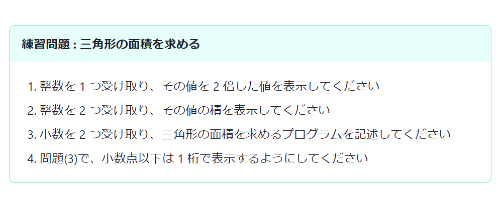

```bash
yarn add remark-custom-blocks
```

**[remark-custom-blocks](https://github.com/zestedesavoir/zmarkdown/tree/master/packages/remark-custom-blocks)** を使うと、markdown にカスタムブロックを追加できる。

```tsx
import remarkCustomBlocks from 'remark-custom-blocks';

const getDefaultMdxOptions = () => ({
  // ...
  remarkPlugins: [
    [
      remarkCustomBlocks,
      {
        exercise: {
          classes: 'exercise',
          title: 'required',
        },
      },
    ],
  ],
});
```

next-mdx-remote の mdxOptions に remarkCustomBlocks を追加し、オプションを設定する。`classes` でブロックにあてる CSS クラス名を、`title` でタイトル部分が必須かどうかを設定できる。

```scss
/* 
 * Custom Blocks
 */
.exercise,
.practice {
  border: 1px solid #e2e8f0;
  border-radius: 0.5em;
  margin-bottom: 1.75em;

  .custom-block-heading {
    padding: 0.5em 1em;
    border-radius: 0.5em 0.5em 0 0;
    font-size: 1em;
    font-weight: bold;
  }

  .custom-block-body {
    border-radius: 0 0 0.5em 0.5em;
    padding: 1em;
    font-size: 1em;

    & ol,
    & ul,
    & p {
      margin-bottom: 0;
    }
  }
}

.exercise {
  border-color: #81e6d9;

  .custom-block-heading {
    background-color: #e6fffa;
  }
}
```

CSS クラス名に対応するスタイルを記述する。今回はブロック全体を角丸矩形で囲い、タイトル部分に背景色を当てた。



```md
[[exercise | 練習問題 : 三角形の面積を求める]]
| 1. 整数を 1 つ受け取り、その値を 2 倍した値を表示してください
| 2. 整数を 2 つ受け取り、その値の積を表示してください
| 3. 小数を 2 つ受け取り、三角形の面積を求めるプログラムを記述してください
| 4. 問題(3)で、小数点以下は 1 桁で表示するようにしてください
```

`[[name | title]]` が開始部分になり、以下 `|` が続く限りブロックとみなす。**`|` の内部で別の markdown 記法を使っても良い**。

### references

- remark-custom-blocks: https://github.com/zestedesavoir/zmarkdown/tree/master/packages/remark-custom-blocks
