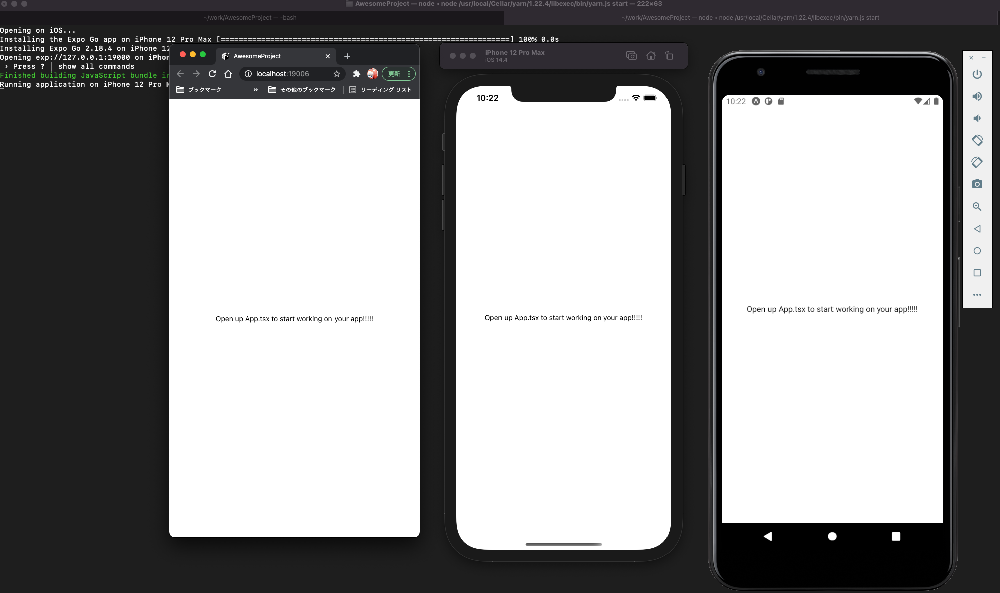

手順は下記の通り；

- expo-cli をインストール
- サンプルプロジェクトを自動生成
- web で動作確認
- iOS(Xcode/Simulator) で動作確認
- Android(Android Studio/AVD) で動作確認

## expo-cli をインストール

`yarn global add expo-cli` で Expo CLI をインストールできる

```bash
$ yarn global add expo-cli
success Installed "expo-cli@4.3.4" with binaries:
      - expo
      - expo-cli
✨  Done in 26.43s.
```

## サンプルプロジェクト (AwesomeProject) を作成

`expo init` でプロジェクトを作成でき、`yarn start` で開発環境を起動できる。

```bash
$ expo init AwesomeProject
✔ Choose a template: › blank (TypeScript)    same as blank but with TypeScript configuration
✔ Downloaded and extracted project files.
🧶 Using Yarn to install packages. Pass --npm to use npm instead.
✔ Installed JavaScript dependencies.

✅ Your project is ready!
```

## web ブラウザをターゲットとして動作確認

`yarn start` した CLI 上で、アプリを実行するターゲットを指定できる。シミュレータがインストールされていない環境でも、web（ブラウザ）をターゲットとして起動することができる。

```bash
$ yarn start
 › Press w │ open web
```

## iOS (Xcode) のセットアップと動作確認

- [‎「Xcode」を Mac App Store で](https://apps.apple.com/jp/app/xcode/id497799835?mt=12) のリンクをクリックして、AppStore を開き、そこから Xcode をインストール
- `$ sudo xcode-select -s /Applications/Xcode.app` を実行しておく
- Simulator を起動し、iPhone のシミュレータを表示
- expo start したターミナルで `i` を入力すると、Simulator との自動連携が始まり、最終的にアプリが起動する

## Android (Android Studio) のセットアップと動作確認

- [Download Android Studio and SDK tools](https://developer.android.com/studio) のリンクをクリックし、Android Studio をインストール
- ウィザードに従って初期設定を行っておく
- AVD Manager を開き、Virtual Device を 1 つ起動しておく（Pixel など）
- expo start したターミナルで `a` を入力すると、AVD との自動連携が始まり、最終的にアプリが起動する

## web/iOS/Android で起動した例



### references

- [React Native · Learn once, write anywhere](https://reactnative.dev/)
- [Setting up the development environment · React Native](https://reactnative.dev/docs/environment-setup)
- [【入門】はじめての React Native - Qiita](https://qiita.com/nskydiving/items/41e446ef5c821359ab79)
