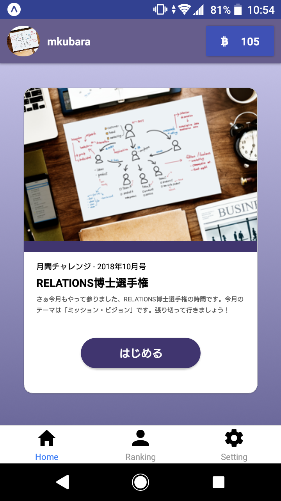
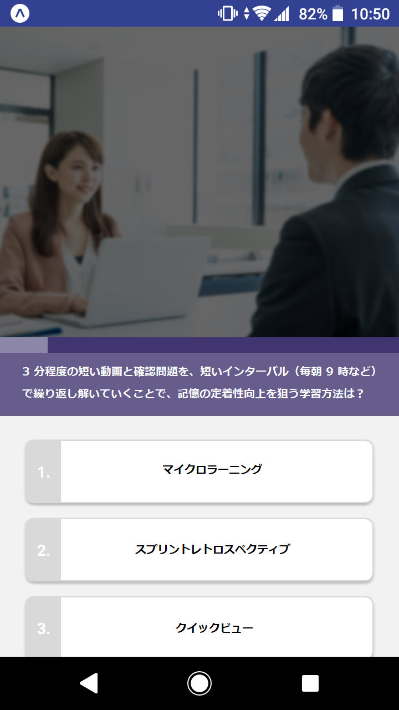
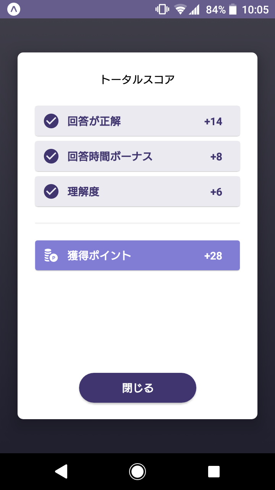
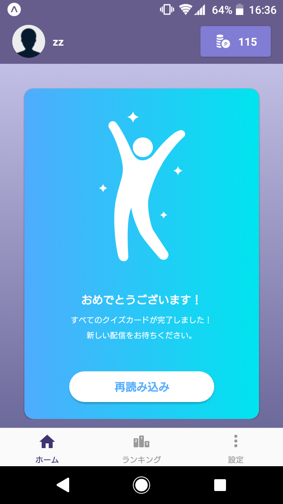

ネイティブアプリ。3 分程度の短い動画と確認問題を、短いインターバル（毎朝 9 時など）で繰り返し解いていくことで、記憶の定着性向上を狙った。問題は弊社提供のほか各社で管理画面から登録することができ、商品構成が目まぐるしく変わる小売業での販売品チュートリアルや、各社新入社員向けの教育などへの利用を狙った。

## 役割

立ち上げメンバーとして、技術選定および開発を行った。

マイクロラーニングを提供するために PUSH 通知が必要となり、ネイティブアプリとしての提供が必須要件となった。社内の経験値を鑑みて React.js のノウハウを活かせるほうが良いと判断し、React Native での開発を行うこととした。

[このときの技術選定について、ブログでも公開済み。](/blog/posts/2019-02-05-to-release-smartphone-app)

React Native(Expo)によるフロントエンド、Firebase によるバックエンドを経験。2 ヶ月ほどで β テスト配布まで漕ぎ着けた。そのままトライアルまで行ったが、最終的に開発資源を Wistant に集中することとなり、プロジェクトクローズ。

## チーム規模

- 全体: 2 名 → 5 名
- 開発: 1 名 → 3 名

## 使用技術

- JavaScript
- React Native(Expo), React.js, Redux, Redux-Saga, Redux-Form, styled-components
- NativeBase, React Navigation
- Atomic Design, Responsive Design, Sketch
- Firebase, Firebase Authentication, Firestore, Cloud Functions, Firebase Hosting, Expo Push Notification
- ESLint, Prettier, Storybook

## スクリーンショット

