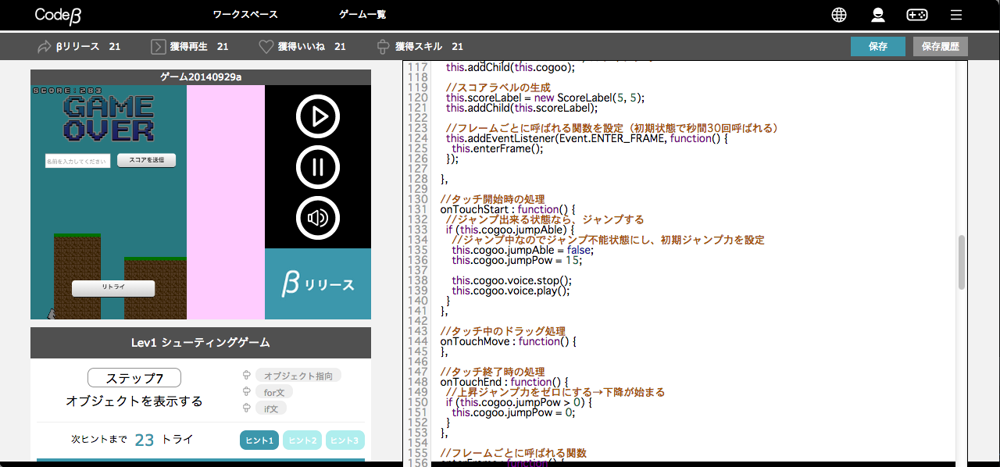
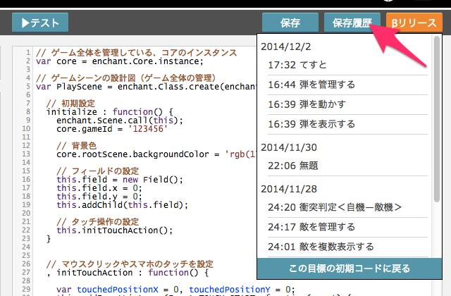
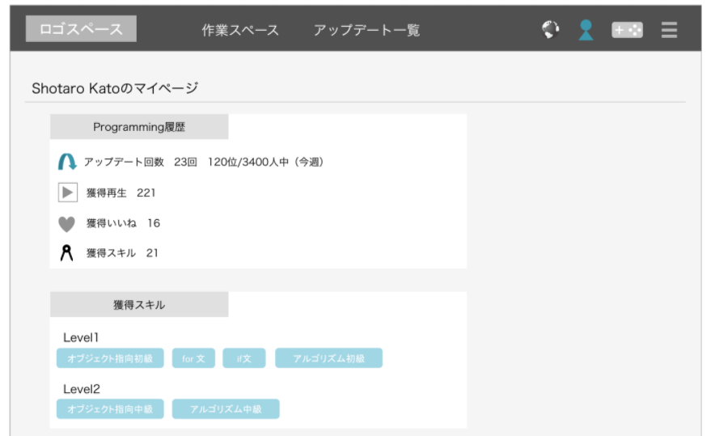
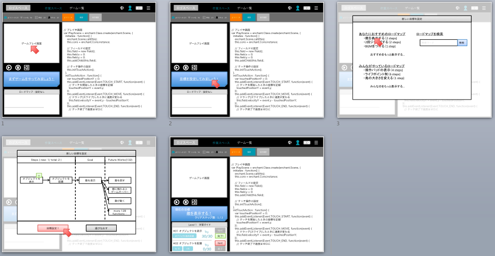

Web サービス。「ブラウザ上で動くサンプルを改造する」ことから学習を始めることで、初学者のつまづきをなるべく抑えながら学習できるように設計した。

## 役割

立ち上げメンバーとして、技術選定および開発を行った。

プログラミング初学者がつまづきやすいポイントとして、「環境構築が難しい」「何から始めていいかわからない」「次にどうすればいいかわからない」などがあった。これらを解決するために、以下の特徴を持った学習サービスを検討した。

- 環境構築なし。ブラウザだけですべて動く
- 動くサンプルをはじめから出す。それを改造すると 1 つの学習が完了できる
- 改造を繰り返すことで、一つの単元を完了できる

ブラウザ上のコードエディタでコードを変更して実行すると、それがそのままブラウザ上で動作する、という環境を構築した。開発は JavaScript で行い、学習コンテンツも 「JavaScript で動くゲームの改造」を作成した。このゲームの改造を繰り返すと、文法や構文、アルゴリズムなどが学べた。

中長期的には、学習コンテンツとゲームを CGM とすることを狙っており、コンテンツ引用回数によるインセンティブ制度を検討していた。

β テスト公開まで漕ぎ着け、そのままトライアルまで行ったが、最終的に開発資源を SELECK に集中することとなり、プロジェクトクローズ。

## チーム規模

- 全体: 4 名
- 開発: 2 名

## 使用技術

- JavaScript
- enchant.js
- SPA

## スクリーンショット

