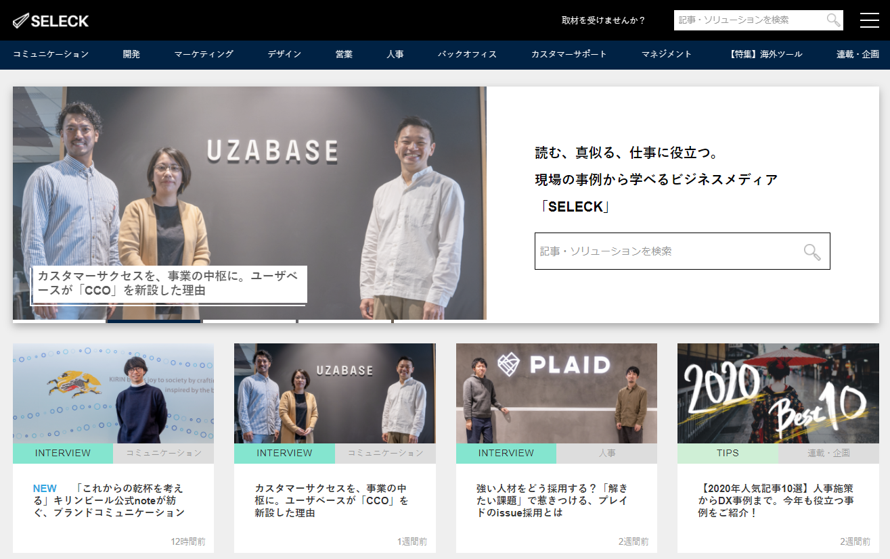
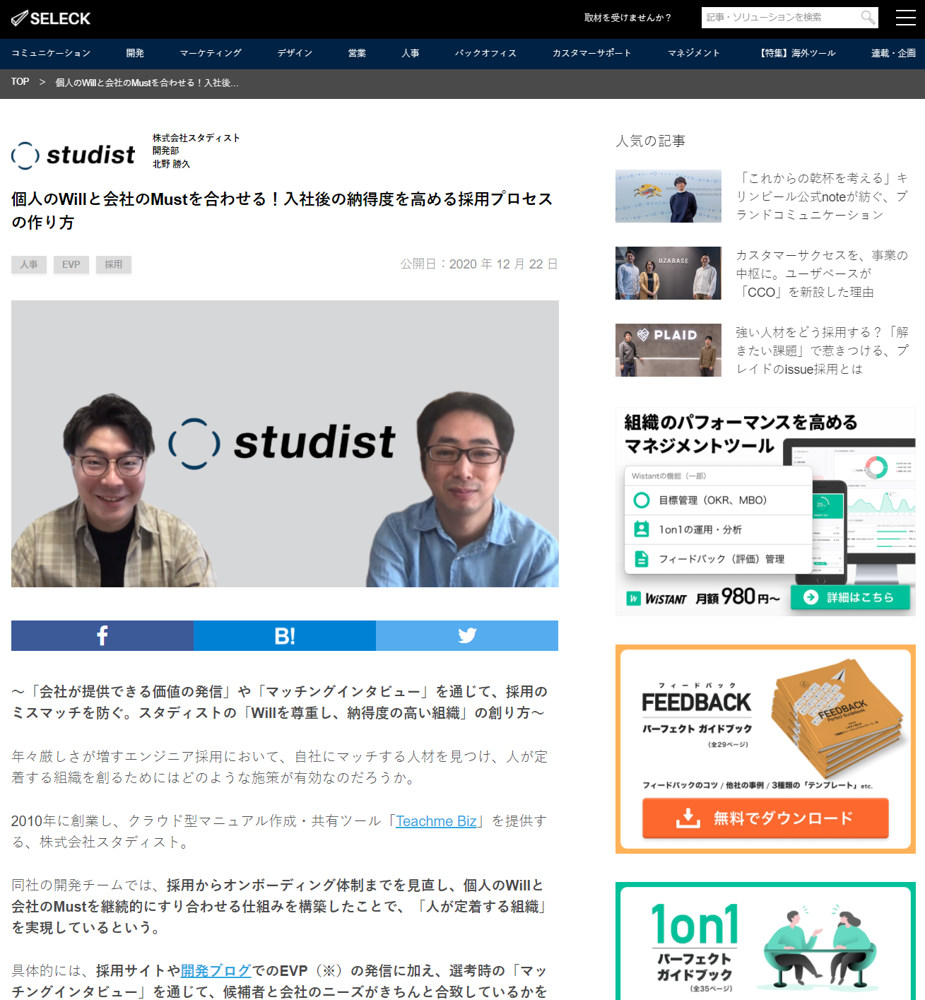
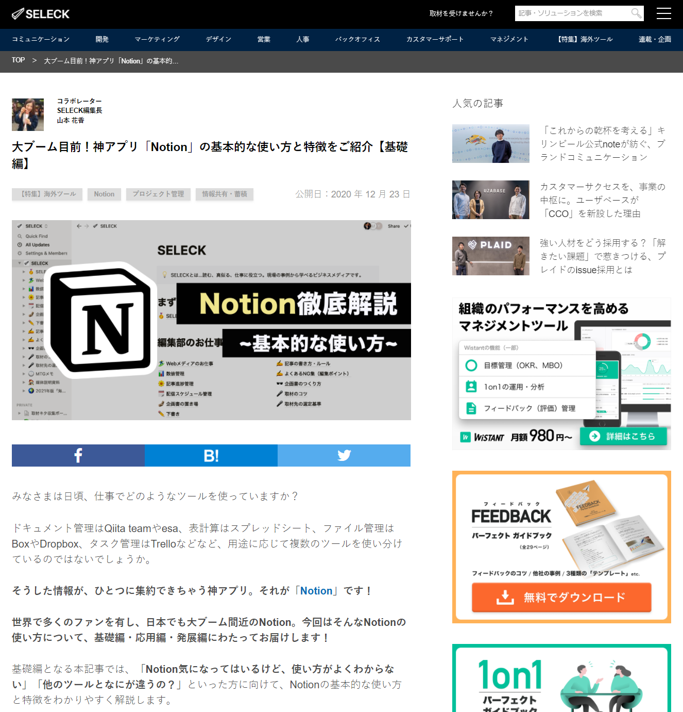
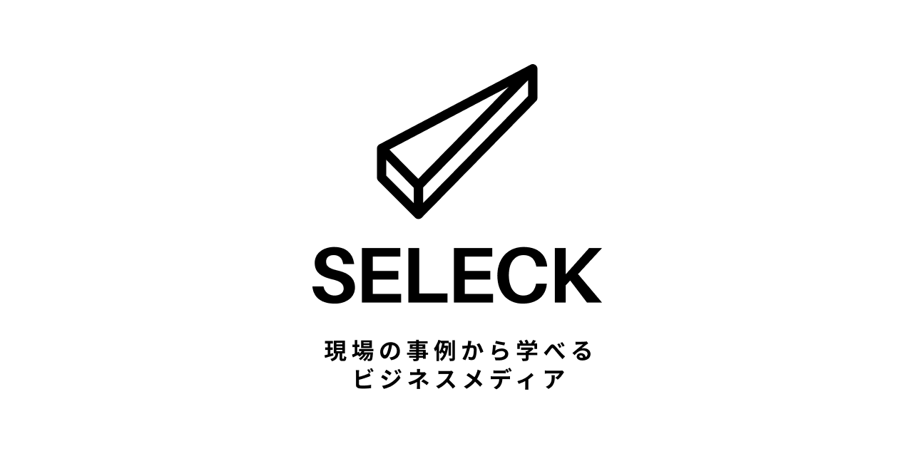

> "読む、真似る、仕事に役立つ。SELECK は、約 700 社のベストプラクティス、ツール情報、Tips を配信している、現場の事例から学べるビジネスメディアです。"（タグラインより）

## 役割

立ち上げメンバーとして、技術選定・開発・運用の全フェーズを担った。

開発当初は、ビジネスメディアとしての記事投稿システムの開発を中心に行った。当時はビジネスメディアを中心としたプラットフォーム化を視野に入れていたため、WordPress のような投稿システムを利用するのではなく、独自に投稿システムを開発することとなった。少人数で技術スタックをなるべく統一したい目的もあり、JavaScript を言語に固定。React.js と Node.js によるサービス開発となった。

サイトオープン後は、投稿システムの改善を行いながら、周辺プラットフォームの開発を担った。このとき Twilio を用いたアウトバウンドコールサービスや、自作の WYSIWYG エディタを用いた汎用投稿システムなどを開発した。

ほか、いくつかの記事について、取材、文字起こし、執筆、校正などを担当した。

最終的には、ビジネスメディアに絞って運営することとなったため、WordPress への移管を行い、その作業を監督した。

## チーム規模

- 全体: 5 名 → 10 名
- 開発: 3 名 → 5 名

## 使用技術

- JavaScript
- React.js, Vue.js, axios
- Original SSR System
- Node.js, Express, Koa, Sails.js
- AWS, CircleCI
- Twilio, Papertrail, GoogleAnalytics

## 画面

