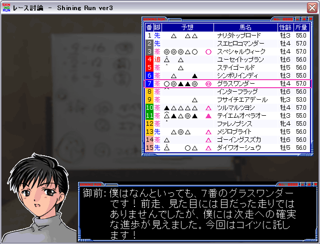
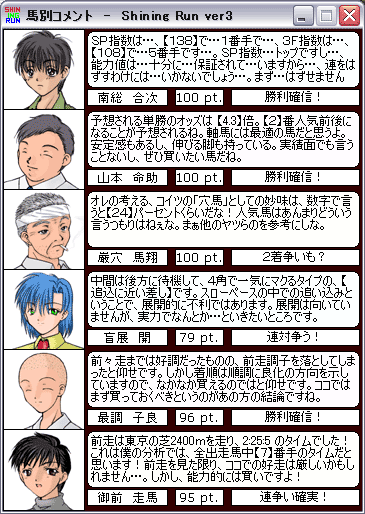
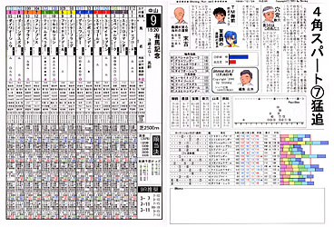

Windows アプリ。JRA-VAN 提供の競馬オフィシャルデータを利用し、競馬ファンの「予想を楽しむ」ことを支援した。開発当時画期的だった特徴として、以下のものを持っていた。

- 競馬新聞: 専門誌と同等レベルの馬柱表示と、ソフトウェアによる独自の指数分析、そして今までにない「予想屋が本当に喋っているようなコメント」が載っている
- 討論モード: 6 人の予想屋が、独自の切り口から思いの丈をぶつけ合う！

## 役割

個人開発。中学生のときにハマったダビスタをキッカケに、「プログラミング × 競馬」という観点で作成をはじめた。

## 特徴

予想については、「タイム」「人気度」「穴馬度」「展開」「調子」「前走」に着目した 6 種類のアルゴリズムを作成し、これらを 6 人の予想屋が独自の切り口から予想したものとして扱うことを特徴とした。

討論モードは、6 つの観点から各出走馬がそれぞれどのように評価されたのかを文章に変換して表示した。アルゴリズムを文章化することが予想屋としての人格となり、これによって人間が議論しているかのように提示することができた。

競馬新聞機能は、複数の競馬新聞を参考に、独自のタイム指数や展開予想などを付記した「馬柱欄」と、6 人の予想屋が各々の観点からレースを分析した「分析欄」の 2 枚を印刷することができ、競馬新聞を購入することなく予想することができた。

## チーム規模

1 名（個人開発）

## 使用技術

- Visual Basic

## 受賞歴

1. **第 3 回 JRA-VAN 競馬ソフトコンテスト 佳作**: "競馬予想ソフト Shining Run ver.2", 1998/09

## 画像

