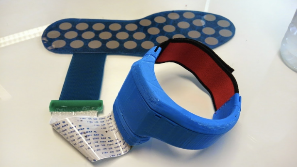
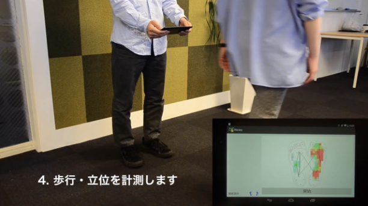
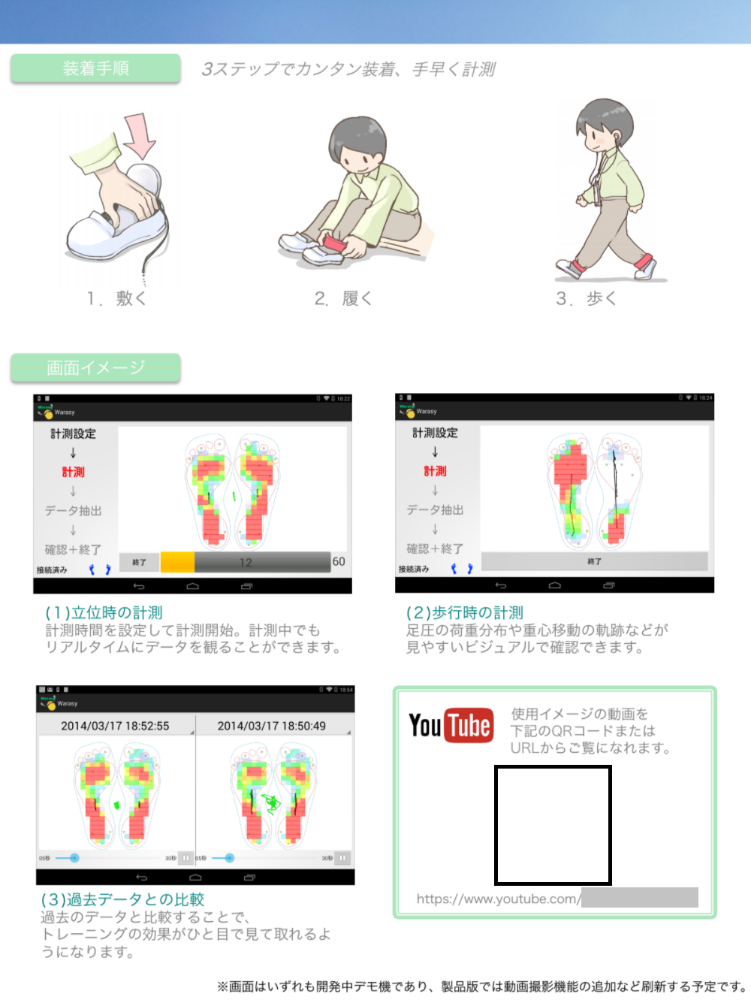

歩行能力に障害を持ってしまった人が、自律的または理学療法士のサポートのもと、より効果的なリハビリを行うことを支援する。

無線式のセンサーを足に取り付けて歩くと、Android タブレットで足圧分布や足動作の定量的モニタリングを行うことができる。目では見えない細かい動作の変化をキャッチし、評価の難しいリハビリ進捗を定量的に示すことができるようになった。

## 役割

大学院における、自らの福祉工学研究からの着手。当初は「無線センサー＋聴覚提示」での研究で、歩き方によって音階や音調が変化する、メディアアート的な要素を含んでいた。この研究成果を学会にて発表し、受賞。

その後はリハビリの専門家（理学療法士、整体師など）と共同研究を始め、より福祉工学的なアプローチで研究を重ねた。歩き方の定量化と可視化のために Android タブレットを利用し、リアルタイムフィードバック、ログによる進捗提示などの機能を提供した。これを学会およびコンテストにて発表し、受賞。

コンテスト受賞がキッカケとなり、RELATIONS 株式会社にて本格的に開発。センサ企業と足圧センサを共同開発し、いくつかのフェスタおよび病院にてデモンストレーションを重ねた。その後もソフトウェア開発およびハードウェア開発を主体的に進めた。

## チーム規模

- 全体: 1 名 → 9 名
- 開発: 1 名 → 3 名

## 使用技術

- Microchip PIC24F, STMicro Cortex-M3(ARM)
- Audio chip(MP3/MIDI), XBee(zigbee), Bluetooth chip
- PIC-C, ARM C++
- Android Java, Windows MFC/C++
- ハードウェアについて、基板設計、部材選定、実装

## 受賞歴

1. **Android Application Award 2012 アイデア部門 優秀賞**: "Warasy -Android 端末を利用した歩行リハビリ支援システム-", 2012/04
1. **電子情報通信学会 ヒューマンコミュニケーション賞**: "聴覚提示を用いた靴型デバイスによる歩行リハビリ活動支援システムの提案と試作", 2010/12
1. **電子情報通信学会 マルチメディア・仮想環境基礎研究会賞**: "聴覚提示を用いた靴型デバイスによる歩行リハビリ活動支援システムの提案と試作", 2010/05

## 画像

