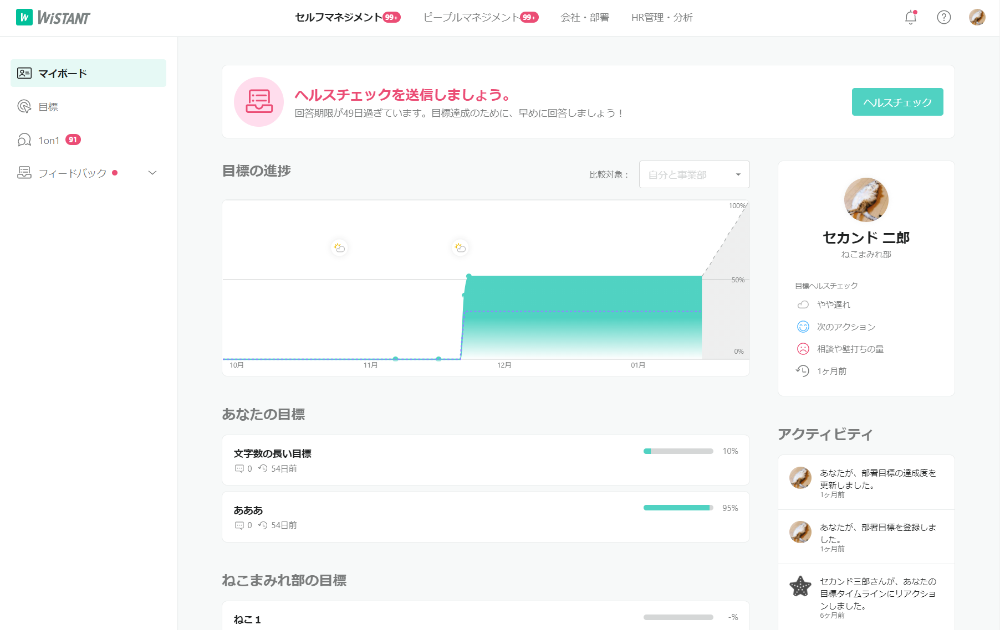
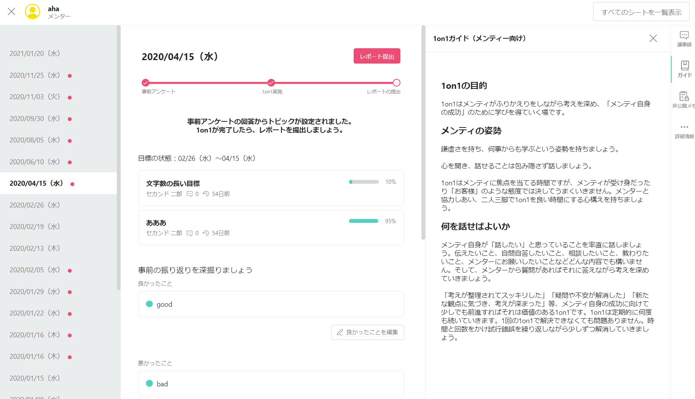
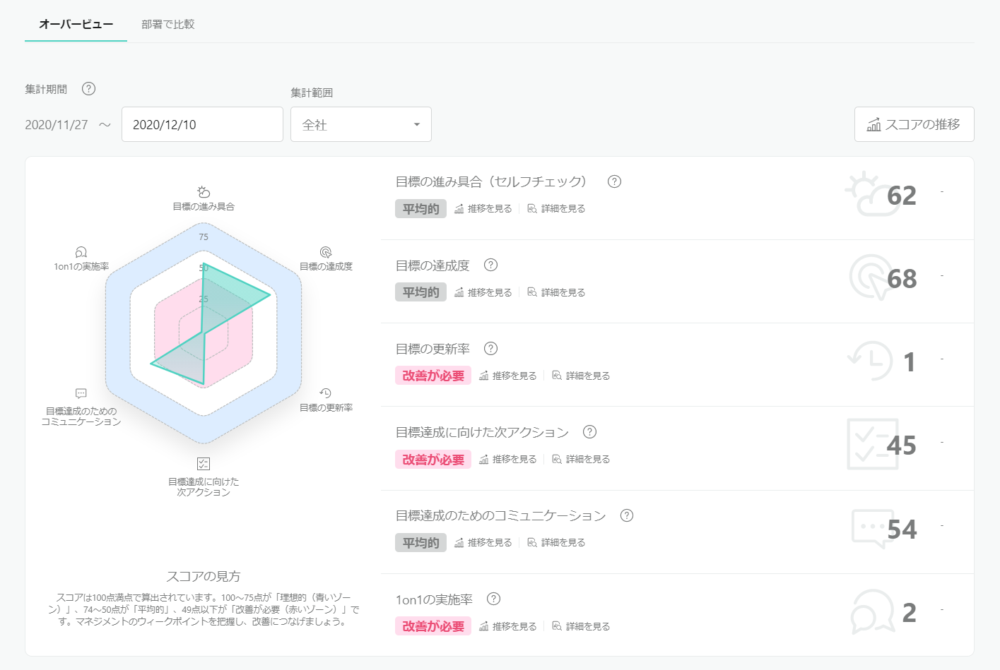
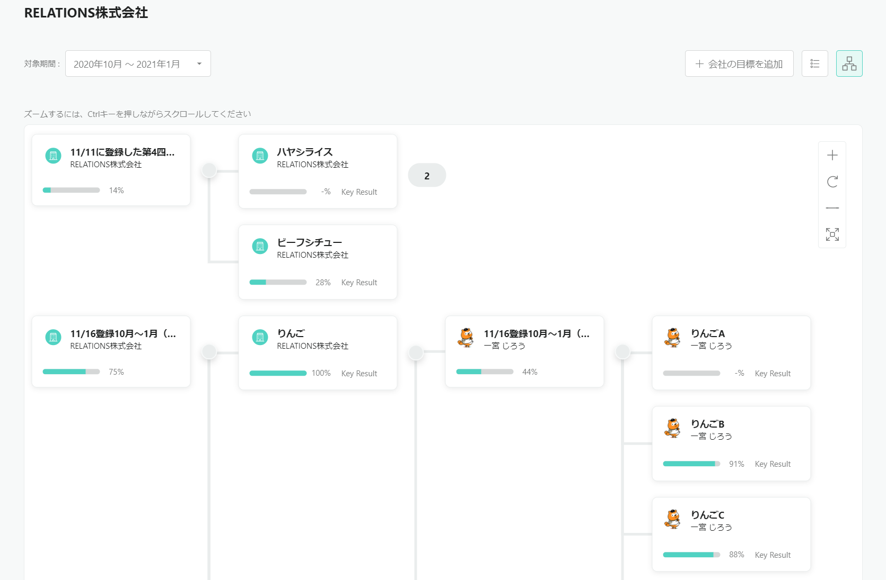

SaaS 型の Web サービス。目標・1on1・フィードバックの 3 要素を主体に、それらのループが螺旋状に上昇してメンバーの成長を支えていく。各種分析機能によって組織の成長状態の見える化を行うことで、経営やマネジメントへ生かせる機能も持つ。

## 役割

立ち上げメンバーとして、技術選定・開発・運用の全フェーズを担っている。

実装領域として、フロントエンド、バックエンド、CI/CD 整備など。特にフロントエンドに関してはテックリードとして他のメンバーを導く立場で活動を行った。また現在でも利用している技術スタックのほぼすべてについて、その技術選定を主体的に行う立場にあった。[このときの選定基準についてブログにて公開。](/blog/posts/2018-12-08-frontend-technology-selection)

このほか、エンジニアリングマネージャーとして、スクラムマスター、テックリード、レビュアーなど。あわせてメンバーの採用・評価・フィードバックなども行った。

1 年目はフロントエンドエンジニアとして従事。業務委託のマークアップエンジニアと連携するため、Atomic Design や Storybook を導入し、得意領域の分業化を行い、効率的に開発を進めた。

2 年目はチーム拡大に伴い、エンジニアリングマネジメントも担当。メンバーの採用・評価・フィードバックなどを行った。主に、新たに JOIN してくれたフロントエンドエンジニア 2 名のマネジメントを担当し、自律自走する状態まで導いた。自身も並行してフロントエンドエンジニアとしてコーディングを行った。

3 年目には、フロントエンドエンジニアチームが成長したことに伴い、自身はチームバランスを考慮して、バックエンド側へ転向。各種 PBI の実装を担当した。あわせてスクラムマスター、テックリード、レビュアーなどのチームマネジメントも行った（[2020 年現在の技術スタック](/blog/posts/2020-12-30-react-tech-stack)）。

## チーム規模

- 全体: 5 名 → 15 名
- 開発: 3 名 → 6 名

## 使用技術

- TypeScript
- React.js, Redux, Hooks, ApolloClient, Formik, styled-components
- Atomic Design, Design System, Figma
- Node.js, GraphQL, Express, Koa, ApolloServer, RxJS, Sequelize
- AWS, MySQL, CircleCI, Docker
- Slack, ChatWork, Teams, Sentry, SendGrid, Intercom, Stripe, GoogleAnalytics
- ESLint, Prettier, Husky, lint-staged, Jest, testing-library

## スクリーンショット

